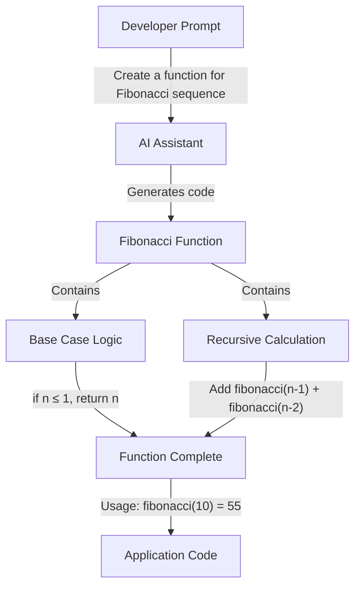
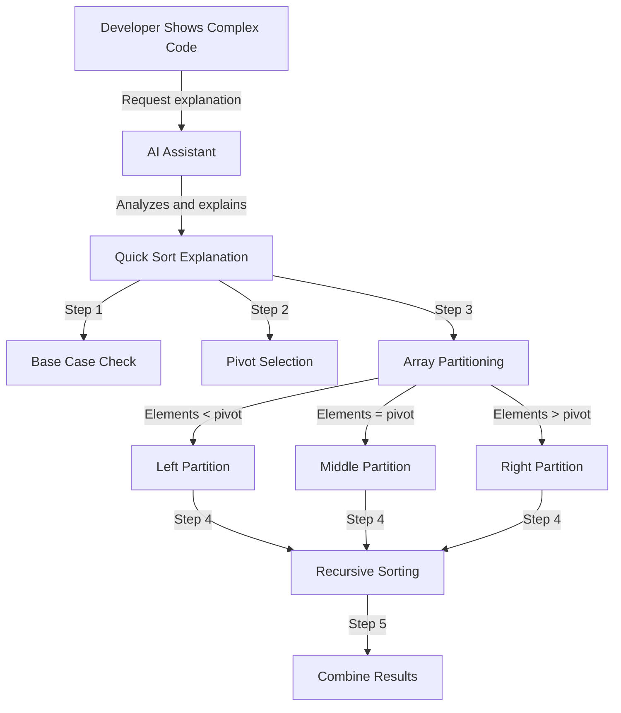
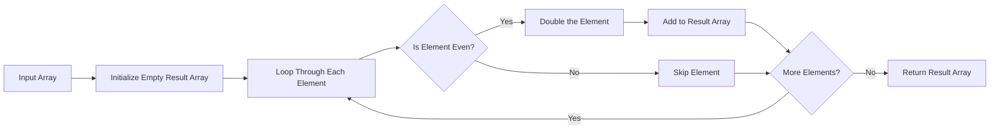
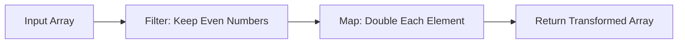

# ⚡ Chapter 01: AI Tool Integration Examples ⚡

## 🔷 Introduction

This document provides practical examples of AI tool integration in development workflows.

## 🔷 Example 1: Code Generation

**Code Generation Example: Fibonacci Sequence**

**Key Concepts:**
- Developer provides a natural language prompt describing the desired function
- AI generates a recursive implementation with proper base cases
- The generated function handles edge cases and follows best practices
- Developer can immediately use the function without needing to research the algorithm

## 🔷 Example 2: Code Explanation

**Code Explanation Example: Quick Sort Algorithm**

**Key Concepts:**
- AI can break down complex algorithms into understandable steps
- The explanation includes the purpose of each operation
- Developers can understand unfamiliar code quickly
- AI can identify potential optimization opportunities
- The visual flow helps clarify the recursive nature of the algorithm

## 🔷 Example 3: Code Refactoring

### Code Refactoring Example: Array Processing

**Before Refactoring (Traditional Approach):**

**After AI-Assisted Refactoring (Functional Approach):**

**Key Improvements:**
- Reduced from 9 lines to 1 line of functional code
- Eliminated mutable state (the result array)
- Removed manual iteration logic
- Improved readability with declarative approach
- Leveraged built-in higher-order functions
- More maintainable and less prone to bugs

---

**[📚 Chapter 01 Main](../Chapter_01_Main.md) | [📚 Examples](../examples/) | [📚 Exercises](../exercises/)**

**[🔰 Beginner](../Chapter_01_Beginner.md) | [⚙️ Advanced](../Chapter_01_Advanced.md) | [⚔️ Ninja](../Chapter_01_Ninja.md)**

*© 2025 VibeCoding - Where Human Creativity Meets AI Capabilities*

