<div align="center">

# ⚡ Chapter 01: Prompt Pattern Examples ⚡

</div>

<div align="center">


</div>

## 🔷 Effective Prompting Patterns

### 🔹 The Persona Pattern

**Persona Pattern Example:**


**Example Prompt Structure:**
"Act as an experienced JavaScript developer with 10+ years of experience in React. Review this component and suggest performance optimizations."

This pattern works by framing the AI's response to come from a specific expert perspective, leading to more focused and specialized advice.

### 🔹 The Step-by-Step Pattern

**Step-by-Step Pattern Example:**


**Example Prompt Structure:**
"Please help me build a REST API in Express.js by:  
1. Creating the basic server setup  
2. Adding the necessary middleware  
3. Creating routes for CRUD operations  
4. Implementing database connections  
5. Adding error handling"  

This pattern helps organize complex tasks into manageable steps, ensuring the AI's response follows a logical progression.

### 🔹 The Persona-Scaling Pattern

**Persona-Scaling Pattern Example:**


**Example Prompt Structure:**
"Please explain how React's virtual DOM works as if I'm:  
1. A 10-year-old child  
2. A computer science student  
3. An experienced web developer switching from Angular"  

This pattern helps build progressive understanding of complex topics by requesting explanations at multiple levels of technical depth.

### 🔹 The Comparison Table Pattern

**Comparison Table Pattern Example:**


**Example Prompt Structure:**
"Compare these three state management approaches for React applications:  

| Approach | Context API | Redux | MobX |  
|---------|------------|-------|------|  
| Complexity | ? | ? | ? |  
| Setup Time | ? | ? | ? |  
| Performance | ? | ? | ? |  
| Debugging | ? | ? | ? |  
| Community Support | ? | ? | ? |"  

This pattern organizes comparisons into a clear table format, making it easy to contrast different options across multiple criteria.

### 🔹 The Constraint Pattern

**Constraint Pattern Example:**


**Example Prompt Structure:**
"Help me develop a React component with these constraints:  
- Must use functional components with hooks  
- Must implement proper accessibility (ARIA) attributes  
- Should follow the container/presentational pattern  
- Code should follow Airbnb style guide  
- Must include unit tests with Jest and React Testing Library"  

This pattern establishes clear boundaries for the AI's response, ensuring the result meets specific quality standards or requirements.

### 🔹 The Example-Driven Pattern

**Example-Driven Pattern Example:**

```mermaid
flowchart TD
    A[Define Task: Function] --> B[Provide Example Inputs and Outputs]
    B --> C1[Example 1: Input → Output]
    B --> C2[Example 2: Input → Output]
    B --> C3[Example 3: Input → Output]
    C1 & C2 & C3 --> D[Get Function Based on Examples]    
```



**Example Prompt Structure:**
"Create a function that formats phone numbers. Examples:  
Input: "1234567890" → Output: "(123) 456-7890"  
Input: "123-456-7890" → Output: "(123) 456-7890"  
Input: "(123)456-7890" → Output: "(123) 456-7890""  

This pattern helps define a function or task by providing concrete examples of inputs and expected outputs.
Examples:
Input: "1234567890" → Output: "(123) 456-7890"
Input: "123-456-7890" → Output: "(123) 456-7890"
Input: "(123)456-7890" → Output: "(123) 456-7890"
```

---

<div align="center">

**[📚 Chapter 01 Main](../Chapter_01_Main.md) | [📚 Examples](../examples/) | [📚 Exercises](../exercises/)**

</div>

<div align="center">

**[🔰 Beginner](../Chapter_01_Beginner.md) | [⚙️ Advanced](../Chapter_01_Advanced.md) | [⚔️ Ninja](../Chapter_01_Ninja.md)**

</div>

<div align="center">

*© 2025 VibeCoding - Where Human Creativity Meets AI Capabilities*

</div>
