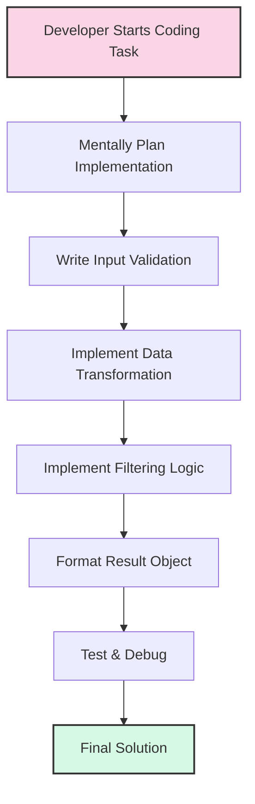
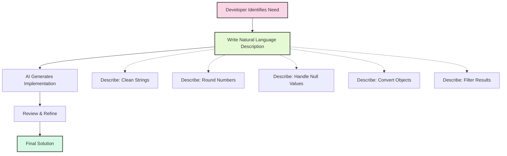
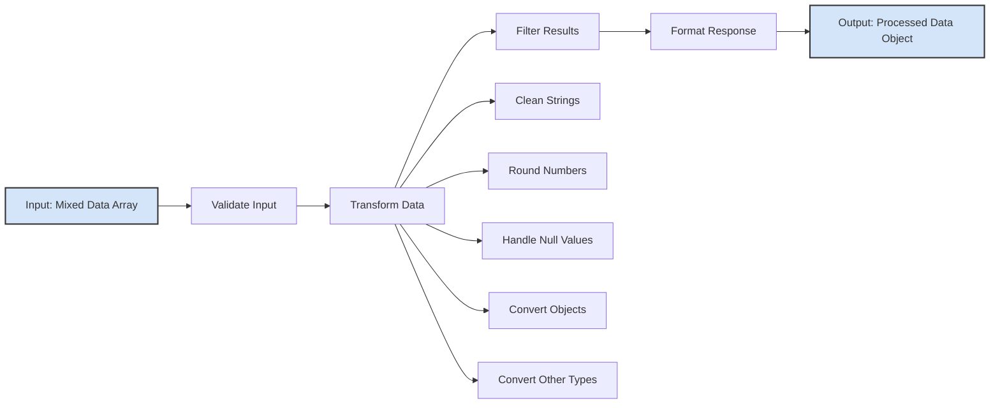

# Comparing Traditional vs. Vibe Coding Approaches

This example demonstrates the difference between traditional coding and AI-assisted Vibe Coding for implementing a data processing utility.

## Data Processing Conceptual Comparison

### Traditional Approach Workflow



**Key Characteristics of Traditional Approach:**
- Developer must manually implement all logic
- Need to remember syntax details and language specifics
- Need to handle edge cases explicitly
- Sequential development process
- More code with separate handling for each transformation
- Debugging happens after implementation

### Vibe Coding Approach Workflow



**Key Characteristics of Vibe Coding Approach:**
- Development starts with natural language description
- Developer focuses on "what" not "how"
- AI handles syntax details and edge cases
- More concise implementation using method chaining
- Focus on problem solving rather than implementation details
- Developer reviews and refines AI-generated solution

## Functionality Flow Diagram

Both approaches implement the same data processing flow:



## Example Input and Output

**Input Data:**
- String with whitespace: `"  Hello World  "`
- Number with many decimals: `42.3456`
- Null value: `null`
- Object: `{ name: 'Example' }`
- Undefined value: `undefined`
- Boolean value: `true`

**Output Result:**
```json
{
  "originalCount": 6,
  "processedCount": 4,
  "data": [
    "hello world",
    42.35,
    "{\"name\":\"Example\"}",
    "true"
  ],
  "timestamp": "2025-04-23T05:00:09.123Z"
}
```

## Key Differences Demonstrated

1. **Development Process**
   - Traditional: Manual implementation of all logic
   - Vibe Coding: Natural language description → AI implementation

2. **Code Structure**
   - Traditional: Separate blocks for each step
   - Vibe Coding: Method chaining and concise syntax

3. **Developer Focus**
   - Traditional: Focus on syntax and implementation details
   - Vibe Coding: Focus on describing desired behavior

4. **Results**
   - Both approaches produce identical functional results
   - Vibe Coding typically requires less development time and reduces cognitive load

5. **Learning Curve**
   - Traditional: Requires deep knowledge of language and frameworks
   - Vibe Coding: Requires skill in problem description and prompt engineering
