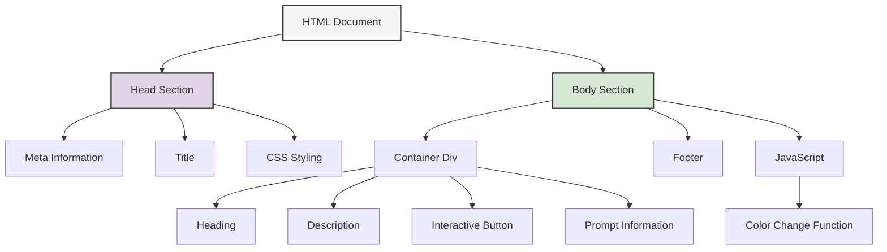
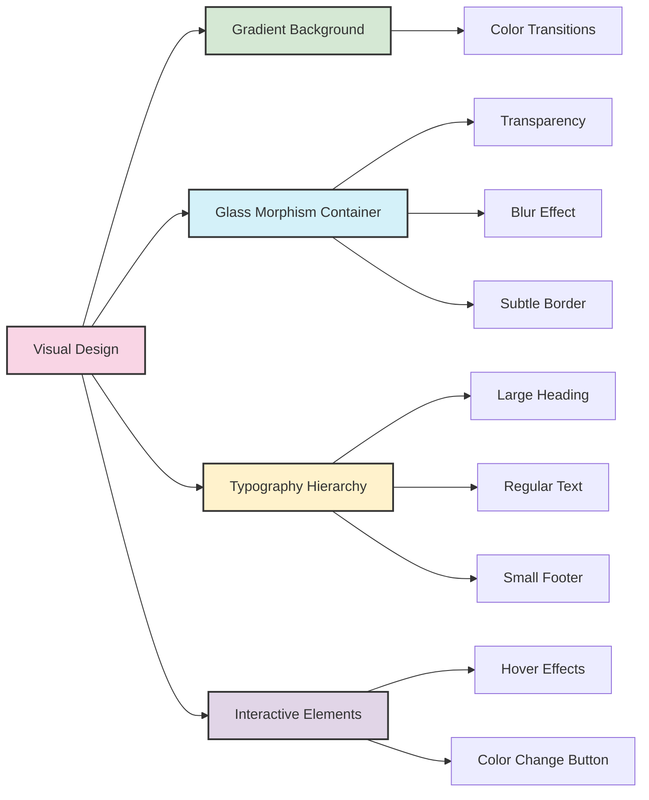
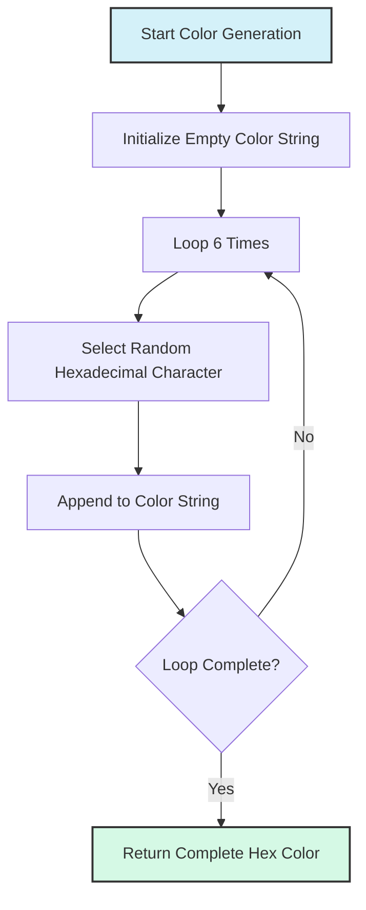

# Hello World Web Page Example

This document explains the structure and design principles of a modern "Hello World" web page created using AI-assisted development techniques.

## Page Structure Overview

The web page follows a clean, component-based structure with distinct visual elements:



## Visual Design Elements

The page incorporates modern design principles to create an engaging user experience:



## Interactivity Flow

The page includes JavaScript-powered interactivity that changes the background colors when the user interacts with the button:

```mermaid
sequenceDiagram
    participant User
    participant Button
    participant EventListener
    participant ColorGenerator
    participant Document
    
    User->>Button: Clicks "Change Colors"
    Button->>EventListener: Triggers click event
    EventListener->>ColorGenerator: Request new colors
    ColorGenerator->>ColorGenerator: Generate random color 1
    ColorGenerator->>ColorGenerator: Generate random color 2
    ColorGenerator->>Document: Update background gradient
    Document->>User: Displays new background
    
    style User fill:#f9d5e5,stroke:#333,stroke-width:2px
```

## Color Generation Algorithm

The random color generation uses a straightforward algorithm:



## CSS Styling Approach

The styling uses a layered approach to create depth and visual interest:

| Component | Style Properties | Purpose |
|-----------|------------------|---------|
| Body | Gradient background, flex layout | Creates colorful backdrop and centers content |
| Container | Glass morphism, border-radius, padding | Creates a floating card effect with depth |
| Heading | Large font size, margin | Establishes visual hierarchy |
| Button | White background, border-radius, transitions | Creates interactive element with feedback |
| Footer | Fixed positioning, small font | Provides attribution without distracting |

## Prompt Engineering Example

This example demonstrates effective prompt engineering. The prompt used was:

> "Create a modern 'Hello World' web page with HTML, CSS, and JavaScript. Include a gradient background, a centered content container with a glass morphism effect, and a button that changes the background colors when clicked."

The prompt effectively specifies:
1. The desired output format (web page with specific technologies)
2. Visual design requirements (modern, gradient, glass morphism)
3. Interactive functionality (color-changing button)
4. Implicit quality standards (modern design practices)

## Key Web Development Concepts Demonstrated

1. **Semantic HTML Structure**: Clean organization of document elements
2. **Modern CSS Techniques**: Flexbox, glass morphism, gradients, transitions
3. **Event-Driven JavaScript**: Click handlers and DOM manipulation
4. **Responsive Design**: Viewport meta tag and flexible layout
5. **Visual Hierarchy**: Clear content organization with appropriate spacing
6. **User Feedback**: Interactive elements with hover states and visual changes

---

**[⬅️ Return to Chapter](../README.md) | [📚 Main Content](../Chapter_02_Main.md) | [📖 Further Reading](../Further_Reading.md)**
