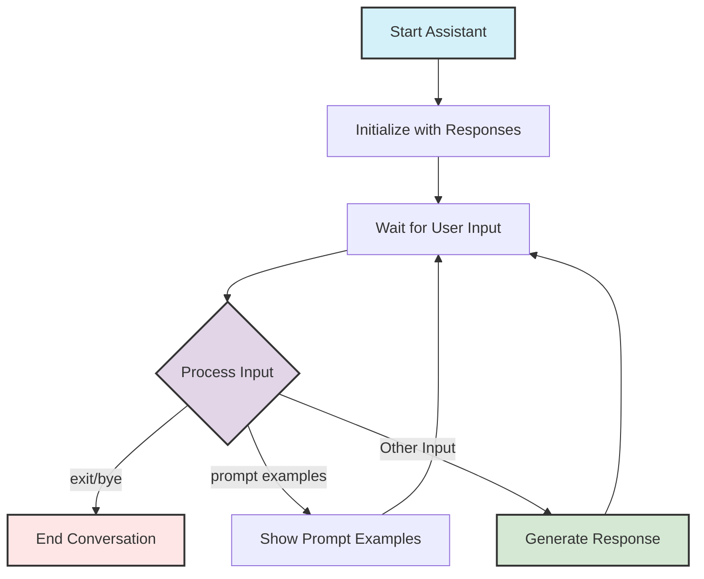
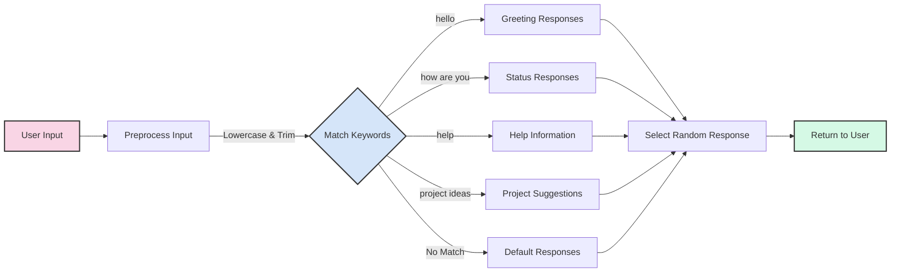

# Simple AI Assistant Example

This document explains the architecture and functionality of a basic command-line AI assistant that demonstrates prompt engineering concepts.

## Assistant Architecture Overview

The Simple Assistant demonstrates the fundamental components of an AI conversation system:

```mermaid
classDiagram
    class SimpleAssistant {
        +name: string
        +responses: Dictionary
        +prompt_examples: Dictionary
        +__init__(name)
        +respond(user_input): string
        +show_prompt_examples()
        +run()
    }
    
    SimpleAssistant --> "User Interaction"
    SimpleAssistant --> "Response Generation"
    SimpleAssistant --> "Prompt Examples"
    
    style SimpleAssistant fill:#f5f5f5,stroke:#333,stroke-width:2px
```

## Conversation Flow

The assistant operates with a simple conversation loop that processes user input and generates appropriate responses:



## Response Mechanism

The assistant uses pattern matching to select appropriate responses from predefined categories:



## Prompt Examples Showcase

The assistant can demonstrate different prompt types to help users understand effective prompting strategies:

| Prompt Type | Example |
|-------------|---------|
| Simple | "Create a function that calculates the average of a list of numbers" |
| Contextual | "I'm working on a weather app. Create a function that converts temperature from Celsius to Fahrenheit" |
| Persona-based | "As a senior Python developer, write a function that efficiently handles large dataset processing" |
| Step-by-step | "1. Create a class named 'User'<br>2. Add properties for name, email, and age<br>3. Include validation for email format<br>4. Add a method to check if user is an adult" |

## Response Categories

The assistant's knowledge base contains categorized responses:

```mermaid
graph TD
    A[Response Database] --> B[Greetings]
    A --> C[Status Updates]
    A --> D[Help Information]
    A --> E[Project Ideas]
    A --> F[Farewells]
    A --> G[Default Responses]
    
    B -->|Examples| B1["Hi there!", "Hello!", "Greetings, human!"]
    C -->|Examples| C1["I'm doing well, thanks!", "I'm great! How are you?"]
    D -->|Examples| D1["I can respond to basic greetings and questions."]
    E -->|Examples| E1["How about creating a personal website?"]
    F -->|Examples| F1["Goodbye!", "See you later!"]
    G -->|Examples| G1["I'm not sure I understand."]
    
    style A fill:#f5f5f5,stroke:#333,stroke-width:2px
    style B fill:#e1d5e7,stroke:#333,stroke-width:2px
    style C fill:#d5e8d4,stroke:#333,stroke-width:2px
    style D fill:#d4f1f9,stroke:#333,stroke-width:2px
    style E fill:#fff2cc,stroke:#333,stroke-width:2px
    style F fill:#f8cecc,stroke:#333,stroke-width:2px
    style G fill:#ffe6cc,stroke:#333,stroke-width:2px
```

## Key Implementation Concepts

1. **Pattern Matching**: Using keywords to identify user intent
2. **Response Variety**: Multiple possible responses for natural conversation
3. **Educational Component**: Showcasing prompt examples for learning
4. **Simple Loop Design**: Clean conversation flow with exit mechanisms
5. **Error Handling**: Graceful termination on keyboard interrupt

## How This Demonstrates Vibe Coding Principles

- **Natural Language Processing**: Simulates AI understanding of user inputs
- **Prompt Engineering**: Shows different prompt structures and their purposes
- **Feedback Loop**: Demonstrates the conversation cycle for continuous interaction
- **Abstraction**: Encapsulates AI assistant functionality in a clean class structure
- **User Experience Focus**: Prioritizes intuitive interaction patterns

---

**[⬅️ Return to Chapter](../README.md) | [📚 Main Content](../Chapter_02_Main.md) | [📖 Further Reading](../Further_Reading.md)**
