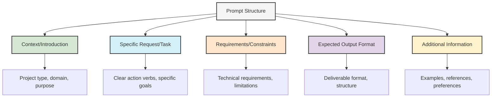
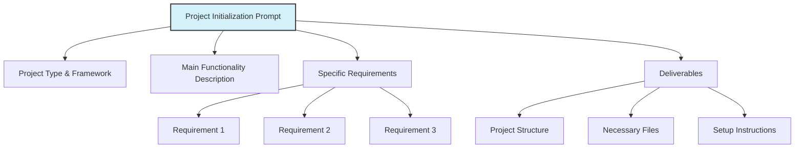
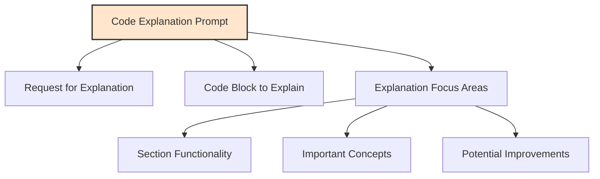
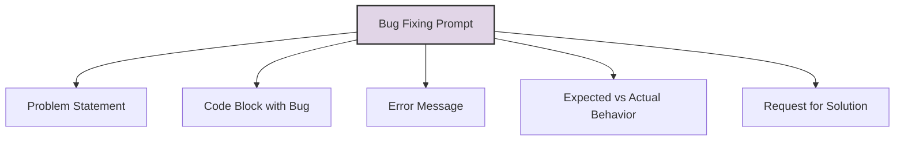
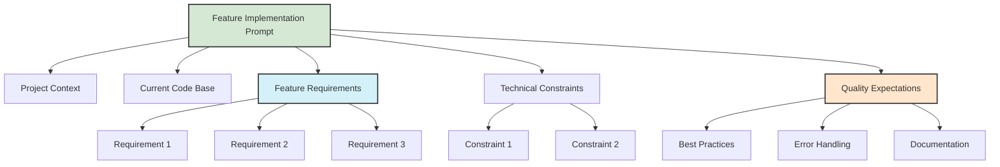
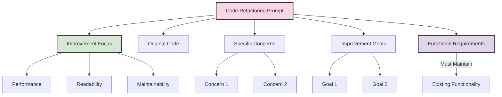
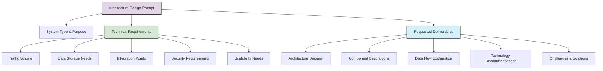
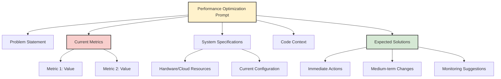
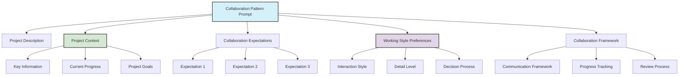

# Effective Prompt Templates for Vibe Coding

This document provides reusable prompt templates for common Vibe Coding tasks, organized by complexity level and purpose.

## Prompt Template Structure

Effective prompts follow a consistent structure that provides necessary context and clear requests:

## Basic Prompt Templates

### Project Initialization Template

**Example Fields:**
- **Project Type**: Web app, CLI tool, data analysis script
- **Framework**: React, Django, Flask, Express
- **Main Functionality**: User authentication, data visualization, API integration
- **Requirements**: Responsive design, offline support, accessibility features
- **Deliverables**: Folder structure diagram, configuration files, README content

### Code Explanation Template

**Example Request:** "Explain this authentication middleware function in simple terms, focusing on the JWT verification process and security implications."

### Bug Fixing Template

**Key Elements:**
- **Problem Statement**: Clear description of the issue
- **Code Context**: Relevant code section with sufficient context
- **Error Details**: Exact error messages or unexpected outputs
- **Behavior Comparison**: What should happen vs. what actually happens
- **Solution Request**: Specific help needed (identify cause, suggest fix, explain solution)

## Intermediate Prompt Templates

### Feature Implementation Template

**Template Structure:**

1. **Introduction**: Brief description of the project and its current state
2. **Feature Need**: Clear description of the feature to be implemented
3. **Current Context**: Relevant existing code snippets
4. **Requirements List**: Numbered list of specific requirements
5. **Constraints**: Technical limitations or compatibility requirements
6. **Quality Standards**: Expectations for the implementation quality

### Code Refactoring Template

**Refactoring Focus Areas:**

- **Performance**: Execution speed, memory usage, resource efficiency
- **Readability**: Clear variable names, consistent style, self-documenting
- **Maintainability**: Modular design, reduced complexity, separation of concerns
- **Specific Concerns**: Identified issues like duplicate code or complex conditions
- **Improvement Goals**: Quantifiable targets like "reduce function length by 50%"

## Advanced Prompt Templates

### Architecture Design Template

**Architecture Design Elements:**
- **System Purpose**: Clear definition of the system's main function
- **Technical Requirements**: Specific metrics and constraints
- **Integration Context**: External systems and APIs
- **Expected Deliverables**: Defined artifacts to be produced

### Performance Optimization Template

**Optimization Components:**
- **Baseline Metrics**: Current performance measurements
- **System Context**: Hardware, software, and configuration details
- **Problem Conditions**: When and how issues occur
- **Solution Timeframes**: Short-term fixes vs architectural improvements
- **Monitoring Strategy**: How to verify improvements

### AI Collaboration Pattern Template

**Effective Collaboration Setup:**
- **Project Context**: The what, why, and current state
- **Clear Expectations**: Specific roles and deliverables
- **Working Style**: Communication preferences and decision processes
- **Process Framework**: How progress will be tracked and reviewed
