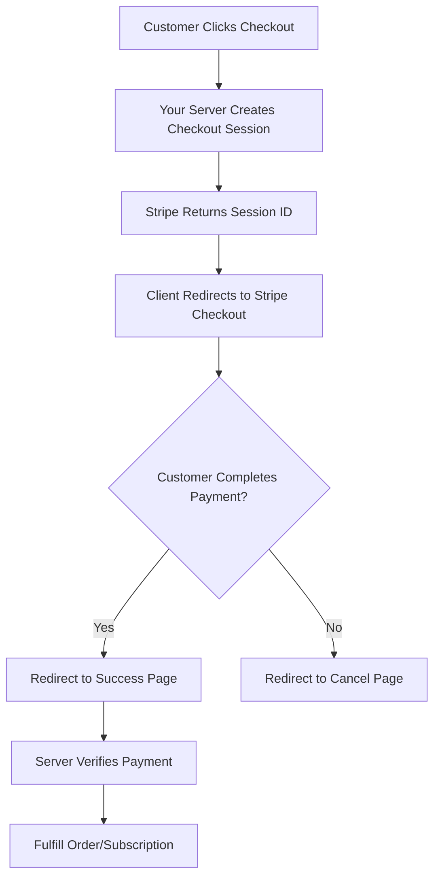
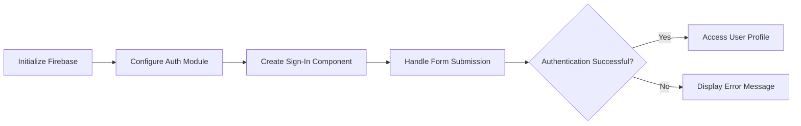
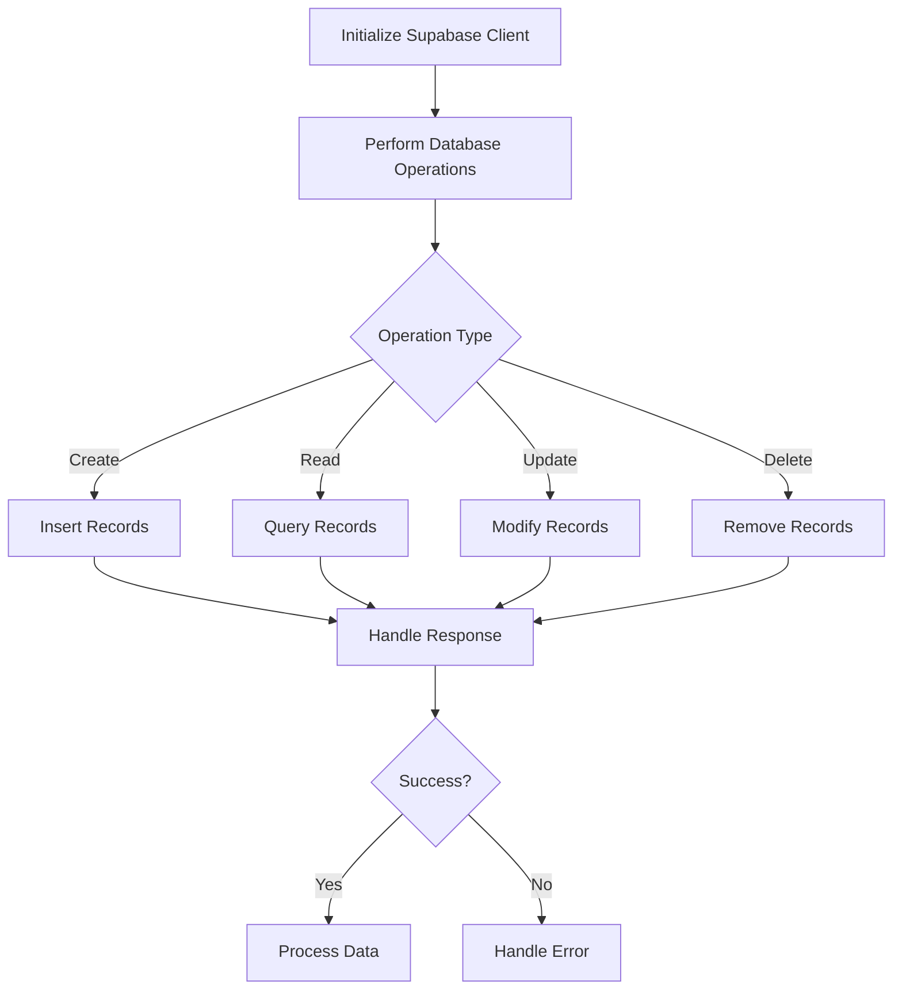
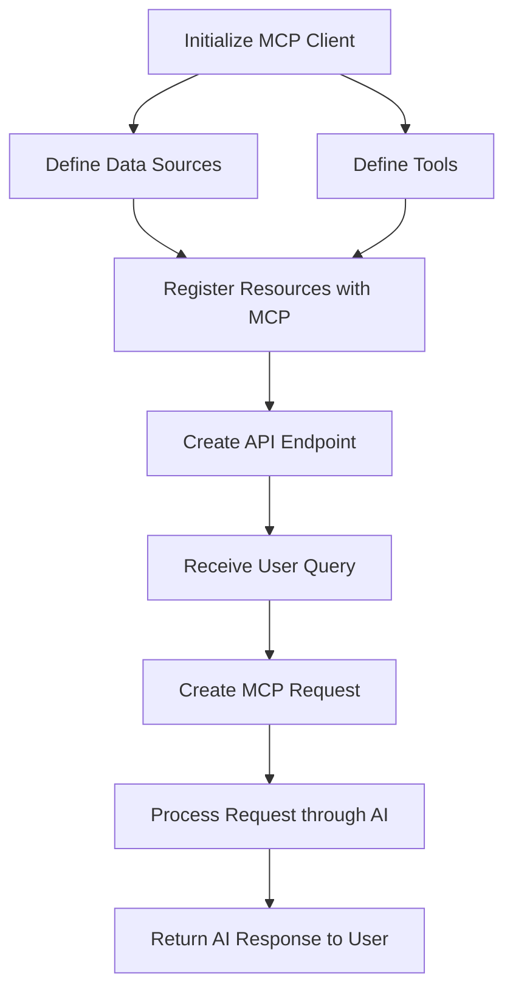

# Essential Third-Party Services for Modern App Development

This resource covers key third-party services, APIs, and protocols that will help you build robust applications for your capstone project. These services provide pre-built functionality that allows you to focus on your core application features rather than reinventing the wheel.

## Payment Processing Services

### Stripe

[Stripe](https://stripe.com/) is the industry standard for payment processing, offering:

- **Complete Payment Infrastructure**: Accept credit cards, digital wallets, and local payment methods
- **Subscription Management**: Recurring billing with smart retry logic
- **Fraud Prevention**: Advanced tools to detect and prevent fraudulent transactions
- **Developer-First API**: Clean, well-documented API with SDKs for all major languages
- **Checkout Components**: Pre-built UI components for payments

**Integration Flow**:

The Stripe integration process typically follows these steps:



**Server-side Implementation**:
On your server, you would create a checkout session by providing details like:
- Payment methods to accept (credit cards, etc.)
- Line items with product information and pricing
- Subscription mode for recurring payments
- Success and cancel URLs for redirection after payment

The server then returns a session ID to the client.
```

**Client-side Implementation**:
On the frontend, your application needs to:
1. Initialize the Stripe client with your publishable key
2. Handle checkout button clicks
3. Request a checkout session from your server
4. Redirect the user to Stripe's hosted checkout page

This approach keeps sensitive payment details off your servers, as customers enter their payment information directly on Stripe's secure checkout page.
```

### PayPal

[PayPal](https://developer.paypal.com/) offers an alternative payment solution with:

- **Global Reach**: Access to PayPal's large user base
- **Express Checkout**: One-click purchasing for PayPal account holders
- **Subscription Plans**: Recurring payment capabilities
- **Comprehensive API**: Well-documented developer resources

## Backend-as-a-Service (BaaS) Platforms

### Firebase

[Firebase](https://firebase.google.com/) is Google's comprehensive app development platform offering:

- **Realtime Database**: Store and sync data in real-time
- **Authentication**: User authentication with multiple providers (email/password, Google, Facebook, etc.)
- **Cloud Functions**: Serverless functions for backend logic
- **Storage**: File storage for user-generated content
- **Hosting**: Deploy web applications with a global CDN
- **Analytics**: Understand user behavior

**Firebase Authentication Integration**:



**Implementation Process**:

1. **Firebase Configuration**:
   - Initialize Firebase with your project configuration
   - Keep sensitive keys in environment variables
   - Set up the authentication module

2. **User Interface**:
   - Create form components for user inputs (email/password)
   - Implement state management for form fields
   - Add validation for user inputs

3. **Authentication Logic**:
   - Handle form submission events
   - Call Firebase authentication methods
   - Process successful sign-ins by storing user information
   - Handle authentication errors with appropriate user feedback

This approach provides a secure, managed authentication system without having to build authentication infrastructure from scratch.
```

### Supabase

[Supabase](https://supabase.com/) is an open-source Firebase alternative with:

- **PostgreSQL Database**: Built on top of PostgreSQL for powerful querying
- **Authentication**: Secure user management
- **Storage API**: Store and serve large files
- **Instant APIs**: Automatically generated RESTful APIs
- **Realtime Subscriptions**: Listen to database changes in real-time

**Integration Example**:
**Supabase Data Operations**:



**Supabase Implementation Process**:

1. **Client Setup**:
   - Create a Supabase client with your project URL and API key
   - Store sensitive credentials in environment variables

2. **Data Operations**:
   - **Create**: Insert new records into tables with appropriate fields
   - **Read**: Query data with filters, sorting, and pagination
   - **Update**: Modify existing records based on conditions
   - **Delete**: Remove records from the database

3. **Response Handling**:
   - Extract returned data from successful operations
   - Catch and handle errors appropriately
   - Display feedback to users based on operation results

Supabase provides a straightforward, SQL-like interface that makes database operations intuitive for developers familiar with relational databases.
```

## AI Integration Protocols

### Model Context Protocol (MCP)

[Model Context Protocol (MCP)](https://modelcontextprotocol.io/) is an open standard protocol that enables AI models to interact with external tools and services:

- **Standardized Context Flow**: Unified way for applications to provide context to LLMs
- **Tool Usage**: Enables AI assistants to use external tools and APIs
- **Structured Output**: Standardizes how AI responses are structured
- **Security Boundaries**: Ensures safe interaction between AI models and external systems

**Implementation Example**:
**Model Context Protocol (MCP) Integration**:



**MCP Implementation Process**:

1. **Setup and Configuration**:
   - Initialize the MCP client with your AI provider's API key
   - Configure the language model to use
   - Set up appropriate security measures

2. **Define Resources**:
   - **Data Sources**: Create connectors to your databases or data APIs
     - Provide descriptive names and clear purposes
     - Implement fetch functions to retrieve relevant data
   - **Tools**: Define executable functions the AI can call
     - Specify required parameters with types and descriptions
     - Implement execution logic for each tool

3. **Resource Registration**:
   - Register all data sources and tools with the MCP system
   - Ensure proper error handling for each resource

4. **Query Processing**:
   - Create an endpoint to receive user queries
   - Build MCP requests with the query and relevant context
   - Process the request through the AI
   - Return structured responses to the user

MCP enables AI models to interact with your systems in a controlled, secure manner, allowing them to access data and perform actions through well-defined interfaces.
```

### LangChain

[LangChain](https://js.langchain.com/) is a framework for developing applications powered by language models:

- **Chains**: Combine multiple components for complex workflows
- **Agents**: Create AI systems that can use tools to accomplish tasks
- **Memory**: Manage conversation history and context
- **Document Loaders**: Access data from various sources
- **Vector Stores**: Efficiently store and retrieve embeddings for semantic search

## Authentication Services

### Auth0

[Auth0](https://auth0.com/) provides comprehensive identity management:

- **Universal Authentication**: Support for various identity providers
- **Single Sign-On**: Seamless authentication across applications
- **Multi-factor Authentication**: Enhanced security options
- **User Management**: Tools for managing user accounts and profiles

### Clerk

[Clerk](https://clerk.dev/) offers modern authentication and user management:

- **Pre-built Components**: Ready-to-use UI components
- **Customizable Flows**: Adaptable to your application's needs
- **Multi-session Support**: Multiple accounts signed in simultaneously
- **Device Management**: Control user sessions across devices

## Cloud Hosting and Infrastructure

### Vercel

[Vercel](https://vercel.com/) specializes in frontend and fullstack deployment:

- **Frontend Focus**: Optimized for React, Next.js, Vue, and more
- **Serverless Functions**: Backend logic without managing servers
- **Global CDN**: Fast content delivery worldwide
- **Preview Deployments**: Automatic deployment previews for pull requests

### Netlify

[Netlify](https://www.netlify.com/) provides a complete platform for web projects:

- **Continuous Deployment**: Automated builds from Git
- **Serverless Functions**: Backend capabilities with Functions
- **Forms Processing**: Built-in form handling
- **Identity Service**: User authentication and management

### Railway

[Railway](https://railway.app/) offers a simpler approach to deploying full stack applications:

- **Streamlined Deployment**: Deploy with minimal configuration
- **Database Support**: PostgreSQL, MySQL, MongoDB, and Redis
- **Private Networking**: Secure communication between services
- **Autoscaling**: Handles increased traffic automatically

## Data and Analytics

### MongoDB Atlas

[MongoDB Atlas](https://www.mongodb.com/atlas) is a fully managed cloud database service:

- **Flexible Schema**: Document-based database for modern applications
- **Global Clusters**: Distribute data worldwide for low-latency access
- **Search Capabilities**: Full-text search integration
- **Data Visualization**: Charts and dashboards

### Algolia

[Algolia](https://www.algolia.com/) provides search-as-a-service:

- **Lightning-Fast Search**: Millisecond search response times
- **Typo Tolerance**: Understands user intent despite typing errors
- **Personalization**: Tailors results to user behavior
- **Analytics**: Insights into search patterns

## Content Delivery

### Cloudinary

[Cloudinary](https://cloudinary.com/) specializes in image and video management:

- **Dynamic Transformations**: Resize, crop, and optimize media on-the-fly
- **Automatic Optimization**: Serve images in the best format and size
- **Video Processing**: Edit and deliver video content
- **AI Capabilities**: Automatic tagging and content recognition

### Sanity

[Sanity](https://www.sanity.io/) is a headless CMS for structured content:

- **Real-time Collaboration**: Multiple editors working simultaneously
- **Customizable Content Studio**: Tailor the editing experience
- **Content Lake**: APIs for accessing your structured content
- **GROQ Query Language**: Powerful queries for content retrieval

## Integration Best Practices

When incorporating third-party services into your capstone project, follow these best practices:

1. **Security First**:
   - Never expose API keys in client-side code
   - Use environment variables for sensitive credentials
   - Implement proper authentication and authorization

2. **Error Handling**:
   - Gracefully handle service outages and failures
   - Implement retry mechanisms for transient errors
   - Provide meaningful feedback to users when services are unavailable

3. **Performance Optimization**:
   - Minimize unnecessary API calls
   - Implement caching where appropriate
   - Use connection pooling for database services

4. **Cost Management**:
   - Understand the pricing model of each service
   - Set up usage alerts to avoid unexpected charges
   - Consider implementing throttling for high-volume operations

5. **Documentation**:
   - Document all third-party integrations in your project
   - Include setup instructions for other developers
   - Note any limitations or constraints of the services

Remember that incorporating these services into your capstone project will demonstrate your ability to leverage existing tools while focusing on building unique features that make your application stand out.

---

*This resource is intended for advanced and ninja-level students who are ready to integrate professional-grade services into their applications.*
