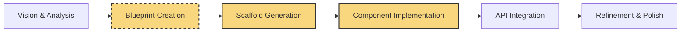

#  BUILDING REAL PROJECTS

<i>"From Blueprint to Implementation: Mastering Project Development with AI Assistance"</i>

---

## 🚀 Chapter Overview

Chapter 3 focuses on the essential process of building real-world projects using AI assistance, with special emphasis on **blueprint creation before coding**. We explore how proper planning and scaffolding are the foundation of successful development. You'll learn a systematic approach to transform concepts into well-structured applications through effective collaboration with AI, ensuring your projects are built on solid architectural foundations.

---

## 📚 What You'll Learn

- **Planning Methods**: Mind mapping, MVP definition, and avoiding over-engineering
- **Blueprint Creation**: Developing comprehensive project blueprints before writing any code
- **Project Scaffolding**: Using AI to generate solid architectural foundations
- **Component Design**: Crafting detailed component specifications for AI implementation
- **Iterative Refinement**: Systematically improving AI-generated code through targeted prompts
- **Advanced UI Patterns**: Implementing sophisticated user interfaces with AI assistance
- **API Integration**: Connecting frontends to backends effectively with AI collaboration

---

## 🎯 Target Audience

This chapter comes in three versions tailored to different experience levels:

<table>
  <tr>
    <td align="center"><b><a href="./Chapter_03_Beginner.md">🌱 BEGINNER</a></b></td>
    <td>For newcomers ready to build their first complete application, with guided examples and explanations focused on understanding the end-to-end process with AI assistance.</td>
  </tr>
  <tr>
    <td align="center"><b><a href="./Chapter_03_Advanced.md">🔧 ADVANCED</a></b></td>
    <td>For professional developers creating commercial applications, with emphasis on code quality, performance, and maintainability in collaborative AI-human workflows.</td>
  </tr>
  <tr>
    <td align="center"><b><a href="./Chapter_03_Ninja.md">⚡ NINJA</a></b></td>
    <td>For experts creating innovative, cutting-edge systems that push the boundaries of human-AI collaboration, including custom toolchains and advanced optimization techniques.</td>
  </tr>
</table>

---

## 🏗️ Blueprint-First Development Process

  <table>
    <tr>
      <td align="center" width="20%"><b>1. Planning Methods</b></td>
      <td align="center" width="20%"><b>2. Vision & Analysis</b></td>
      <td align="center" width="20%"><b>3. Blueprint Creation</b></td>
      <td align="center" width="20%"><b>4. AI-Assisted Scaffolding</b></td>
      <td align="center" width="20%"><b>5. Iterative Implementation</b></td>
    </tr>
    <tr>
      <td>Apply mind mapping, define MVP scope, and use proper diagramming to avoid over-engineering.</td>
      <td>Analyze existing applications and define your project vision with clear requirements and specifications.</td>
      <td>Create detailed blueprints including architecture diagrams, component structures, and interaction flows before any coding.</td>
      <td>Use well-crafted prompts to have AI generate the initial project structure based on your blueprint.</td>
      <td>Implement components through iterative prompting, continuously refining the code based on blueprint specifications.</td>
    </tr>
  </table>

---

## ⚙️ Blueprint-to-Code Translation

This chapter explores how to effectively translate your blueprints into working code:

⚠️ <b>BLUEPRINT FIRST, CODE SECOND</b> ⚠️

---

## 📊 Planning and Blueprint Best Practices

<table>
  <tr>
    <td width="33%">
      <h3>Planning Methodologies</h3>
      <ul>
        <li><b>Mind Mapping</b>: Non-linear idea exploration</li>
        <li><b>MVP Definition</b>: Core value with must-have features</li>
        <li><b>Mermaid Diagrams</b>: Visual relationship mapping</li>
        <li><b>Simplicity Principles</b>: Avoiding over-engineering</li>
      </ul>
    </td>
    <td width="33%">
      <h3>Effective Blueprint Components</h3>
      <ul>
        <li><b>Visual Mockups</b>: Design representations of UI elements</li>
        <li><b>Component Hierarchies</b>: Structural relationships</li>
        <li><b>State Management Plans</b>: Data flow patterns</li>
        <li><b>API Specifications</b>: Endpoint details and data structures</li>
      </ul>
    </td>
    <td width="33%">
      <h3>Blueprint-to-Prompt Strategies</h3>
      <ul>
        <li><b>Component Templates</b>: Standardized prompt structures</li>
        <li><b>Progressive Detail</b>: Increasing specificity in iterations</li>
        <li><b>Visual-to-Code Translation</b>: Converting designs to components</li>
        <li><b>Constraint Definition</b>: Clearly articulated limitations</li>
      </ul>
    </td>
  </tr>
</table>

---

## 🛠️ Blueprint Implementation Techniques

- **Scaffolding Strategies**: Converting high-level blueprints to initial project structures
- **Component Prompt Templates**: Standardized frameworks for requesting components based on blueprints
- **API Integration Patterns**: Blueprint-aligned approaches for connecting to backend services
- **Visual-to-Code Translation**: Converting design mockups into functional components
- **Refinement Workflows**: Systematic approaches to iteratively improving AI-generated code
- **Blueprint Validation**: Ensuring implemented code matches the original architectural vision

---

