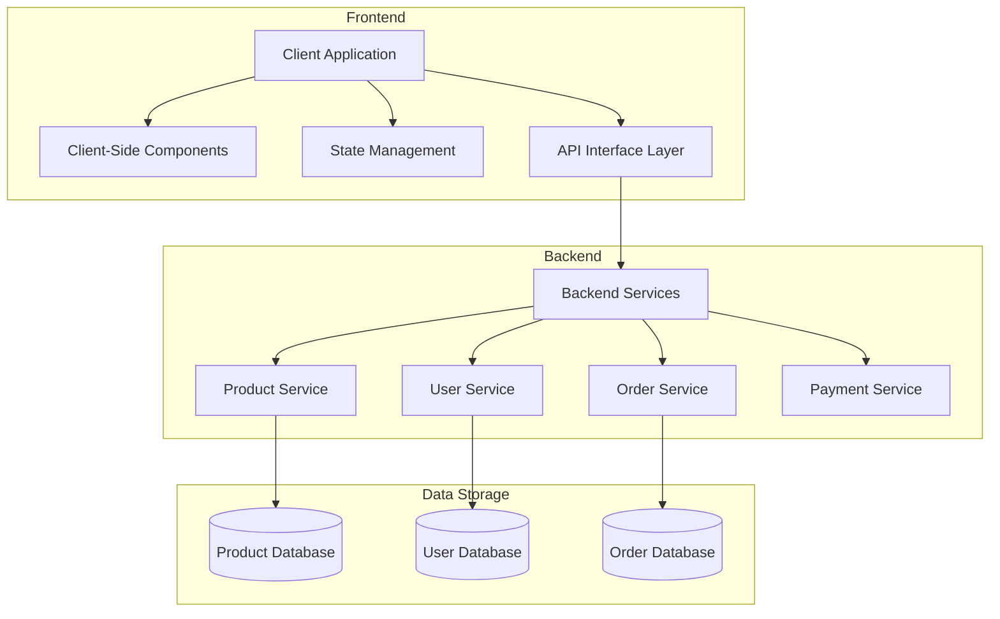

# Project Blueprint: E-Commerce Platform

## 1. Project Vision

A modern e-commerce platform that provides an exceptional shopping experience with personalized recommendations, seamless checkout processes, and comprehensive inventory management for administrators.

## 2. Core Objectives

- Create an intuitive, responsive online shopping experience
- Implement secure payment processing and user account management
- Provide robust product search, filtering, and recommendation features
- Build comprehensive admin tools for inventory and order management
- Ensure scalability to handle growing product catalogs and user traffic

## 3. Architecture Overview



## 4. Data Models

### Product Model
```typescript
interface Product {
  id: string;
  name: string;
  description: string;
  price: number;
  discountPrice?: number;
  categories: string[];
  tags: string[];
  images: string[];
  inventory: {
    sku: string;
    inStock: number;
    variants: ProductVariant[];
  };
  specifications: Record<string, string>;
  ratings: {
    average: number;
    count: number;
  };
  createdAt: Date;
  updatedAt: Date;
}

interface ProductVariant {
  id: string;
  attributes: Record<string, string>; // e.g., {"color": "red", "size": "XL"}
  price?: number; // Override base price if needed
  sku: string;
  inStock: number;
  images?: string[];
}
```

### User Model
```typescript
interface User {
  id: string;
  email: string;
  name: {
    first: string;
    last: string;
  };
  addresses: Address[];
  paymentMethods: PaymentMethod[];
  orderHistory: Order[];
  wishlist: string[]; // Product IDs
  cart: CartItem[];
  preferences: {
    theme: 'light' | 'dark';
    notifications: boolean;
    currency: string;
  };
  createdAt: Date;
  updatedAt: Date;
}

interface Address {
  id: string;
  type: 'billing' | 'shipping';
  isDefault: boolean;
  street: string;
  city: string;
  state: string;
  postalCode: string;
  country: string;
  phone: string;
}

interface PaymentMethod {
  id: string;
  type: 'credit_card' | 'paypal' | 'other';
  isDefault: boolean;
  lastFour?: string; // For credit cards
  expiryDate?: string; // For credit cards
  providerDetails: Record<string, any>; // Provider-specific information
}

interface CartItem {
  productId: string;
  variantId?: string;
  quantity: number;
  addedAt: Date;
}
```

### Order Model
```typescript
interface Order {
  id: string;
  userId: string;
  items: OrderItem[];
  shipping: {
    method: string;
    address: Address;
    trackingNumber?: string;
    estimatedDelivery?: Date;
  };
  payment: {
    method: PaymentMethod;
    total: number;
    currency: string;
    status: 'pending' | 'paid' | 'failed' | 'refunded';
    transactionId?: string;
  };
  status: 'created' | 'processing' | 'shipped' | 'delivered' | 'cancelled';
  createdAt: Date;
  updatedAt: Date;
}

interface OrderItem {
  productId: string;
  variantId?: string;
  name: string;
  price: number;
  quantity: number;
  total: number;
}
```

## 5. Component Structure

### Component Hierarchy
```
ECommerceApp
├── Header
│   ├── Logo
│   ├── SearchBar
│   ├── NavigationMenu
│   ├── UserMenu
│   └── CartIcon
├── HomePage
│   ├── HeroBanner
│   ├── FeaturedProducts
│   ├── PromotionSection
│   └── CategoryNavigation
├── ProductListPage
│   ├── FilterSidebar
│   │   ├── CategoryFilter
│   │   ├── PriceRangeFilter
│   │   └── AttributeFilters
│   ├── ProductGrid
│   │   └── ProductCard
│   └── Pagination
├── ProductDetailPage
│   ├── ProductGallery
│   ├── ProductInfo
│   │   ├── ProductTitle
│   │   ├── PriceDisplay
│   │   ├── VariantSelector
│   │   ├── QuantitySelector
│   │   └── AddToCartButton
│   ├── ProductDescription
│   ├── ProductSpecifications
│   ├── RelatedProducts
│   └── ReviewSection
├── CartPage
│   ├── CartItemList
│   │   └── CartItem
│   ├── CartSummary
│   └── CheckoutButton
├── CheckoutPage
│   ├── ShippingAddressForm
│   ├── PaymentMethodForm
│   ├── OrderSummary
│   └── PlaceOrderButton
├── UserAccountPage
│   ├── AccountNavigation
│   ├── OrderHistory
│   ├── AddressBook
│   ├── PaymentMethods
│   └── AccountSettings
└── Footer
    ├── SiteLinks
    ├── SocialMediaLinks
    ├── NewsletterSignup
    └── Copyright
```

## 6. User Interface Mockups

### Product List Page
```
+-------------------------------------------+
| SHOP NAME      [Search]   [Account] [Cart]|
+-------------------------------------------+
| Home > Categories > Electronics           |
+-------------------------------------------+
| FILTERS        |                          |
|                | Sort by: Relevance  [v]  |
| Categories     |                          |
| [x] Electronics| +-------------------+    |
| [ ] Clothing   | | Product Name      |    |
| [ ] Home       | | $99.99            |    |
|                | | ★★★★☆ (42)        |    |
| Price          | | [Add to Cart]     |    |
| $_____ to $____| +-------------------+    |
|                |                          |
| Brand          | +-------------------+    |
| [ ] Apple      | | Product Name      |    |
| [ ] Samsung    | | $149.99           |    |
| [ ] Sony       | | ★★★★★ (18)        |    |
|                | | [Add to Cart]     |    |
| Rating         | +-------------------+    |
| [ ] ★★★★★      |                          |
| [ ] ★★★★☆      | +-------------------+    |
| [ ] ★★★☆☆      | | Product Name      |    |
|                | | $79.99 $59.99     |    |
| [Apply Filters]| | ★★★☆☆ (7)         |    |
|                | | [Add to Cart]     |    |
+----------------+-------------------+------+
|       < 1 2 3 ... 10 >                    |
+-------------------------------------------+
```

### Product Detail Page
```
+-------------------------------------------+
| SHOP NAME      [Search]   [Account] [Cart]|
+-------------------------------------------+
| Home > Electronics > Smartphones          |
+-------------------------------------------+
|  +-------------+  | Smartphone X2000     |
|  |             |  | $899.99              |
|  |    Image    |  | ★★★★★ (126 reviews)  |
|  |             |  |                      |
|  +-------------+  | Color:               |
|                   | [Black] [Silver] [Gold]|
|  +---- +---- +    |                      |
|  |Thumb|Thumb|    | Storage:             |
|  +---- +---- +    | [64GB] [128GB] [256GB]|
|                   |                      |
|                   | Quantity: [1 ▼]      |
|                   |                      |
|                   | [Add to Cart]        |
|                   | [Add to Wishlist]    |
|                   |                      |
+-------------------+----------------------+
| Product Description                       |
|                                           |
| The X2000 features our most advanced...   |
+-------------------------------------------+
| Specifications                            |
|                                           |
| Display: 6.7" OLED                        |
| Processor: A16 Bionic                     |
| Battery: 4,500 mAh                        |
| Camera: 48MP triple lens                  |
+-------------------------------------------+
| Customer Reviews                          |
|                                           |
| ★★★★★ John D. - Great phone with...       |
| ★★★★☆ Sarah M. - Love the camera but...   |
+-------------------------------------------+
| You May Also Like                         |
|                                           |
| [Product] [Product] [Product] [Product]   |
+-------------------------------------------+
```

## 7. State Management

```
AppState
├── User
│   ├── currentUser
│   ├── authStatus
│   ├── cart
│   └── wishlist
├── Products
│   ├── productList
│   ├── currentProduct
│   ├── filteredProducts
│   ├── searchResults
│   └── relatedProducts
├── Orders
│   ├── currentOrder
│   ├── orderHistory
│   └── checkoutStatus
├── UI
│   ├── currentView
│   ├── theme
│   ├── modals
│   └── notifications
└── API
    ├── loadingStatus
    └── errorMessages
```

## 8. API Endpoints

| Endpoint | Method | Description | Request Body | Response |
|----------|--------|-------------|-------------|----------|
| /products | GET | Get filtered products | Query params | `{ products: Product[], total: number, pages: number }` |
| /products/:id | GET | Get single product | N/A | `Product` |
| /products/search | GET | Search products | Query params | `{ products: Product[], total: number }` |
| /products/recommended | GET | Get recommendations | Query params | `Product[]` |
| /users/me | GET | Get current user | N/A | `User` |
| /users/me | PUT | Update user info | `Partial<User>` | `User` |
| /cart | GET | Get user cart | N/A | `CartItem[]` |
| /cart | POST | Add to cart | `{ productId, variantId, quantity }` | `CartItem[]` |
| /cart/:itemId | PUT | Update cart item | `{ quantity }` | `CartItem[]` |
| /cart/:itemId | DELETE | Remove from cart | N/A | `CartItem[]` |
| /orders | POST | Create order | `{ shipping, payment }` | `Order` |
| /orders | GET | Get user orders | Query params | `Order[]` |
| /orders/:id | GET | Get order details | N/A | `Order` |
| /checkout/process | POST | Process payment | `{ orderId, paymentDetails }` | `{ success, transactionId, order }` |

## 9. Component Specifications

### ProductCard Component

**Purpose:** Display a concise product preview with essential information and quick actions.

**Props:**
```typescript
interface ProductCardProps {
  product: Product;
  onAddToCart: (productId: string, quantity?: number) => void;
  onAddToWishlist: (productId: string) => void;
  onClick: (productId: string) => void;
  layout?: 'grid' | 'list';
  showRating?: boolean;
  showDescription?: boolean;
  isInWishlist?: boolean;
}
```

**Visual Requirements:**
- Product image as primary focal point
- Clear display of product name and price
- Visual treatment for discounted prices (show original and new price)
- Star rating visualization
- "Add to Cart" and "Add to Wishlist" action buttons
- Visual indicator for low stock items
- "New" badge for recently added products
- Support for both grid and list layouts

**Behavior:**
- Hover effect with subtle elevation and action button emphasis
- Image lazy loading for performance
- Click on card navigates to product detail page
- "Add to Cart" adds default variant with quantity of 1
- "Add to Wishlist" toggles wishlist status
- Price formatting based on user's selected currency

### CartItem Component

**Purpose:** Display and manage a product in the shopping cart.

**Props:**
```typescript
interface CartItemProps {
  item: CartItem & { product: Product; variant?: ProductVariant };
  onUpdateQuantity: (itemId: string, newQuantity: number) => void;
  onRemove: (itemId: string) => void;
  onSaveForLater: (itemId: string) => void;
  disabled?: boolean;
}
```

**Visual Requirements:**
- Product thumbnail image
- Product name with variant information
- Unit price and total price (quantity × price)
- Quantity selector
- Remove and "Save for Later" actions
- Compact layout that scales well for mobile

**Behavior:**
- Quantity selector prevents invalid inputs (below 1 or above available stock)
- Update quantity debounced to prevent rapid API calls
- Visual feedback when updating or removing
- Disabled state for checkout processing

## 10. Implementation Strategy

1. **Phase 1: Foundation**
   - Set up project with Next.js or similar framework
   - Configure TypeScript and build tools
   - Create core component library with design system
   - Implement basic layout and navigation

2. **Phase 2: Product Catalog**
   - Build product list and filtering
   - Create detailed product page
   - Implement search functionality
   - Add category navigation

3. **Phase 3: User Features**
   - Build user authentication
   - Create account management pages
   - Implement wishlist functionality
   - Build shopping cart management

4. **Phase 4: Checkout Process**
   - Create checkout flow
   - Implement address and payment forms
   - Add order summary
   - Integrate with payment processor

5. **Phase 5: Admin Features**
   - Build product management interface
   - Create order management system
   - Implement inventory tracking
   - Add analytics dashboard

6. **Phase 6: Enhancements**
   - Add recommendation engine
   - Implement performance optimizations
   - Add advanced search features
   - Create promotional tools

## 11. Testing Strategy

- **Unit Tests:** Test individual components and utility functions
- **Integration Tests:** Test interaction between components and API
- **E2E Tests:** Simulate complete user journeys (browsing, adding to cart, checkout)
- **Performance Tests:** Measure load time, Time to Interactive, bundle size
- **Accessibility Tests:** Ensure WCAG 2.1 AA compliance
- **Security Tests:** Test authentication, authorization, and input validation

## 12. Deployment Considerations

- Implement CI/CD pipeline with staging environment
- Configure CDN for static assets
- Set up database backups and failover
- Implement monitoring for performance and errors
- Plan for scaling during high traffic events
- Configure security headers and CORS policies

---

This blueprint provides a comprehensive foundation for developing an e-commerce platform. By starting with this detailed plan before any code is written, developers can leverage AI assistance effectively while maintaining a cohesive architecture and user experience.
