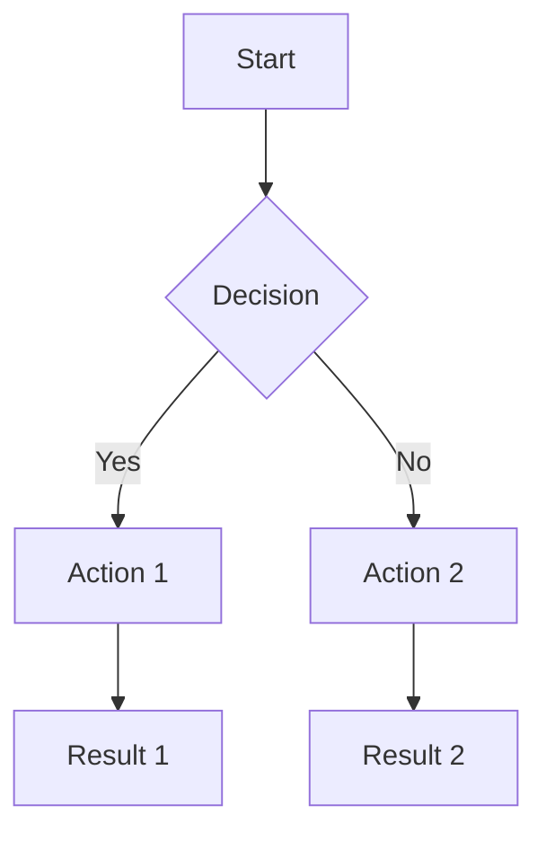

# Planning Methods for Effective Project Development

## 1. Mind Mapping for Project Ideation

Mind mapping is a powerful technique for organizing thoughts and exploring ideas before creating formal blueprints. It allows for non-linear thinking and helps capture relationships between concepts.

### How to Create an Effective Mind Map:

1. **Start with a central concept** – Place your main project idea in the center
2. **Branch out with key categories** – Add major features or components as primary branches
3. **Add detail to each branch** – Expand with specific functionality, requirements, or questions
4. **Use colors and icons** – Visually distinguish different types of information
5. **Connect related elements** – Draw links between concepts that have relationships

### Mind Mapping Tools:
- **Paper and pen** – Quick, accessible, and distraction-free
- **Digital tools** – MindMeister, XMind, Miro, or Coggle
- **AI assistance** – Use AI to expand branches with relevant considerations

### Example: Task Manager App Mind Map

```
                     ┌────────────┐
                     │ Task       │
                     │ Manager App│
                     └─────┬──────┘
          ┌─────────────┬──┴───┬────────────┬─────────────┐
┌─────────▼────────┐┌───▼────┐│┌────▼─────┐│┌─────▼──────┐│┌─────▼─────┐
│User Experience   ││Data    ││ │Core     ││ │Technical ││ │Business   │
└┬────────────────┘└┬───────┘│ └┬─────────┘│ └┬─────────┘│ └┬──────────┘
 │                   │        │  │          │  │          │  │
 ├─►Task Creation    ├─►Models│  ├─►Task CRUD│  ├─►Stack   │  ├─►Pricing
 │                   │        │  │          │  │          │  │
 ├─►Task Organization├─►Storage│ ├─►Categories│ ├─►Security │ ├─►Marketing
 │                   │        │  │          │  │          │  │
 ├─►Notifications    ├─►Sync  │  ├─►Search  │  ├─►Hosting │  ├─►Timeline
 │                   │        │  │          │  │          │  │
 └─►Mobile Experience└─►Backup│  └─►Reports │  └─►API     │  └─►Resources
                     │        │             │             │
```

## 2. Mermaid Flow Charts & Diagrams

Mermaid is a markdown-based diagramming tool that allows developers to create various diagrams using a simple text syntax. It's particularly useful for documenting:

- Flow charts
- Sequence diagrams
- Class diagrams
- Entity-Relationship diagrams
- User journey maps

### Basic Mermaid Syntax:



### When to Use Different Diagram Types:

- **Flowcharts (graph)**: For visualizing processes and logic flows
- **Sequence diagrams**: For showing interactions between components over time
- **Class diagrams**: For modeling object-oriented structures
- **Entity-Relationship diagrams**: For database schema design
- **Gantt charts**: For project scheduling and timeline visualization

### Best Practices for Effective Diagrams:

1. **Keep it simple** – Aim for clarity over comprehensiveness
2. **Use consistent styling** – Maintain visual consistency for similar elements
3. **Add meaningful labels** – Make sure connections and nodes have clear labels
4. **Organize spatially** – Group related elements together
5. **Include a legend** – Explain any symbols or color coding used

## 3. Avoiding Over-Engineering

Over-engineering is a common pitfall where developers create unnecessarily complex solutions. Recognizing and avoiding this is crucial for efficient development.

### Warning Signs of Over-Engineering:

1. **Excessive abstraction** – Creating abstract classes and interfaces without clear need
2. **Premature optimization** – Optimizing for scenarios that may never occur
3. **Feature creep** – Adding "nice-to-have" features before core functionality is solid
4. **Framework obsession** – Using complex frameworks for simple problems
5. **Over-architecting** – Implementing complex patterns for straightforward use cases

### Strategies to Avoid Over-Engineering:

1. **Start with minimum viable architecture** – Begin with the simplest design that works
2. **Implement just-in-time** – Add complexity only when immediately needed
3. **Question each component** – Ask "What problem is this solving right now?"
4. **Use the rule of three** – Wait until you need something three times before abstracting
5. **Regularly refactor** – Simplify complex code as patterns emerge naturally

### Practical Exercise: Simplification Challenge

Take a proposed architecture and:
1. Identify components that could be deferred to later phases
2. Eliminate dependencies that aren't immediately necessary
3. Propose a simpler alternative that meets current needs

## 4. The MVP (Minimum Viable Product) Approach

An MVP is the version of a product with just enough features to be usable by early customers who can then provide feedback for future development.

### Core Principles of MVP:

1. **Focus on core value proposition** – Identify what makes your product uniquely valuable
2. **Ruthlessly prioritize features** – Only include what's absolutely necessary for launch
3. **Learn from real users quickly** – Get actual feedback rather than making assumptions
4. **Iterate based on data** – Use early feedback to guide next development phases
5. **Reduce time to market** – Launch sooner to start the feedback loop earlier

### MVP Planning Framework:

#### 1. Feature Categorization
Organize all potential features into these categories:
- **Must-Have**: Critical for the product to function and deliver core value
- **Should-Have**: Important but not critical for initial release
- **Could-Have**: Desirable but can be deferred
- **Won't-Have**: Explicitly decided not to include in this version

#### 2. User Story Mapping
Create a visual map showing:
- Key user activities across the top
- Tasks to accomplish each activity below
- MVP line drawn to indicate what's in/out of initial release

#### 3. Success Metrics
Define clear, measurable criteria for what constitutes a successful MVP:
- User adoption targets
- Engagement metrics
- Feedback quality
- Technical performance benchmarks

### Example: Task Manager MVP Definition

```
TASK MANAGER MVP

Core Value Proposition:
"Help users organize and track their personal tasks with a simple, intuitive interface."

Must-Have Features:
- User account creation and login
- Create, edit, and delete tasks
- Mark tasks as complete
- Basic task categorization
- Due date assignment and sorting
- Mobile-responsive design

Explicitly Not Included in MVP:
- Team collaboration features
- Advanced reporting
- Calendar integration
- Recurring tasks
- Notifications
- API for third-party integrations

Success Metrics:
- 100 active users within first month
- Average of 5 tasks created per user
- 70% of users return after first use
- 50% of tasks marked as complete
```

## 5. Integrating Planning Methods into AI Collaboration

When working with AI, effective planning is even more crucial. Here's how to integrate these planning methods into AI-assisted development:

### 1. Create Clear Blueprints Before Prompting

Use the planning techniques to create detailed specifications before asking AI to generate code:
- **Mind maps** to explore the problem space
- **Diagrams** to visualize architecture and flows
- **MVP definitions** to clarify scope boundaries

### 2. Structured Prompting Based on Plans

Develop prompts that clearly communicate your blueprint elements:
```
I'm building a task manager app with the following MVP features:
[Paste relevant section from MVP definition]

Here's the component structure:
[Paste relevant diagram]

Please help me implement the TaskList component which should:
[Paste specific requirements from blueprint]
```

### 3. Iterative Refinement Guided by Plans

When refining AI-generated code, reference your planning documents:
- "This doesn't match the data flow shown in my diagram, let's revise..."
- "Let's simplify this according to our MVP definition..."
- "According to our mind map, we need to also consider..."

### 4. Blueprint-First Checklist

Before starting any implementation with AI:
- ✅ Created a mind map of the problem space
- ✅ Defined clear MVP boundaries
- ✅ Sketched key user flows and interfaces
- ✅ Created architectural diagrams
- ✅ Identified potential over-engineering risks
- ✅ Prepared clear, specific prompts based on plans

## Practical Exercises

### Exercise 1: Mind Mapping Practice
Choose a simple application idea and create a comprehensive mind map exploring all aspects of it. Then identify which elements would be included in an MVP.

### Exercise 2: Blueprint Translation
Take a written project description and translate it into:
1. A mind map of key concepts
2. A Mermaid diagram showing component relationships
3. An MVP definition with feature categorization
4. A set of structured prompts for AI implementation

### Exercise 3: Over-Engineering Detection
Review the e-commerce blueprint in this chapter and identify three areas where it might be over-engineered for a first release. Propose simpler alternatives.

---

Remember: **The quality of your planning directly impacts the quality of AI-generated code**. Investing time in these planning methods will dramatically improve your results when collaborating with AI assistants.
