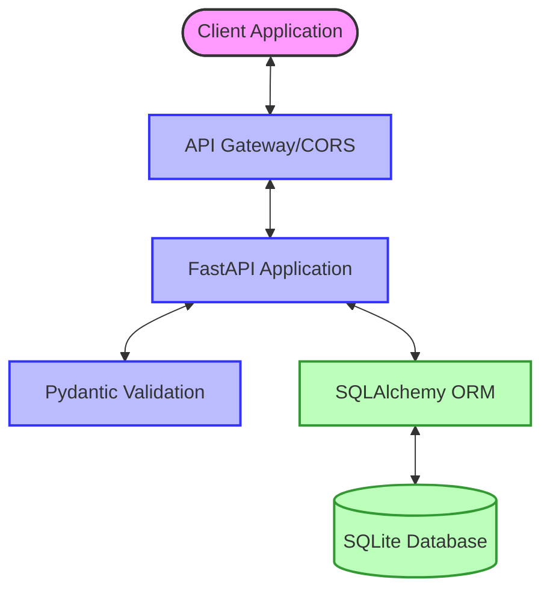
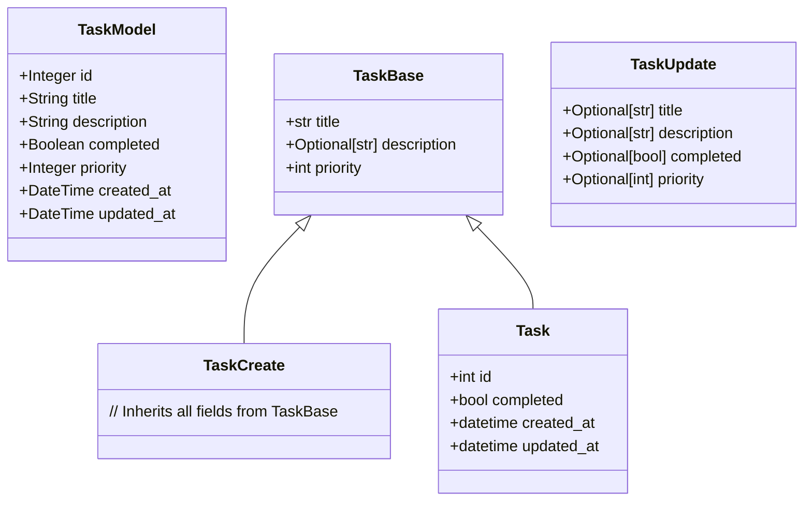
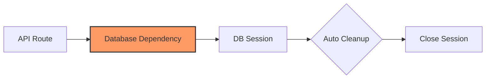
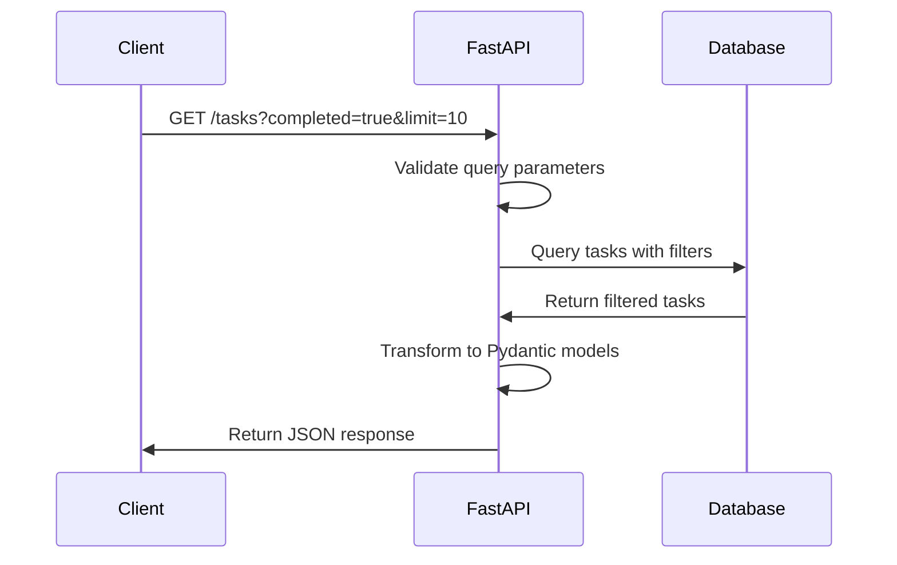
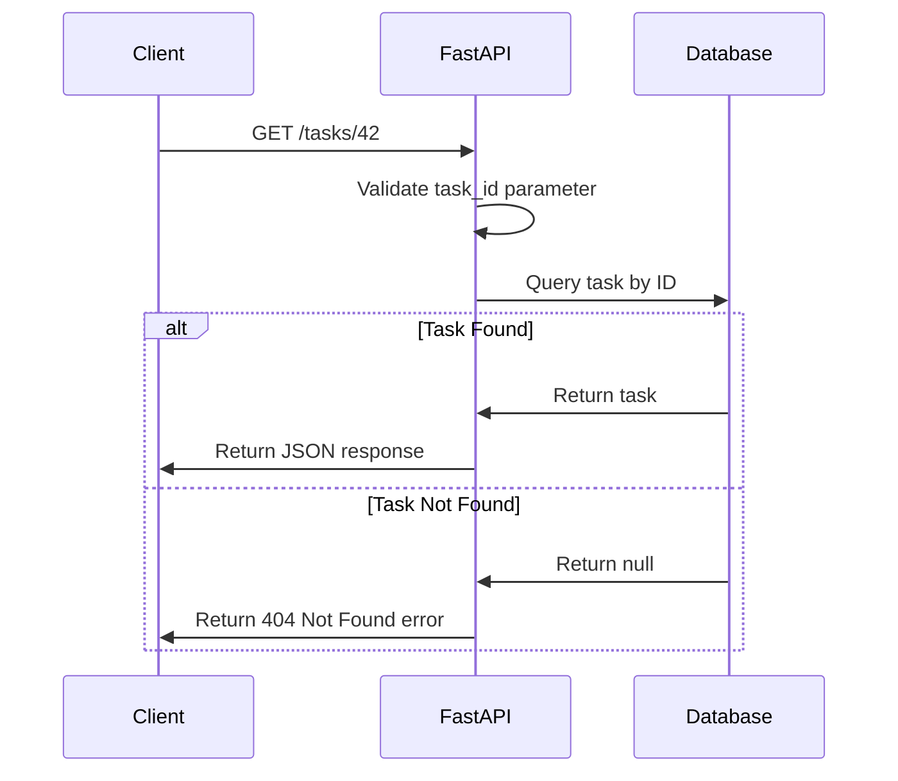
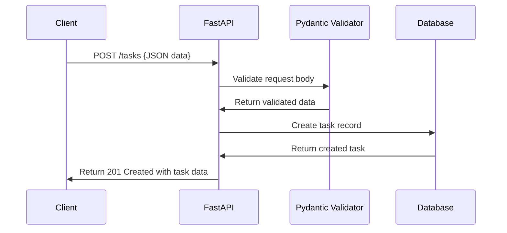
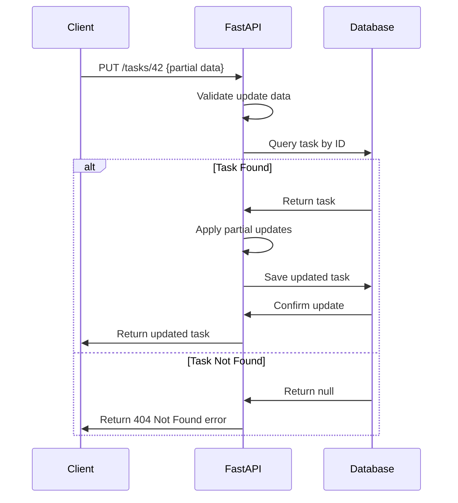
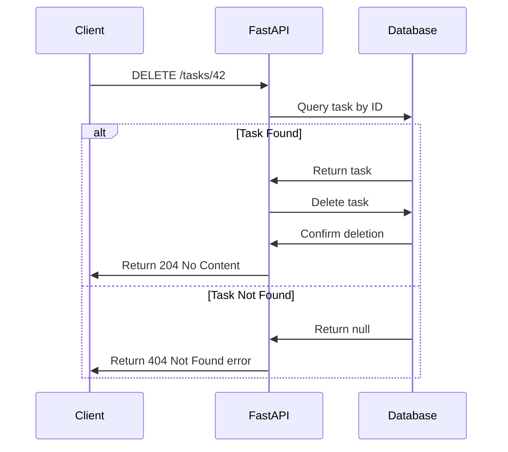
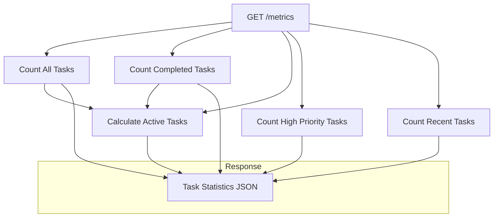
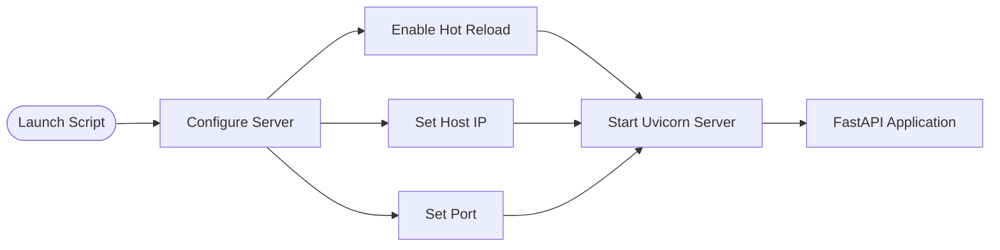

#!/usr/bin/env python3
"""
Title: Chapter 03 - Advanced Example: RESTful API Service
Description: A FastAPI-based RESTful API service with database integration
Chapter: 03 - Building Real Projects with AI Assistance
Skill Level: Advanced
"""

# This file demonstrates a modern API architecture using FastAPI and SQLAlchemy
# Below are diagrams and explanations of the system instead of actual code

## API Architecture Overview



## Database Configuration Approach

The application uses SQLAlchemy as an ORM (Object-Relational Mapper) with the following configuration approach:

1. **Connection Management**:
   - Environment variable-based database URL configuration
   - Fallback to SQLite for local development
   - Connection pooling with session management

## Data Models Visualization



## Data Modeling Strategy

1. **SQLAlchemy Models** - Database schema representation:
   - `TaskModel`: Database table definition with columns and constraints
   - Primary keys, indexes, and default values defined at the database level
   - Automatic timestamp management for created/updated times

2. **Pydantic Models** - API schema representation:
   - `TaskBase`: Common shared fields for tasks
   - `TaskCreate`: Input validation for creating tasks
   - `TaskUpdate`: Partial update support with optional fields
   - `Task`: Response model with all fields including database-generated ones
   - ORM mode enabled for automatic conversion between SQLAlchemy and Pydantic

## Dependency Injection Pattern



## FastAPI Application Configuration

1. **Dependency Injection**:
   - Automatic database session management
   - Context-managed session with guaranteed cleanup
   - Yielding pattern for dependency lifecycle control

2. **API Documentation**:
   - Auto-generated OpenAPI specifications
   - Interactive Swagger UI for testing
   - Clear metadata for API discovery

3. **Security Configuration**:
   - CORS middleware configuration
   - Cross-Origin Resource Sharing controls
   - Production-ready settings with configurable origins

## API Routing Strategy

```mermaid
flowchart TD
    subgraph Endpoints
        Root[GET /]-->Info[API Information]
        GetAll[GET /tasks]-->|Query parameters|FilteredList[Filtered Task List]
        GetOne[GET /tasks/{id}]-->SingleTask[Single Task Details]
        Create[POST /tasks]-->NewTask[Create Task]
        Update[PUT /tasks/{id}]-->UpdatedTask[Update Task]
        Delete[DELETE /tasks/{id}]-->RemoveTask[Remove Task]
        Metrics[GET /metrics]-->Stats[Task Statistics]
    end
    
    classDef root fill:#f9f,stroke:#333,stroke-width:2px
    class Root root
```

1. **Root Endpoint**:
   - Provides API information and metadata
   - Self-documenting with links to documentation
   - Entry point for API exploration

## Task Listing with Filtering



1. **Query Parameter Processing**:
   - Pagination support (skip/limit parameters)
   - Optional filtering by completion status
   - Sensible defaults for parameters
   - Type conversion and validation

2. **Database Query Building**:
   - Dynamic filter construction
   - Efficient query optimization
   - Pagination implementation

## Single Task Retrieval



1. **Path Parameter Handling**:
   - Type validation for task_id (integer)
   - Proper URL structure for resource access
   - RESTful interface design

2. **Error Handling**:
   - HTTP status codes for different scenarios
   - Descriptive error messages
   - Consistent error response format

## Task Creation Flow



1. **Request Body Validation**:
   - Schema-based validation with Pydantic
   - Automatic type conversion
   - Field constraints enforcement

2. **Database Transaction**:
   - Model instance creation
   - Transaction management (commit/rollback)
   - Database-generated fields retrieval

## Task Update Pattern



1. **Partial Update Support**:
   - Only update fields provided in request
   - Maintain existing values for omitted fields
   - Exclude unset values through Pydantic's exclude_unset

2. **Attribute Update Pattern**:
   - Dynamic attribute setting using setattr
   - Single-pass update of multiple fields
   - Transaction management for atomicity

## Task Deletion Pattern



1. **Resource Deletion**:
   - Proper HTTP status code (204 No Content)
   - Empty response body convention
   - Database record removal

2. **Validation Before Deletion**:
   - Existence check before attempting deletion
   - Appropriate error handling
   - Transaction completion assurance

## Task Metrics Aggregation



1. **Aggregation Queries**:
   - Efficient count operations
   - Filter-based aggregations
   - Derived calculations

2. **Time-Based Filtering**:
   - Date/time calculations
   - Recent activity tracking
   - Temporal database queries

3. **Reporting Structure**:
   - Structured response format
   - Multiple metrics in single request
   - Dashboard-ready data

## Server Configuration



1. **Development Mode**:
   - Hot reload for development efficiency
   - Environment-based configuration
   - Command-line entry point

2. **Production Considerations**:
   - Configurable host and port settings
   - ASGI server integration (Uvicorn)
   - Script vs. module execution patterns

## Benefits of This Architecture

1. **Maintainability**:
   - Clear separation of concerns
   - Modular components with specific responsibilities
   - Consistent patterns across endpoints

2. **Extensibility**:
   - Easy to add new endpoints
   - Structured approach to feature expansion
   - Reusable components and patterns

3. **Performance**:
   - Async-ready framework (FastAPI)
   - Efficient database access patterns
   - Optimized response processing

"""
Navigation:
[⬅️ Return to Chapter](../README.md) | [📚 Main Content](../Chapter_03_Main.md) | [⚙️ Advanced Level](../Chapter_03_Advanced.md)
"""
