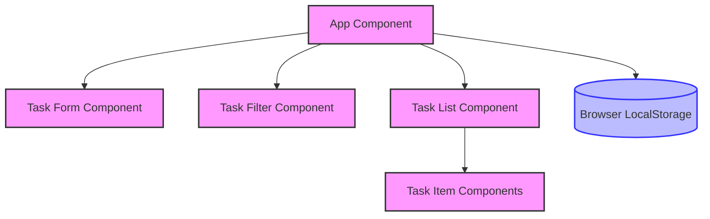
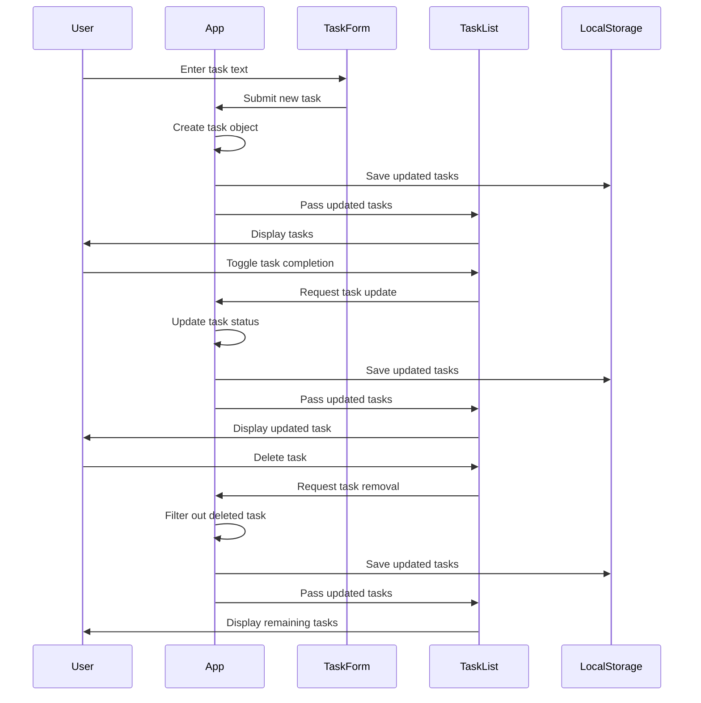
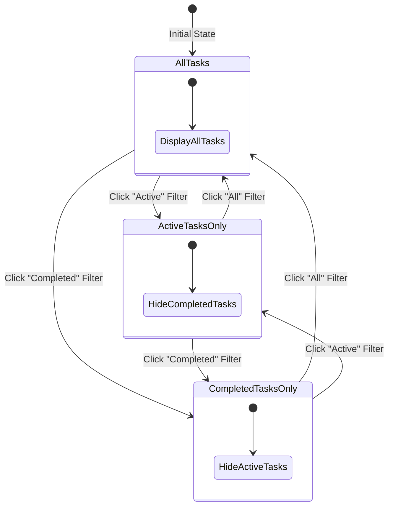

/*
 * Title: Chapter 03 - Beginner Example: Todo App 
 * Description: A simple React-based todo application
 * Chapter: 03 - Building Real Projects with AI Assistance
 * Skill Level: Beginner
 */

// This file demonstrates a React Todo application architecture 
// Below is a diagram of the component structure instead of actual code

## Component Architecture Explanation

The Todo application follows a standard React component hierarchy with state management:

### App Component
- **Core State Management**: Uses React's useState hook to maintain:
  - A tasks array containing all todo items
  - A filter value to control which tasks are displayed
- **Persistence Logic**: Implements localStorage integration via useEffect to save tasks between sessions
  
## Data Flow Diagram

### Core Functionality

1. **Adding Tasks**
   - Creates a new task object with unique ID (timestamp-based)
   - Assigns properties like text content, completion status, and creation time
   - Updates state using the immutable pattern with spread operator

2. **Toggling Completion**
   - Maps through the task array to find the target task
   - Flips the completion status while preserving all other properties
   - Maintains immutability for proper React rendering

3. **Deleting Tasks**
   - Uses array filtering to remove the target task
   - Returns a new array without the deleted item
  
## State Management Diagram

### User Interface Components

1. **Task Filtering System**
   - Implements three view modes: All, Active, or Completed tasks
   - Uses derived state pattern to filter tasks based on current selection
   - Preserves original data while changing only the view

2. **Statistics Dashboard**
   - Calculates and displays task metrics in real-time:
     - Total number of tasks
     - Number of active (incomplete) tasks
     - Number of completed tasks
   - Updates automatically when tasks change

3. **Component Structure**
   - Main container holds the entire application
   - TaskForm component handles new task input
   - Filter controls and statistics display in a control bar
   - TaskList renders the filtered tasks
   - Each task has toggle and delete functionality

## Benefits of React Component Architecture

- **Maintainability**: Separating concerns into distinct components makes the code easier to maintain
- **Reusability**: Components can be reused throughout the application or in other projects
- **State Isolation**: Each component manages only the state it needs
- **Testing**: Components can be tested individually for better test coverage
- **Performance**: React's virtual DOM efficiently updates only what has changed

/*
 * Navigation:
 * [⬅️ Return to Chapter](../README.md) | [📚 Main Content](../Chapter_03_Main.md) | [🔰 Beginner Level](../Chapter_03_Beginner.md)
 */
