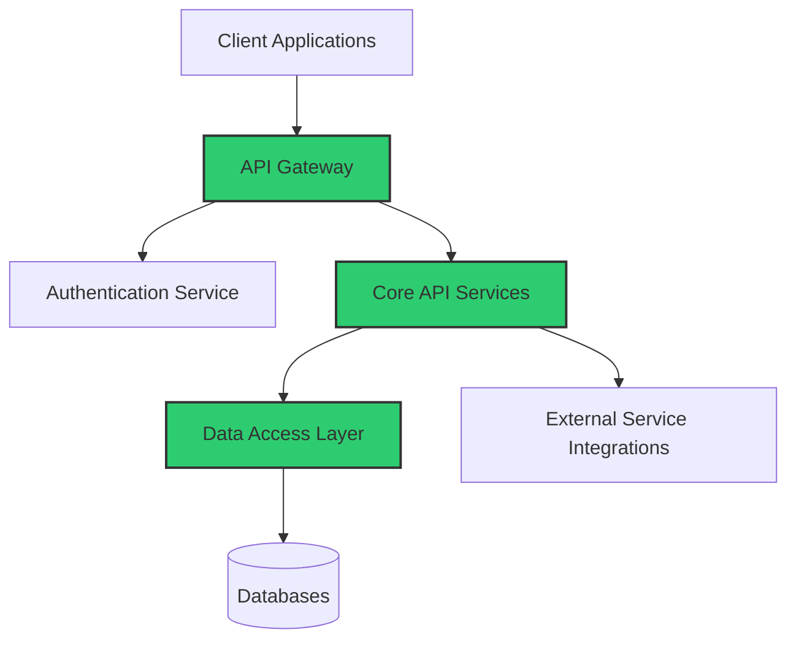

#  BACKEND DEVELOPMENT

<i>"Blueprint to API: Architecting Robust Backend Systems with AI Assistance"</i>

---

## 🚀 Chapter Overview

Chapter 4 extends our blueprint-first approach to backend development. Learn how to architect scalable, secure, and efficient server-side systems with AI collaboration. This chapter emphasizes planning your data structures, API contracts, and system architecture before writing a single line of code, ensuring your backends are built on solid foundations that can evolve with your needs.

---

## 📚 What You'll Learn

- **Backend Architecture Planning**: Designing scalable and maintainable server-side systems
- **Data Modeling**: Creating efficient and normalized database schemas with AI assistance
- **API Design**: Developing clear, consistent API contracts using RESTful and GraphQL patterns
- **Server Implementation**: Building robust express/Node.js, FastAPI/Python, or other server frameworks
- **Authentication & Security**: Implementing secure user authentication and authorization
- **Backend Testing**: Automating API tests to ensure reliability and performance
- **Database Integration**: Working with SQL, NoSQL, and ORM systems effectively

---

## 🎯 Target Audience

This chapter comes in three versions tailored to different experience levels:

<table>
  <tr>
    <td align="center"><b><a href="./Chapter_04_Beginner.md">🌱 BEGINNER</a></b></td>
    <td>For newcomers to backend development, with guided examples of creating simple APIs and database connections, focusing on understanding core concepts without complexity.</td>
  </tr>
  <tr>
    <td align="center"><b><a href="./Chapter_04_Advanced.md">🔧 ADVANCED</a></b></td>
    <td>For professional developers building production-ready backend systems, with emphasis on architectural patterns, security best practices, and performance optimization.</td>
  </tr>
  <tr>
    <td align="center"><b><a href="./Chapter_04_Ninja.md">⚡ NINJA</a></b></td>
    <td>For expert developers pushing backend boundaries with microservices architecture, advanced caching strategies, real-time data processing, and custom middleware development.</td>
  </tr>
</table>

---

## 🏗️ Backend Development Pipeline

  <table>
    <tr>
      <td align="center" width="20%"><b>1. System Architecture</b></td>
      <td align="center" width="20%"><b>2. Data Modeling</b></td>
      <td align="center" width="20%"><b>3. API Design</b></td>
      <td align="center" width="20%"><b>4. Implementation</b></td>
      <td align="center" width="20%"><b>5. Testing & Security</b></td>
    </tr>
    <tr>
      <td>Define system components, services, and communication patterns before any implementation.</td>
      <td>Design database schemas, entity relationships, and data structures with normalization and future growth in mind.</td>
      <td>Create comprehensive API contracts with endpoints, parameters, responses, and error handling defined upfront.</td>
      <td>Implement the backend using frameworks and ORMs that best match your architecture and data models.</td>
      <td>Write automated tests and implement security measures to ensure a robust, production-ready backend.</td>
    </tr>
  </table>

---

## ⚙️ Backend Architecture Patterns

This chapter explores effective architectural patterns for modern backend systems:

⚠️ <b>DESIGN YOUR API BEFORE CODING</b> ⚠️

---

## 📊 Backend Planning and Implementation Practices

<table>
  <tr>
    <td width="33%">
      <h3>Architecture Planning</h3>
      <ul>
        <li><b>System Boundaries</b>: Define clear service responsibilities</li>
        <li><b>Scalability Strategy</b>: Horizontal vs. vertical scaling decisions</li>
        <li><b>State Management</b>: Stateful vs. stateless design choices</li>
        <li><b>Communication Patterns</b>: Synchronous vs. asynchronous</li>
      </ul>
    </td>
    <td width="33%">
      <h3>API Design Best Practices</h3>
      <ul>
        <li><b>Resource-Oriented</b>: Clear noun-based resource URLs</li>
        <li><b>Consistent Responses</b>: Standardized format and error handling</li>
        <li><b>Versioning Strategy</b>: Managing API evolution</li>
        <li><b>Documentation-First</b>: OpenAPI/Swagger specifications</li>
      </ul>
    </td>
    <td width="33%">
      <h3>Implementation Strategies</h3>
      <ul>
        <li><b>Framework Selection</b>: Choosing tools that match your needs</li>
        <li><b>Code Organization</b>: Clear separation of concerns</li>
        <li><b>Error Handling</b>: Comprehensive approach to failures</li>
        <li><b>Logging & Monitoring</b>: Observability from day one</li>
      </ul>
    </td>
  </tr>
</table>

---

## 🛠️ Backend Implementation Techniques with AI

- **Schema-to-Code Generation**: Convert database schemas directly to ORM models
- **API Contract Implementation**: Generate controllers and routes from OpenAPI specifications
- **Authentication Flows**: Implement secure user authentication with best practices
- **Middleware Development**: Create reusable middleware components for common concerns
- **Database Query Optimization**: Craft efficient database queries and indexes
- **Test Suite Generation**: Create comprehensive test suites for your API endpoints

---

## 🔒 Backend Security Fundamentals

- **Authentication**: JWT, OAuth, session management
- **Authorization**: Role-based access control, permission systems
- **Data Protection**: Encryption at rest and in transit
- **Input Validation**: Preventing injection attacks
- **Rate Limiting**: Protection against abuse and DOS
- **Secrets Management**: Secure handling of API keys and credentials

---

