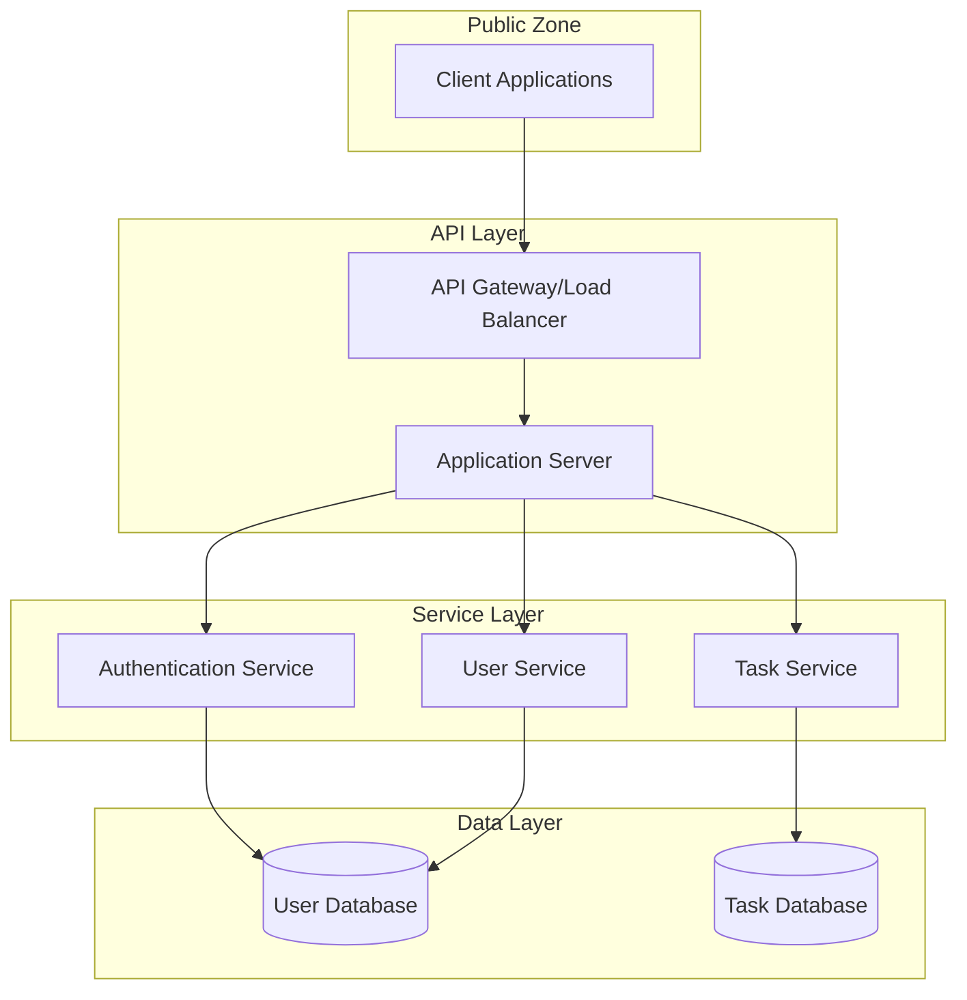

# Backend Blueprint: Task Management API

## 1. System Overview

A RESTful API backend service that provides task management functionality, allowing users to create, organize, and track tasks with authentication, data persistence, and flexible querying capabilities.

## 2. Core Objectives

- Create a secure, scalable API for task management
- Implement robust user authentication and authorization
- Design an efficient database schema for task data
- Provide comprehensive API documentation
- Ensure data validation and error handling
- Enable flexible task filtering and sorting

## 3. System Architecture



## 4. Data Models

### User Model
```typescript
interface User {
  id: string;
  email: string;
  passwordHash: string;
  name: string;
  createdAt: Date;
  updatedAt: Date;
  lastLoginAt: Date | null;
  isActive: boolean;
}
```

### Task Model
```typescript
interface Task {
  id: string;
  title: string;
  description: string | null;
  status: 'todo' | 'in-progress' | 'completed';
  priority: 'low' | 'medium' | 'high';
  dueDate: Date | null;
  userId: string;
  tags: string[];
  createdAt: Date;
  updatedAt: Date;
  completedAt: Date | null;
}
```

### Database Schema

#### Users Table
```sql
CREATE TABLE users (
  id UUID PRIMARY KEY DEFAULT uuid_generate_v4(),
  email VARCHAR(255) NOT NULL UNIQUE,
  password_hash VARCHAR(255) NOT NULL,
  name VARCHAR(255) NOT NULL,
  created_at TIMESTAMP NOT NULL DEFAULT NOW(),
  updated_at TIMESTAMP NOT NULL DEFAULT NOW(),
  last_login_at TIMESTAMP,
  is_active BOOLEAN NOT NULL DEFAULT TRUE
);

CREATE INDEX idx_users_email ON users(email);
```

#### Tasks Table
```sql
CREATE TABLE tasks (
  id UUID PRIMARY KEY DEFAULT uuid_generate_v4(),
  title VARCHAR(255) NOT NULL,
  description TEXT,
  status VARCHAR(20) NOT NULL DEFAULT 'todo',
  priority VARCHAR(20) NOT NULL DEFAULT 'medium',
  due_date TIMESTAMP,
  user_id UUID NOT NULL REFERENCES users(id) ON DELETE CASCADE,
  created_at TIMESTAMP NOT NULL DEFAULT NOW(),
  updated_at TIMESTAMP NOT NULL DEFAULT NOW(),
  completed_at TIMESTAMP,
  CONSTRAINT valid_status CHECK (status IN ('todo', 'in-progress', 'completed')),
  CONSTRAINT valid_priority CHECK (priority IN ('low', 'medium', 'high'))
);

CREATE INDEX idx_tasks_user_id ON tasks(user_id);
CREATE INDEX idx_tasks_status ON tasks(status);
CREATE INDEX idx_tasks_due_date ON tasks(due_date);
```

#### Task Tags Table
```sql
CREATE TABLE task_tags (
  task_id UUID NOT NULL REFERENCES tasks(id) ON DELETE CASCADE,
  tag VARCHAR(50) NOT NULL,
  PRIMARY KEY (task_id, tag)
);

CREATE INDEX idx_task_tags_tag ON task_tags(tag);
```

## 5. API Endpoints

### Authentication Endpoints

| Endpoint | Method | Description | Request Body | Response |
|----------|--------|-------------|-------------|----------|
| /auth/register | POST | Create new user account | `{ email, password, name }` | `{ id, email, name, token }` |
| /auth/login | POST | Authenticate user | `{ email, password }` | `{ token, user }` |
| /auth/refresh | POST | Refresh auth token | `{ refreshToken }` | `{ token, refreshToken }` |

### Task Endpoints

| Endpoint | Method | Description | Request Body | Response |
|----------|--------|-------------|-------------|----------|
| /tasks | GET | Get user's tasks | Query params for filtering | `{ tasks: Task[], total: number }` |
| /tasks | POST | Create new task | `Task` (without id) | `Task` |
| /tasks/:id | GET | Get task by ID | N/A | `Task` |
| /tasks/:id | PUT | Update task | `Partial<Task>` | `Task` |
| /tasks/:id | DELETE | Delete task | N/A | `{ success: boolean }` |
| /tasks/status/:status | GET | Get tasks by status | Query params | `{ tasks: Task[], total: number }` |
| /tasks/priority/:priority | GET | Get tasks by priority | Query params | `{ tasks: Task[], total: number }` |
| /tasks/tags/:tag | GET | Get tasks by tag | Query params | `{ tasks: Task[], total: number }` |

### User Endpoints

| Endpoint | Method | Description | Request Body | Response |
|----------|--------|-------------|-------------|----------|
| /users/me | GET | Get current user | N/A | `User` (without passwordHash) |
| /users/me | PUT | Update user info | `Partial<User>` | `User` (without passwordHash) |
| /users/me/password | PUT | Change password | `{ currentPassword, newPassword }` | `{ success: boolean }` |

## 6. Authentication & Authorization

### Authentication Strategy

- **JWT-based** authentication
- Access token (short-lived, 15 minutes)
- Refresh token (longer-lived, 7 days)
- Secure, HTTP-only cookies for refresh tokens

### Authorization Rules

- Users can only access their own tasks
- All API endpoints except /auth/register and /auth/login require authentication
- Rate limiting applied to authentication endpoints (10 requests per minute)
- Input validation on all endpoints

### Security Measures

- Password hashing with bcrypt (10 rounds)
- HTTPS required for all API communication
- CORS configuration for approved client domains
- SQL injection protection via parameterized queries
- Rate limiting to prevent abuse
- Input validation and sanitization

## 7. API Response Format

### Success Response

```json
{
  "success": true,
  "data": { /* Response data object */ },
  "meta": {
    "total": 100,  // For paginated results
    "page": 1,
    "pageSize": 20
  }
}
```

### Error Response

```json
{
  "success": false,
  "error": {
    "code": "VALIDATION_ERROR",
    "message": "Invalid input provided",
    "details": [
      {
        "field": "email",
        "message": "Must be a valid email address"
      }
    ]
  }
}
```

### Status Codes

- 200: Success
- 201: Created
- 400: Bad Request
- 401: Unauthorized
- 403: Forbidden
- 404: Not Found
- 422: Unprocessable Entity
- 429: Too Many Requests
- 500: Internal Server Error

## 8. Implementation Strategy

### Technology Stack

- **Language**: Node.js with TypeScript
- **Framework**: Express.js
- **Database**: PostgreSQL
- **ORM**: Prisma
- **Authentication**: Passport.js with JWT strategy
- **Validation**: Zod
- **Documentation**: Swagger/OpenAPI
- **Testing**: Jest with supertest

### Project Structure

```
src/
├── config/               # Configuration settings
├── controllers/          # Route handlers
│   ├── auth.controller.ts
│   ├── task.controller.ts
│   └── user.controller.ts
├── middleware/           # Express middleware
│   ├── auth.middleware.ts
│   ├── error.middleware.ts
│   ├── validation.middleware.ts
│   └── rateLimiter.middleware.ts
├── models/               # Prisma models
│   └── index.ts
├── routes/               # API routes
│   ├── auth.routes.ts
│   ├── task.routes.ts
│   └── user.routes.ts
├── services/             # Business logic
│   ├── auth.service.ts
│   ├── task.service.ts
│   └── user.service.ts
├── utils/                # Utility functions
│   ├── jwt.util.ts
│   ├── password.util.ts
│   └── validation.util.ts
├── app.ts                # Express app setup
└── server.ts             # Server entry point
```

### Implementation Phases

1. **Phase 1: Foundation**
   - Set up project structure and database
   - Implement basic Express server with middleware
   - Create database schema and ORM models

2. **Phase 2: Authentication**
   - Implement user registration and login
   - Set up JWT authentication
   - Create middleware for protected routes

3. **Phase 3: Core API**
   - Implement task CRUD operations
   - Add filtering and pagination capabilities
   - Create validation middleware

4. **Phase 4: Advanced Features**
   - Implement tag functionality
   - Add task sorting and advanced filtering
   - Create user profile management

5. **Phase 5: Optimization & Security**
   - Add rate limiting
   - Implement caching strategies
   - Set up logging and monitoring
   - Conduct security audit

## 9. Testing Strategy

### Unit Tests
- Test individual service functions in isolation
- Mock external dependencies
- Focus on business logic correctness

### Integration Tests
- Test API endpoints with a test database
- Verify request/response flow through middleware
- Test authentication and authorization

### End-to-End Tests
- Simulate complete user flows
- Test API behaviors with realistic scenarios
- Verify database persistence

### Security Testing
- Test authentication bypass attempts
- Verify rate limiting effectiveness
- Test for common vulnerabilities (SQL injection, XSS)

## 10. API Documentation

- Generate OpenAPI/Swagger documentation from code
- Provide interactive API explorer for developers
- Include example requests and responses for each endpoint
- Document error codes and troubleshooting

## 11. Monitoring & Logging

### Logging Strategy
- Request logging (HTTP method, path, status code, response time)
- Error logging with stack traces
- User activity logging for security events
- Performance metric logging

### Monitoring
- Server health checks
- Response time metrics
- Error rate tracking
- Database query performance
- Authentication success/failure rates

## 12. Deployment Considerations

- Containerization with Docker
- CI/CD pipeline configuration
- Environment variable management
- Database migration strategy
- Backup and recovery procedures
- Horizontal scaling approach

---

This blueprint provides a comprehensive roadmap for developing a task management API backend. By defining the architecture, data models, API contracts, and implementation strategy upfront, developers can leverage AI assistance effectively while maintaining a cohesive and well-structured backend system.
