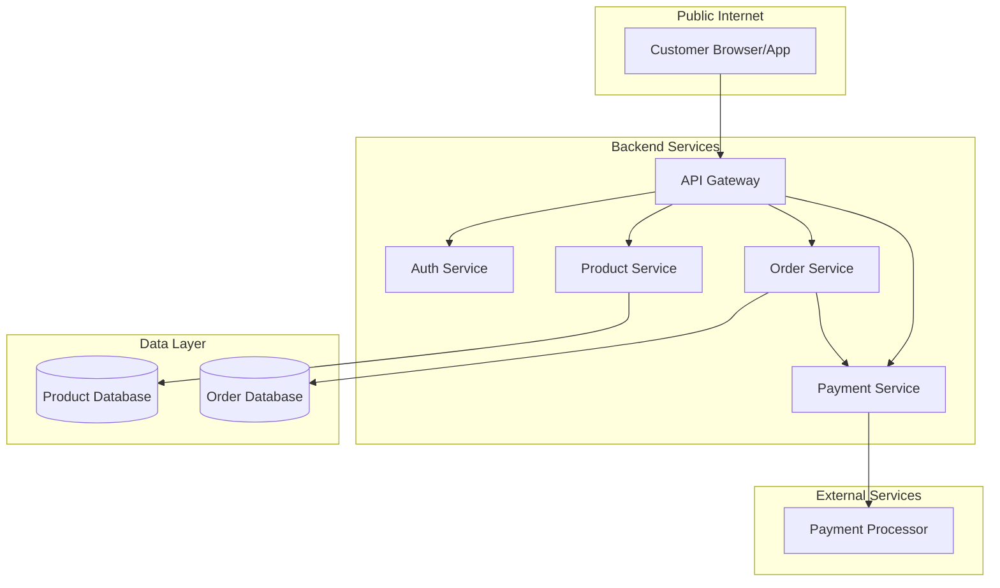
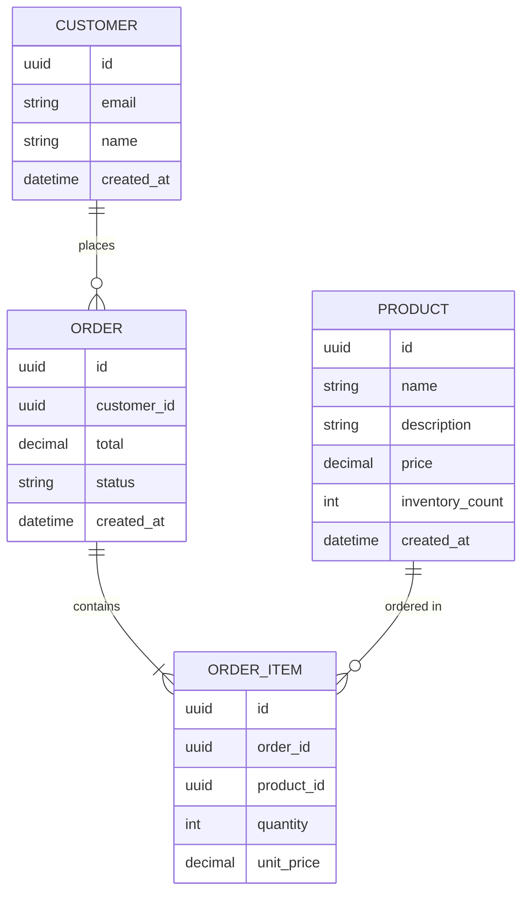
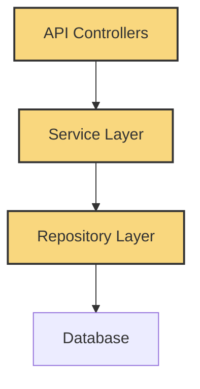
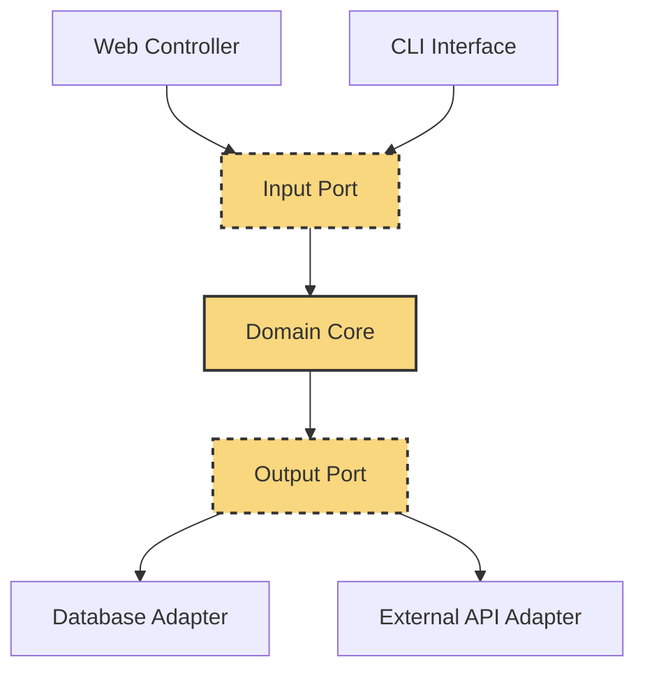
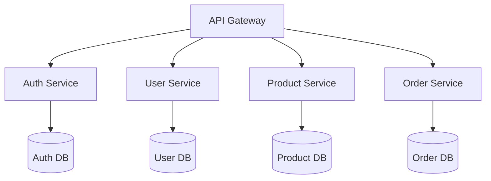
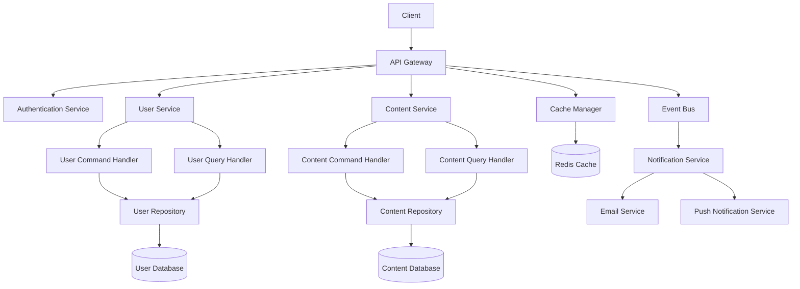

# Backend Planning Methods

## 1. System Topology Mapping

Before writing any backend code, map out your system's topology to understand its components, boundaries, and interactions.

### Components of a System Topology Map:

1. **Bounded Contexts** – Define distinct functional areas of your application
2. **Services and Microservices** – Identify discrete, independently deployable functions
3. **Data Stores** – Map out databases, caches, and other persistence mechanisms
4. **Communication Pathways** – Document how components interact (REST, GraphQL, message queues)
5. **External Dependencies** – Identify third-party services your system relies on

### Topology Mapping Techniques:

#### C4 Model Approach
The C4 model provides four levels of diagrams for describing software architecture:
- **Context** – Show system in relation to users and other systems
- **Container** – Break down system into interrelated containers (applications, data stores)
- **Component** – Break down containers into components
- **Code** – Detail how components are implemented

#### Example: Basic E-Commerce System Topology



## 2. Data Modeling and Schema Design

Data modeling is the process of creating a conceptual representation of your data and its relationships before implementing your database schema.

### Data Modeling Approaches:

1. **Entity-Relationship Diagrams (ERD)** – Visual representation of data entities and relationships
2. **Schema Definition Language (SDL)** – Text-based schema definitions (used in GraphQL, Prisma)
3. **JSON Schema** – Define the structure of JSON documents
4. **Object-Relational Mappings (ORM)** – Define data models as code classes

### Data Modeling Best Practices:

- **Normalize appropriately** – Balance data normalization with query performance
- **Consider access patterns** – Design with common queries in mind
- **Plan for evolution** – Structure data to accommodate future changes
- **Use appropriate types** – Select proper data types for each field
- **Define constraints** – Set validation rules at the schema level

### Example: E-Commerce ERD



## 3. API Contract Design

API contracts define the interface between your backend services and their consumers. Creating these contracts before implementation ensures all stakeholders have a clear understanding of the system's capabilities.

### API Design Methodologies:

#### Resource-Oriented Design
- Organize APIs around resources (nouns, not verbs)
- Use HTTP methods to define actions (GET, POST, PUT, DELETE)
- Use consistent URL patterns: `/resources` and `/resources/{id}`

#### API Specification Formats:
- **OpenAPI (Swagger)** – Industry standard for RESTful APIs
- **GraphQL Schema** – Type system for GraphQL APIs
- **JSON Schema** – For defining JSON-RPC APIs
- **Protocol Buffers** – For gRPC services

### API Contract Components:

1. **Endpoints/Operations** – What can be called
2. **Parameters** – Input data requirements
3. **Response Schemas** – Output data structures
4. **Authentication Requirements** – How to authenticate
5. **Error Codes and Messages** – Possible failure modes
6. **Rate Limits** – Usage restrictions

### Example: OpenAPI Specification Excerpt

```yaml
openapi: 3.0.0
info:
  title: Product API
  version: 1.0.0
paths:
  /products:
    get:
      summary: List products
      parameters:
        - name: category
          in: query
          schema:
            type: string
        - name: limit
          in: query
          schema:
            type: integer
            default: 20
      responses:
        '200':
          description: A list of products
          content:
            application/json:
              schema:
                type: array
                items:
                  $ref: '#/components/schemas/Product'
components:
  schemas:
    Product:
      type: object
      required:
        - id
        - name
        - price
      properties:
        id:
          type: string
          format: uuid
        name:
          type: string
        description:
          type: string
        price:
          type: number
          format: decimal
        categoryId:
          type: string
          format: uuid
```

## 4. Backend Architecture Patterns

Selecting the right architectural pattern is crucial for building maintainable, scalable backend systems.

### Common Architecture Patterns:

#### 1. Layered Architecture
Organizes code into horizontal layers, each with a specific responsibility:
- **Presentation Layer** – Handles HTTP requests/responses
- **Business Logic Layer** – Implements domain rules and workflows
- **Data Access Layer** – Manages persistence and data retrieval



#### 2. Hexagonal Architecture (Ports and Adapters)
Places domain logic at the center, with "ports" defining interfaces and "adapters" implementing external connections.



#### 3. Microservices Architecture
Divides the application into small, independently deployable services organized around business capabilities.



### Selecting the Right Architecture:

Consider these factors when choosing an architecture pattern:
- Team size and structure
- System complexity
- Scalability requirements
- Development velocity needs
- Operational capabilities

## 5. Avoiding Backend Over-Engineering

Backend systems are particularly susceptible to over-engineering. Here are strategies to maintain appropriate complexity:

### Signs of Backend Over-Engineering:

1. **Excessive abstraction layers** – Too many interfaces and indirection
2. **Premature service splitting** – Microservices before they're needed
3. **Over-normalized databases** – Normalization beyond practical needs
4. **Framework abuse** – Using all features of a framework regardless of need
5. **Excessive middleware** – Adding unnecessary processing to every request

### Simplification Strategies:

1. **Start with monolith** – Begin with a well-structured monolith before considering microservices
2. **Use boring technology** – Favor proven, simple solutions over cutting-edge complexity
3. **Optimize for development speed** – Choose patterns that enable rapid iteration
4. **Delay decisions** – Make architectural decisions only when you have enough information
5. **Measure complexity costs** – Evaluate the maintenance burden of added complexity

## 6. Backend MVP Definition

When defining a backend MVP, focus on core functionality while establishing a foundation for future growth.

### Backend MVP Principles:

1. **API-first development** – Define clear API contracts even for minimal functionality
2. **Simplified data model** – Start with essential entities and relationships
3. **Manual processes over automation** – Automate only what's necessary for launch
4. **Essential security** – Never compromise on authentication and basic security
5. **Monitoring fundamentals** – Include basic logging and error tracking from day one

### Backend MVP Checklist:

- [ ] Core data models and schema defined
- [ ] Basic CRUD operations for essential resources
- [ ] Authentication system implemented (even if simple)
- [ ] Input validation for all API endpoints
- [ ] Error handling and logging strategy
- [ ] Basic automated tests for critical paths
- [ ] Documentation for API endpoints

### Example: Task Manager API MVP

```
TASK MANAGER API MVP

Core Functionality:
- User authentication (email/password)
- Task CRUD operations
- Basic task filtering (by status)

Data Model MVP:
- Users: id, email, password, created_at
- Tasks: id, title, description, status, user_id, created_at

API Endpoints MVP:
- POST /auth/register
- POST /auth/login
- GET /tasks
- POST /tasks
- GET /tasks/:id
- PUT /tasks/:id
- DELETE /tasks/:id

Explicitly Not Included:
- Task categories or tags
- Recurring tasks
- User roles and permissions
- File attachments
- Task assignment to other users
- Activity history
```

## 7. Implementation Planning with AI

Planning a strategic approach to AI-assisted backend implementation can dramatically improve development efficiency.

### AI-Assisted Backend Development Workflow:

1. **System design prompt** – Have AI help with architectural decisions
   ```
   I'm building a task management API with the following requirements:
   [List core requirements]
   
   Help me design a system architecture that is:
   - Scalable to 10,000+ users
   - Maintainable by a small team
   - Secure for handling sensitive task data
   
   Please suggest an appropriate architecture pattern, key components, 
   and data storage approach.
   ```

2. **Schema generation prompt** – Create database schemas and models
   ```
   Based on these entity requirements:
   [List entity requirements]
   
   Please generate:
   1. A PostgreSQL schema with appropriate tables, constraints, and indexes
   2. Prisma/TypeORM/Mongoose models (as appropriate)
   3. Entity relationship diagram in Mermaid syntax
   ```

3. **API contract prompt** – Define API specifications
   ```
   I need to create a RESTful API for a task management system.
   
   Please generate an OpenAPI 3.0 specification with:
   - User authentication endpoints
   - CRUD operations for tasks
   - Appropriate validation rules
   - Error response structures
   - Example requests and responses
   ```

4. **Implementation guidance prompt** – Get architectural advice
   ```
   I'm implementing the task API using Express.js and PostgreSQL.
   
   Please suggest:
   1. A folder structure following clean architecture principles
   2. Key middleware components needed
   3. Approach for implementing authentication
   4. Error handling strategy
   ```

### Blueprint-to-Code Process:

1. Create system topology map
2. Design data models and relationships
3. Define API contracts
4. Plan implementation architecture
5. Use targeted AI prompts to assist with each implementation component
6. Validate implementations against original blueprints

## 8. Backend Security Planning

Security considerations must be integrated into backend planning from the beginning, not added afterward.

### Security Planning Checklist:

- [ ] **Authentication strategy** – How users prove their identity
- [ ] **Authorization model** – How permissions are defined and enforced
- [ ] **Data protection** – How sensitive data is secured at rest and in transit
- [ ] **Input validation** – How to prevent injection attacks
- [ ] **Rate limiting** – How to protect against abuse
- [ ] **Logging strategy** – What to log for security auditing
- [ ] **Dependency management** – How to keep dependencies secure
- [ ] **Secret management** – How to handle API keys and credentials

### Security-First Implementation Principles:

1. **Secure by default** – Systems should be secure in their initial configuration
2. **Defense in depth** – Multiple security layers protect against different threats
3. **Principle of least privilege** – Grant only the access needed to perform a function
4. **Secure failure modes** – Systems should fail securely, not expose vulnerabilities
5. **Regular security reviews** – Plan for ongoing security assessment

## Practical Exercises

### Exercise 1: System Topology Design
Design a system topology diagram for a social media application with these features:
- User profiles and connections
- Post creation and sharing
- Real-time notifications
- Content moderation

### Exercise 2: Data Model Evolution
1. Design an initial MVP data model for a simple e-commerce store
2. Then evolve this model to support:
   - Product variations (size, color)
   - Discount codes
   - Customer reviews
   - Order tracking

### Exercise 3: API Contract-First Development
Create an OpenAPI specification for a weather forecast API before writing any code. Include:
- Location-based forecast retrieval
- Historical weather data
- Units conversion (metric/imperial)
- User preferences

### Exercise 4: Over-Engineering Detection
Review this backend architecture and identify three ways it could be simplified:



---

Remember: **The quality of your backend planning directly impacts the reliability, maintainability, and scalability of your system**. Time invested in thoughtful planning pays dividends throughout the development lifecycle and reduces technical debt.
