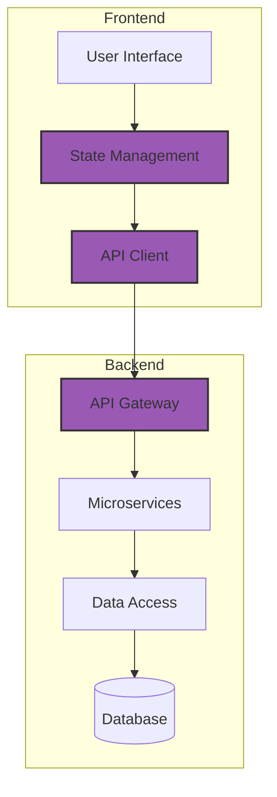

#  FULL STACK DEVELOPMENT

<i>"Blueprint to Integration: Harmonizing Frontend and Backend with AI Collaboration"</i>

---

## 🚀 Chapter Overview

Chapter 5 brings together frontend and backend development into cohesive full-stack systems. This chapter demonstrates how to unify your development approach using comprehensive blueprints that account for all layers of your application. Learn to coordinate frontend and backend components while maintaining clean separation of concerns, resulting in maintainable, scalable applications built through effective AI collaboration.

---

## 📚 What You'll Learn

- **Full-Stack Architecture Planning**: Creating unified blueprints that define all system layers
- **API Contract Design**: Establishing clear interfaces between frontend and backend
- **State Management Strategies**: Coordinating application state across system boundaries
- **Authentication Flows**: Implementing secure user identity across the stack
- **Full-Stack Testing**: Verifying functionality from UI to database
- **Deployment Strategies**: Coordinating releases across frontend and backend systems
- **Performance Optimization**: Tuning both client and server components for optimal user experience

---

## 🎯 Target Audience

This chapter comes in three versions tailored to different experience levels:

<table>
  <tr>
    <td align="center"><b><a href="./Chapter_05_Beginner.md">🌱 BEGINNER</a></b></td>
    <td>For newcomers building their first complete application, with guided examples of integrating simple frontend interfaces with backend APIs, focusing on core concepts and workflows.</td>
  </tr>
  <tr>
    <td align="center"><b><a href="./Chapter_05_Advanced.md">🔧 ADVANCED</a></b></td>
    <td>For professional developers creating production-grade applications, with emphasis on architecture patterns, state management, authentication strategies, and operational considerations.</td>
  </tr>
  <tr>
    <td align="center"><b><a href="./Chapter_05_Ninja.md">⚡ NINJA</a></b></td>
    <td>For expert developers building sophisticated systems, exploring advanced topics like microfrontends, serverless architectures, real-time systems, and GraphQL federation.</td>
  </tr>
</table>

---

## 🏗️ Full-Stack Development Lifecycle

  <table>
    <tr>
      <td align="center" width="20%"><b>1. Architecture Blueprint</b></td>
      <td align="center" width="20%"><b>2. API Contract Design</b></td>
      <td align="center" width="20%"><b>3. Frontend Implementation</b></td>
      <td align="center" width="20%"><b>4. Backend Implementation</b></td>
      <td align="center" width="20%"><b>5. Integration & Testing</b></td>
    </tr>
    <tr>
      <td>Create a comprehensive system architecture that defines all layers, from UI to database, with clear boundaries.</td>
      <td>Design detailed API contracts that specify exactly how frontend and backend will communicate, before implementation begins.</td>
      <td>Build the user interface with components that interact with the API according to the established contracts.</td>
      <td>Implement backend services that fulfill the API contracts while managing business logic and data persistence.</td>
      <td>Integrate all components, test cross-boundary functionality, and verify the entire system works as a cohesive whole.</td>
    </tr>
  </table>

---

## ⚙️ Full-Stack Architecture Patterns

This chapter explores effective patterns for coordinating frontend and backend development:

⚠️ <b>CONTRACT-FIRST INTEGRATION</b> ⚠️

---

## 📊 Full-Stack Development Best Practices

<table>
  <tr>
    <td width="33%">
      <h3>Architecture Patterns</h3>
      <ul>
        <li><b>Clean Architecture</b>: Separation of concerns</li>
        <li><b>CQRS</b>: Command/query responsibility segregation</li>
        <li><b>BFF</b>: Backend-for-frontend pattern</li>
        <li><b>API Gateway</b>: Unified entry point for clients</li>
      </ul>
    </td>
    <td width="33%">
      <h3>Integration Strategies</h3>
      <ul>
        <li><b>Contract Testing</b>: Verify API compliance</li>
        <li><b>Feature Flags</b>: Coordinated feature releases</li>
        <li><b>Shared Type Definitions</b>: Cross-stack type safety</li>
        <li><b>Unified Authentication</b>: Seamless identity flow</li>
      </ul>
    </td>
    <td width="33%">
      <h3>Development Workflows</h3>
      <ul>
        <li><b>Trunk-Based Development</b>: Maintain synchronization</li>
        <li><b>Integrated CI/CD</b>: Coordinated deployments</li>
        <li><b>E2E Testing</b>: Verify full system functionality</li>
        <li><b>Shared Documentation</b>: Unified system understanding</li>
      </ul>
    </td>
  </tr>
</table>

---

## 🛠️ Full-Stack Implementation Techniques with AI

- **Cross-Stack Code Generation**: Create matching frontend and backend components from a single specification
- **Type-Safe API Implementation**: Generate API clients and servers with shared types
- **Authentication Implementation**: Coordinated auth flows across frontend and backend
- **State Management**: Synchronize client state with server state
- **Full-Stack Testing**: Generate comprehensive tests across system boundaries
- **Documentation Generation**: Create unified documentation from code annotations

---

## 🔄 Integrating Frontend and Backend

### Key Integration Points:

- **Data Fetching Strategies**: REST, GraphQL, or RPC
- **Real-time Communication**: WebSockets, Server-Sent Events
- **Authentication Flows**: Token handling, session management
- **Form Submission & Validation**: Client vs. server validation
- **Error Handling**: Consistent error patterns
- **Caching Strategies**: Browser, CDN, and server caching
- **Performance Monitoring**: End-to-end tracing

### Integration Challenges:

- **Version Compatibility**: Managing API evolution
- **Type Safety Across Boundaries**: Preventing interface mismatches
- **Development Velocity**: Coordinating changes across teams
- **Testing Complexity**: Verifying cross-boundary behavior
- **Deployment Coordination**: Ensuring compatible releases

---

