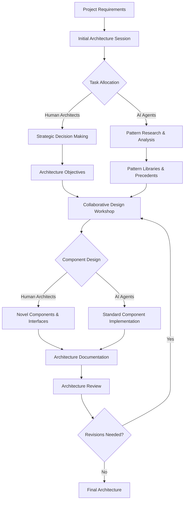

<div align="center">

# 🤖 Chapter 06: AI Agents and Automation - Ninja Level Part 2

</div>

<div align="center">

## Creating Custom AI Agents and Advanced Collaboration Patterns

</div>

<div align="center">

> *"The master developer creates the tools that create the tools."*

</div>

---

<div align="center">

**[⬅️ Ninja Level Part 1](./Chapter_06_Ninja_Part1.md) | [📚 Table of Contents](../README.md) | [➡️ Next Chapter](../Chapter_07_Mobile_Development/Chapter_07_Main.md)**

</div>

# Creating Custom AI Agents for Development Teams

In this section, we'll explore the cutting-edge practice of creating custom AI agents tailored to specific development needs. While using general-purpose AI assistants is powerful, truly ninja-level practitioners build specialized agents optimized for their specific domains and workflows.

## Custom Agent Development

### Fine-Tuning Foundation Models

The most advanced teams create custom-tuned AI models for specialized development tasks:

- **Domain-Specific Fine-Tuning**: Training on specialized technical documents and codebases
- **Behavioral Fine-Tuning**: Optimizing for specific interaction patterns and outputs
- **Team Alignment**: Calibrating to team practices and conventions
- **Continuous Improvement**: Implementing feedback loops for ongoing enhancement

**Example fine-tuning approach:**

```python
def prepare_fine_tuning_dataset(team_interactions, codebase, standards_docs):
    """
    Create a fine-tuning dataset from team interactions and resources
    """
    examples = []
    
    # Extract successful prompts and responses from team interactions
    for interaction in team_interactions:
        if interaction.quality_rating >= 4:  # Only high-quality interactions
            examples.append({
                "prompt": interaction.prompt,
                "completion": interaction.response
            })
    
    # Generate examples from codebase patterns
    code_patterns = extract_patterns(codebase)
    for pattern in code_patterns:
        examples.append({
            "prompt": f"Implement a component following our standard pattern for {pattern.type}",
            "completion": pattern.template_with_explanation
        })
    
    # Add examples from standards documentation
    standards_examples = convert_standards_to_examples(standards_docs)
    examples.extend(standards_examples)
    
    # Validate and format dataset
    validated_examples = validate_examples(examples)
    
    return format_for_fine_tuning(validated_examples)
```

This approach creates specialized agents that embody team standards and practices while maintaining the general capabilities of the foundation model.

### Creating Specialized Reasoning Systems

Ninja-level developers implement custom reasoning frameworks tailored to specific domains:

- **Domain-Specific Reasoning Patterns**: Encodings of expert reasoning for specialized domains
- **Structured Analysis Frameworks**: Systematic approaches to particular technical problems
- **Decision Frameworks**: Explicit processes for evaluating trade-offs
- **Quality Criteria**: Formalized standards for evaluating solutions

**Example structured reasoning implementation:**

```
# Security Analysis Framework for Web Applications

When performing security analysis on web applications, follow this structured reasoning process:

## Phase 1: Threat Surface Mapping
1. Enumerate all API endpoints and their authentication requirements
2. Identify data entry points (forms, file uploads, headers, etc.)
3. Document data flows across system boundaries
4. Catalog stored credentials and secrets

## Phase 2: Vulnerability Analysis
For each element in the threat surface:
1. Apply OWASP Top 10 analysis methodically
2. Check for common implementation errors specific to the technology stack
3. Analyze authorization models against business rules
4. Evaluate input validation and output encoding

## Phase 3: Defense-in-Depth Assessment
1. Evaluate layered security controls
2. Identify single points of failure
3. Assess security monitoring coverage
4. Verify secure defaults and configuration

## Phase 4: Remediation Prioritization
1. Score vulnerabilities using CVSS 4.0
2. Group related vulnerabilities into remediation sets
3. Identify quick wins vs. structural improvements
4. Create tiered remediation plan with verification criteria
```

These custom reasoning frameworks encode domain expertise in structured formats that AI agents can apply consistently, essentially embedding expert thinking into the agent's operation.

### Agent Personality Engineering

The most sophisticated custom agents implement carefully designed personalities and communication styles:

- **Team-Aligned Communication**: Language patterns that match team culture
- **Appropriate Assertiveness**: Calibrated confidence based on certainty levels
- **Productive Skepticism**: Constructive questioning of assumptions
- **Learning Orientation**: Approaches that prioritize knowledge transfer

**Example personality specification:**

```yaml
agent_personality:
  name: "TechArchitect"
  role: "Senior System Architecture Advisor"
  
  communication_style:
    formality: 3.5/5  # Somewhat formal but approachable
    technical_depth: 4/5  # Detailed but not overly academic
    examples_frequency: "high"  # Frequent use of examples
    question_style: "socratic"  # Uses questions to guide thinking
  
  expertise_presentation:
    confidence_calibration: "high"  # Expresses uncertainty appropriately
    alternative_views: "always"  # Presents multiple perspectives
    tradeoff_analysis: "explicit"  # Clearly states pros and cons
    
  interaction_patterns:
    clarification_threshold: "low"  # Asks for clarification frequently
    explanation_depth: "adaptive"  # Adjusts to user's expertise
    followup_suggestions: "targeted"  # Suggests specific next steps
    
  team_alignment:
    values: ["maintainability", "scalability", "security", "pragmatism"]
    terminology: "./company_glossary.json"  # Custom terminology mapping
    code_conventions: "./coding_standards.md"  # Team coding standards
```

This personality engineering creates agents that work harmoniously with the team while bringing appropriate expertise and perspective to interactions.

## Integrating Custom Agents into Development Workflows

### Development Environment Integration

Ninja-level practitioners deeply integrate custom agents into their development environments:

- **Editor/IDE Plugins**: Direct integration with coding environments
- **CLI Tools**: Command-line interfaces for agent interaction
- **Development Portals**: Web interfaces for more complex interactions
- **Ambient Intelligence**: Proactive assistance based on development activity

**Example IDE integration:**

```typescript
// VS Code extension for architecture assistant integration
export class ArchitectureAssistantProvider implements vscode.WebviewViewProvider {
    private view?: vscode.WebviewView;
    private context: vscode.ExtensionContext;
    private agent: ArchitectureAgent;
    
    constructor(context: vscode.ExtensionContext) {
        this.context = context;
        this.agent = new ArchitectureAgent(
            this.context.globalState.get('project_architecture') || {}
        );
        
        // Register for file changes to update context
        vscode.workspace.onDidChangeTextDocument(this.updateContext.bind(this));
        
        // Register for selection changes for contextual assistance
        vscode.window.onDidChangeTextEditorSelection(this.provideContextualHelp.bind(this));
    }
    
    private async updateContext(event: vscode.TextDocumentChangeEvent) {
        // Update agent's understanding of the codebase
        const changedFile = event.document.fileName;
        const fileContent = event.document.getText();
        
        await this.agent.updateFileContext(changedFile, fileContent);
        
        // Save updated architecture understanding
        this.context.globalState.update(
            'project_architecture',
            this.agent.getArchitectureUnderstanding()
        );
        
        // Update view if visible
        if (this.view?.visible) {
            this.updateView();
        }
    }
    
    private async provideContextualHelp(event: vscode.TextEditorSelectionChangeEvent) {
        if (!this.view?.visible) return;
        
        const editor = event.textEditor;
        const selection = editor.selection;
        const selectedText = editor.document.getText(selection);
        
        if (selectedText.length > 10) {
            // Generate contextual advice for selected code
            const advice = await this.agent.analyzeCode(
                selectedText,
                editor.document.fileName,
                selection.start.line
            );
            
            this.updateViewWithAdvice(advice);
        }
    }
    
    // Implementation of WebviewViewProvider interface
    resolveWebviewView(webviewView: vscode.WebviewView) {
        this.view = webviewView;
        
        webviewView.webview.options = {
            enableScripts: true,
            localResourceRoots: [this.context.extensionUri]
        };
        
        this.updateView();
        
        // Handle messages from webview
        webviewView.webview.onDidReceiveMessage(async message => {
            switch (message.command) {
                case 'analyze':
                    const analysis = await this.agent.analyzeArchitecture();
                    this.sendMessageToWebview({ type: 'analysis', data: analysis });
                    break;
                    
                case 'suggest':
                    const suggestion = await this.agent.suggestImprovement(message.area);
                    this.sendMessageToWebview({ type: 'suggestion', data: suggestion });
                    break;
                    
                case 'implement':
                    const implementation = await this.agent.implementSuggestion(message.suggestionId);
                    await this.applyImplementation(implementation);
                    break;
            }
        });
    }
    
    // Additional implementation details...
}
```

This deep integration brings AI capabilities directly into the development workflow, enabling contextual assistance and proactive recommendations.

### Hybrid Team Workflows

The most advanced teams implement sophisticated workflows that leverage both human and AI capabilities:

- **AI Augmentation Patterns**: Specific ways AI enhances human capabilities
- **Role Allocation Frameworks**: Clear delineation of human and AI responsibilities
- **Collaboration Interfaces**: Specialized tools for human-AI interaction
- **Team Adaptation Strategies**: Approaches for evolving team structure and practices

**Example hybrid workflow for software architecture:**



This hybrid workflow leverages the unique strengths of both humans (creativity, novel problem-solving, stakeholder alignment) and AI agents (pattern knowledge, consistency, comprehensive analysis).

### Feedback Loops for Continuous Improvement

Ninja-level teams implement sophisticated feedback systems for agent enhancement:

- **Interaction Rating Systems**: Capturing the quality of agent outputs
- **Success Metrics**: Measuring the impact of AI assistance on development
- **Learning Pipelines**: Processes for incorporating feedback into agents
- **Performance Dashboards**: Visualizing agent effectiveness and improvement

**Example feedback pipeline:**

```python
class AgentFeedbackSystem:
    def __init__(self, agent_registry, feedback_database):
        self.agent_registry = agent_registry
        self.feedback_database = feedback_database
        self.learning_pipeline = LearningPipeline()
    
    def capture_interaction_feedback(self, interaction_id, rating, comments=None):
        """Capture feedback for a specific agent interaction"""
        interaction = self.feedback_database.get_interaction(interaction_id)
        
        feedback_data = {
            "interaction_id": interaction_id,
            "agent_id": interaction.agent_id,
            "timestamp": datetime.now(),
            "rating": rating,  # 1-5 scale
            "comments": comments,
            "context": interaction.context,
            "prompt": interaction.prompt,
            "response": interaction.response,
            "user_id": interaction.user_id
        }
        
        self.feedback_database.store_feedback(feedback_data)
        
        # Trigger learning pipeline if sufficient new feedback
        self.check_learning_trigger(interaction.agent_id)
    
    def check_learning_trigger(self, agent_id):
        """Check if enough new feedback has accumulated to trigger learning"""
        recent_feedback = self.feedback_database.get_recent_feedback(
            agent_id, 
            since=self.agent_registry.get_last_update(agent_id)
        )
        
        if len(recent_feedback) >= self.get_learning_threshold(agent_id):
            self.trigger_learning_pipeline(agent_id, recent_feedback)
    
    def trigger_learning_pipeline(self, agent_id, feedback):
        """Initiate the learning process for an agent based on feedback"""
        agent = self.agent_registry.get_agent(agent_id)
        
        # Analyze feedback patterns
        analysis = self.analyze_feedback(feedback)
        
        # Generate improvement recommendations
        recommendations = self.generate_recommendations(analysis, agent)
        
        if self.should_auto_implement(recommendations):
            # Automatic improvements for clear, safe updates
            self.implement_improvements(agent_id, recommendations.auto_implementable)
            self.notify_team_automatic_updates(agent_id, recommendations.auto_implementable)
        
        if recommendations.needs_human_review:
            # Schedule human review for more complex changes
            self.schedule_human_review(agent_id, recommendations.for_review)
    
    def implement_improvements(self, agent_id, recommendations):
        """Implement recommended improvements to the agent"""
        agent = self.agent_registry.get_agent(agent_id)
        
        for recommendation in recommendations:
            if recommendation.type == "prompt_refinement":
                agent.refine_prompt_template(
                    recommendation.template_id,
                    recommendation.refinements
                )
            elif recommendation.type == "knowledge_update":
                agent.update_knowledge_base(
                    recommendation.knowledge_area,
                    recommendation.updates
                )
            elif recommendation.type == "reasoning_adjustment":
                agent.update_reasoning_framework(
                    recommendation.framework_id,
                    recommendation.adjustments
                )
        
        # Update agent version and timestamp
        self.agent_registry.update_agent_version(agent_id)
```

This feedback system creates a continuous improvement cycle that enhances agent capabilities based on real-world performance and team input.

## Case Studies in Custom Agent Integration

### Case Study: Architecture Evolution System

A major enterprise software company created a specialized agent system to assist with large-scale architecture evolution:

**Challenge:**
The company needed to modernize a 15-year-old monolithic application with over 2 million lines of code, transitioning to a microservices architecture while maintaining business continuity.

**Custom Agent Solution:**
They developed a multi-agent architecture evolution system:

1. **Codebase Analysis Agent**
   - Created a comprehensive model of the existing codebase
   - Identified module boundaries, dependencies, and coupling
   - Generated detailed architectural diagrams

2. **Decomposition Planning Agent**
   - Analyzed business domains and data ownership
   - Recommended service boundaries based on domain-driven design
   - Created a multi-phase transition plan

3. **Migration Assistant Agents**
   - Generated infrastructure-as-code templates for new services
   - Created data migration scripts and validation tests
   - Implemented API adapters for transitional integration

4. **Technical Debt Tracker**
   - Monitored temporary workarounds and transition patterns
   - Scheduled refactoring work in future sprints
   - Tracked architectural quality metrics

**Integration Approach:**
The system was deeply integrated into the development workflow:
- Embedded in CI/CD pipelines to validate architectural compliance
- Integrated with issue tracking to manage migration tasks
- Connected to documentation systems to maintain living architecture documents

**Results:**
- 40% reduction in estimated time for the architectural transition
- 65% decrease in regression issues during migration
- Successful incremental deployment with zero customer-facing incidents
- Comprehensive, up-to-date architecture documentation

**Key Success Factors:**
1. Domain-specific fine-tuning on enterprise architecture patterns
2. Explicitly encoded migration strategies from industry best practices
3. Tight integration with existing development tools and workflows
4. Clear role definition between architects and AI assistants

### Case Study: Specialized Testing Intelligence

A cybersecurity company built a custom agent ecosystem for advanced application security testing:

**Challenge:**
The company needed to enhance their security testing capabilities for client applications, struggling to maintain expertise across rapidly evolving threat landscapes and technology stacks.

**Custom Agent Solution:**
They implemented a specialized security testing intelligence system:

1. **Threat Modeling Agent**
   - Analyzed application architecture and technology stack
   - Generated comprehensive threat models based on STRIDE
   - Prioritized security testing based on risk assessment

2. **Vulnerability Research Agents**
   - Maintained up-to-date knowledge of CVEs and attack patterns
   - Specialized agents for different technology stacks
   - Generated test cases from vulnerability research

3. **Test Generation Agents**
   - Created specialized fuzz testing inputs
   - Generated penetration testing scripts
   - Developed static analysis rules for custom vulnerabilities

4. **Remediation Advisor Agent**
   - Provided detailed remediation guidance for identified vulnerabilities
   - Generated code fixes for common security issues
   - Created security architecture improvement recommendations

**Integration Approach:**
The system integrated with their security testing platform:
- Connected to CI/CD systems for automated security testing
- Integrated with development environments for real-time security guidance
- Linked to client portal for detailed remediation reporting

**Results:**
- 215% increase in unique vulnerability types identified
- 78% reduction in false positives compared to generic tools
- 40% improvement in remediation implementation time
- Ability to cover 3x more technology stacks with the same team size

**Key Success Factors:**
1. Continuous integration with threat intelligence feeds
2. Specialized agents for different technology ecosystems
3. Explicit encoding of security testing methodologies
4. Effective prioritization and remediation guidance

## The Future of Custom Agent Development

### Emerging Trends in Agent Capabilities

The frontier of custom agent development includes several emerging capabilities:

- **Multimodal Understanding**: Processing and generating across code, diagrams, natural language, and visual media
- **Extended Context Windows**: Maintaining understanding across entire codebases and development histories
- **Advanced Planning Capabilities**: Creating and executing increasingly sophisticated multi-stage plans
- **Self-Improvement Mechanisms**: Independently identifying improvement opportunities and implementing enhancements
- **Meta-Learning**: Learning how to learn more effectively in specific domains

### Prediction: The Future Development Team

Looking ahead to 2027-2028, we anticipate development teams will evolve in these directions:

1. **AI Developer Operations (AIOps)** 
   - Specialized roles for managing, training, and optimizing AI development systems
   - New skill sets focusing on prompt engineering, agent design, and human-AI collaboration
   - Hybrid management approaches for mixed human-AI teams

2. **Dynamic Role Allocation**
   - Fluid boundaries between human and AI responsibilities
   - Task routing systems that match work to the most appropriate agent (human or AI)
   - Performance-based role evolution as AI capabilities mature

3. **Development Platforms as Agent Ecosystems**
   - IDEs and development platforms built around agent orchestration
   - Custom agent marketplaces for specialized development capabilities
   - Composition interfaces for assembling task-specific agent teams

4. **Collective Intelligence Optimization**
   - Sophisticated metrics for team performance across human-AI boundaries
   - Explicit design of information flows between agents and humans
   - Team structures optimized for complementary capabilities

### Preparing for the Future

To position yourself at the forefront of this evolution:

1. **Invest in Agent Design Skills**
   - Study the principles of effective agent architecture
   - Experiment with custom fine-tuning and personality design
   - Develop expertise in agent evaluation and improvement

2. **Master Orchestration Techniques**
   - Learn patterns for effective multi-agent workflows
   - Develop frameworks for hybrid team organization
   - Create integration approaches for development ecosystems

3. **Redefine Your Value Proposition**
   - Shift focus from implementation to direction and evaluation
   - Develop stronger domain expertise and strategic thinking
   - Build skills in areas where human judgment remains essential

4. **Contribute to Best Practices**
   - Share effective patterns and approaches with the community
   - Help establish ethical guidelines for AI in development
   - Participate in defining the future of human-AI collaboration

## Conclusion

Custom AI agent development represents the cutting edge of software development practice. By creating specialized agents tailored to specific domains and workflows, integrating them deeply into development environments, and establishing effective hybrid team structures, ninja-level practitioners can achieve unprecedented levels of productivity and capability.

The future belongs to those who can design, orchestrate, and collaborate with these increasingly sophisticated systems, leveraging the unique capabilities of both human and artificial intelligence. Rather than fearing replacement, the most successful developers will embrace this transformation, focusing their efforts on the distinctly human aspects of software creation while leveraging AI capabilities for everything else.

The journey of AI-assisted development has only just begun, and those who master these ninja-level techniques will help shape the future of our field.

---

<div align="center">

**[⬅️ Ninja Level Part 1](./Chapter_06_Ninja_Part1.md) | [📚 Table of Contents](../README.md) | [➡️ Next Chapter](../Chapter_07_Mobile_Development/Chapter_07_Main.md)**

</div>

<div align="center">

*© 2025 VibeCoding - Where Human Creativity Meets AI Capabilities*

</div>
