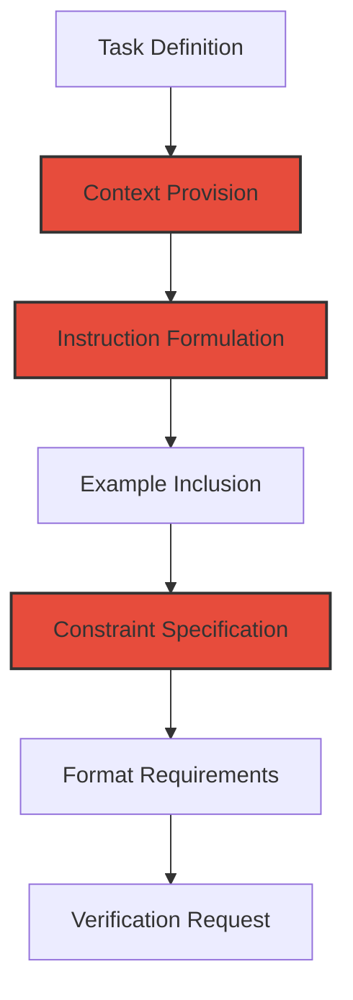

<div align="center">

#  ADVANCED PROMPT ENGINEERING

<p align="center">
<i>"Blueprint to Conversation: Mastering Strategic AI Communication"</i>
</p>

</div>

---

## 🚀 Chapter Overview

Chapter 6 focuses on the science and art of advanced prompt engineering - how to effectively communicate with AI systems to achieve precise and consistent results. This chapter builds on our blueprint-first approach by teaching you how to translate your carefully designed plans into optimized prompts that generate exactly what you need. Learn structured techniques for crafting prompts that produce high-quality code, accurate documentation, and effective problem-solving across the development lifecycle.

<div align="center">


</div>

---

## 📚 What You'll Learn

- **Prompt Design Principles**: Crafting clear, specific, and contextually rich prompts
- **Prompt Patterns**: Using established patterns to achieve consistent results
- **Iterative Refinement**: Building on AI responses to progressively improve outputs
- **Domain-Specific Prompting**: Tailoring prompts for different coding contexts
- **Debugging with AI**: Resolving errors and issues through strategic prompting
- **Chain-of-Thought Techniques**: Breaking complex problems into manageable steps
- **Prompt Templating**: Creating reusable prompt structures for common tasks

---

## 🎯 Target Audience

This chapter comes in three versions tailored to different experience levels:

<table>
  <tr>
    <td align="center"><b><a href="./Chapter_06_Beginner.md">🌱 BEGINNER</a></b></td>
    <td>For newcomers to prompt engineering, focusing on fundamental concepts and simple patterns to achieve reliable results when working with AI on basic development tasks.</td>
  </tr>
  <tr>
    <td align="center"><b><a href="./Chapter_06_Advanced.md">🔧 ADVANCED</a></b></td>
    <td>For professional developers, teaching sophisticated prompt structures for complex scenarios, optimization techniques, and strategies for integrating AI-generated code into production workflows.</td>
  </tr>
  <tr>
    <td align="center"><b><a href="./Chapter_06_Ninja.md">⚡ NINJA</a></b></td>
    <td>For prompt engineering experts, exploring cutting-edge techniques like multi-agent systems, few-shot learning, system prompt design, and creating specialized prompt frameworks for unique use cases.</td>
  </tr>
</table>

---

## 🧠 Prompt Engineering Methodology

<div align="center">
  <table>
    <tr>
      <td align="center" width="20%"><b>1. Task Analysis</b></td>
      <td align="center" width="20%"><b>2. Prompt Design</b></td>
      <td align="center" width="20%"><b>3. Response Evaluation</b></td>
      <td align="center" width="20%"><b>4. Iterative Refinement</b></td>
      <td align="center" width="20%"><b>5. Prompt Optimization</b></td>
    </tr>
    <tr>
      <td>Clearly define what you need from the AI, breaking complex tasks into discrete components.</td>
      <td>Craft a structured prompt with appropriate context, examples, and constraints based on your blueprint.</td>
      <td>Analyze AI responses against your requirements, identifying gaps or misalignments.</td>
      <td>Modify your prompts to address issues and progressively achieve better results.</td>
      <td>Refine successful prompts into templates and patterns for consistent future use.</td>
    </tr>
  </table>
</div>

---

## ⚙️ Prompt Engineering Frameworks

This chapter explores established frameworks for effective prompt design:



<div align="center">⚠️ <b>CLEAR INSTRUCTION YIELDS BETTER RESULTS</b> ⚠️</div>

---

## 📊 Prompt Engineering Techniques

<table>
  <tr>
    <td width="33%">
      <h3>Fundamental Techniques</h3>
      <ul>
        <li><b>Role-Based Prompting</b>: Assigning personas to the AI</li>
        <li><b>Few-Shot Learning</b>: Providing examples in the prompt</li>
        <li><b>Chain-of-Thought</b>: Breaking down complex reasoning</li>
        <li><b>Task Decomposition</b>: Splitting complex work into steps</li>
      </ul>
    </td>
    <td width="33%">
      <h3>Advanced Techniques</h3>
      <ul>
        <li><b>Self-Consistency</b>: Multiple solutions for verification</li>
        <li><b>Reliability Engineering</b>: Designing for consistent outputs</li>
        <li><b>Iteration Management</b>: Progressive improvement strategies</li>
        <li><b>Constraint Satisfaction</b>: Enforcing specific requirements</li>
      </ul>
    </td>
    <td width="33%">
      <h3>Strategic Approaches</h3>
      <ul>
        <li><b>Failure Analysis</b>: Learning from suboptimal responses</li>
        <li><b>Pattern Recognition</b>: Identifying effective prompt structures</li>
        <li><b>Model Calibration</b>: Adapting to model capabilities</li>
        <li><b>Memory Utilization</b>: Working with context limitations</li>
      </ul>
    </td>
  </tr>
</table>

---

## 🛠️ Domain-Specific Prompt Engineering

### Software Development Contexts

- **Architecture Design**: Prompting for system design and component relationships
- **API Design**: Creating clear and consistent API specifications
- **Database Schema**: Generating optimized database structures
- **Algorithm Development**: Breaking down complex algorithms step-by-step
- **Test Generation**: Creating comprehensive test suites
- **Documentation**: Producing clear, accurate technical documentation
- **Code Refactoring**: Improving existing codebases
- **Debugging**: Identifying and fixing issues in code

### Prompt Template Examples

<table>
  <tr>
    <td width="50%">
      <h4>Code Generation</h4>
      <pre>
I need to implement [specific component].

Context:
- The component needs to [specific functionality]
- It will be used within [system context]
- It needs to handle [edge cases]
- It should follow [coding standards]

Technical requirements:
- Language: [language]
- Framework: [framework]
- Performance considerations: [considerations]

Please provide a complete implementation with:
1. Necessary imports
2. Function/class definition
3. Input validation
4. Error handling
5. Documentation
      </pre>
    </td>
    <td width="50%">
      <h4>Code Debugging</h4>
      <pre>
I'm debugging the following code:
```
[problematic code]
```

Error message:
```
[error message]
```

Context:
- This code is trying to [purpose]
- It works correctly when [working scenario]
- It fails when [failing scenario]

I've already tried:
- [attempted fix 1]
- [attempted fix 2]

Please help identify the issue and suggest a fix.
Include an explanation of what causes the problem
and why your solution resolves it.
      </pre>
    </td>
  </tr>
</table>

---

## 📈 Measuring Prompt Effectiveness

### Key Performance Indicators

- **Accuracy**: How closely the output matches requirements
- **Completeness**: Whether all aspects of the task are addressed
- **Consistency**: Reliability of results across multiple runs
- **Efficiency**: Number of iterations needed to reach desired output
- **Adaptability**: How well the prompt works across different contexts
- **Clarity**: Ease of understanding and using the output

### Evaluation Framework

```
1. Define clear expectations before prompting
2. Compare AI output against expectations
3. Identify specific gaps or misalignments
4. Rate each dimension (accuracy, completeness, etc.)
5. Document what works and what doesn't
6. Refine prompt based on evaluation
7. Repeat until optimal results achieved
```

---

<div align="center">

[](./prompt_engineering_fundamentals.md)
[](./prompt_templates/)
[](./examples/)

[](../Chapter_05_Full_Stack/README.md)
[](../README.md)
[](../Chapter_07_Testing_and_Debugging/README.md)

</div>
