#  MOBILE DEVELOPMENT

<i>"Building Cross-Platform Mobile Applications with AI-Assisted Development"</i>

---

## 🚀 Chapter Overview

Chapter 7 focuses on creating mobile applications for iOS and Android platforms using AI assistance. We explore how to leverage device-specific capabilities while maintaining cross-platform compatibility. You'll learn how to design responsive interfaces, access device features, optimize performance, and deploy applications to app stores—all with the help of AI collaboration.

---

## 📚 What You'll Learn

- **Cross-Platform Development**: Building apps that work across iOS and Android
- **Responsive UI Design**: Creating adaptable interfaces for different screen sizes
- **Device Feature Integration**: Accessing camera, location, sensors, and other hardware
- **State Management**: Handling application state in a mobile context
- **Offline Capabilities**: Building apps that function without constant connectivity
- **Performance Optimization**: Ensuring smooth experiences on resource-constrained devices
- **App Store Deployment**: Preparing applications for distribution

---

## 🎯 Target Audience

This chapter comes in three versions tailored to different experience levels:

<table>
  <tr>
    <td align="center"><b><a href="./Chapter_07_Beginner.md">🌱 BEGINNER</a></b></td>
    <td>For newcomers to mobile development, with step-by-step guidance on building your first mobile app using React Native and Expo with AI assistance.</td>
  </tr>
  <tr>
    <td align="center"><b><a href="./Chapter_07_Advanced.md">🔧 ADVANCED</a></b></td>
    <td>For developers creating professional-grade mobile applications, covering advanced UI patterns, device integration, and optimizations for production apps.</td>
  </tr>
  <tr>
    <td align="center"><b><a href="./Chapter_07_Ninja.md">⚡ NINJA</a></b></td>
    <td>For experts pushing the boundaries of mobile development with cutting-edge techniques including AR/VR, ML on device, custom rendering, and platform-specific optimizations.</td>
  </tr>
</table>

---

## 📱 Mobile Development Approaches

  <table>
    <tr>
      <td align="center" width="25%"><b>1. Native Development</b></td>
      <td align="center" width="25%"><b>2. Cross-Platform Frameworks</b></td>
      <td align="center" width="25%"><b>3. Hybrid Solutions</b></td>
      <td align="center" width="25%"><b>4. Progressive Web Apps</b></td>
    </tr>
    <tr>
      <td>Platform-specific development using Swift/Objective-C (iOS) or Kotlin/Java (Android) for maximum performance and feature access.</td>
      <td>Using React Native, Flutter, or similar frameworks to write once and deploy to multiple platforms with near-native performance.</td>
      <td>Combining web technologies with native containers using solutions like Ionic or Capacitor for rapid development.</td>
      <td>Creating web applications with mobile-like features that can be installed on devices and work offline.</td>
    </tr>
  </table>

---

## ⚙️ Mobile Development Workflow

This chapter demonstrates a comprehensive workflow for mobile application development:

```mermaid
graph LR
    A[Planning & Design] --> B[Project Setup]
    B --> C[UI Implementation]
    C --> D[Device Integration]
    D --> E[State Management]
    E --> F[Testing & Optimization]
    F --> G[Deployment]
    
    style A fill:#f9d77e,stroke:#333,stroke-width:2px
    style C fill:#f9d77e,stroke:#333,stroke-width:2px
    style D fill:#f9d77e,stroke:#333,stroke-width:2px
    style G fill:#f9d77e,stroke:#333,stroke-width:2px
```

⚠️ <b>DESIGN FOR MOBILE FIRST, THEN IMPLEMENT</b> ⚠️

---

## 📊 Mobile Development Best Practices

<table>
  <tr>
    <td width="33%">
      <h3>UI/UX Design</h3>
      <ul>
        <li><b>Touch-First Design</b>: Optimizing for fingers not mouse pointers</li>
        <li><b>Responsive Layouts</b>: Adapting to different screen sizes</li>
        <li><b>Platform Guidelines</b>: Following iOS/Android design standards</li>
        <li><b>Offline States</b>: Designing for intermittent connectivity</li>
      </ul>
    </td>
    <td width="33%">
      <h3>Performance Optimization</h3>
      <ul>
        <li><b>Memory Management</b>: Minimizing resource usage</li>
        <li><b>Render Optimization</b>: Reducing UI bottlenecks</li>
        <li><b>Battery Considerations</b>: Energy-efficient coding patterns</li>
        <li><b>Load Time Optimization</b>: Fast startup and transitions</li>
      </ul>
    </td>
    <td width="33%">
      <h3>Device Integration</h3>
      <ul>
        <li><b>Permission Handling</b>: Requesting access appropriately</li>
        <li><b>Sensor Usage</b>: Working with device hardware</li>
        <li><b>Background Processing</b>: Efficiently using background time</li>
        <li><b>Push Notifications</b>: Engaging users when app is closed</li>
      </ul>
    </td>
  </tr>
</table>

---

## 🛠️ Key Implementation Techniques

- **Responsive UI Patterns**: Creating interfaces that adapt to any screen size and orientation
- **Cross-Platform Component Design**: Building reusable components that work on both platforms
- **Device API Integration**: Accessing camera, location, sensors, and other hardware features
- **Local Data Storage**: Implementing persistent storage for offline capabilities
- **Navigation Architecture**: Creating intuitive app navigation and screen transitions
- **Form Handling**: Building and validating input forms optimized for mobile
- **Testing on Multiple Devices**: Ensuring compatibility across the device ecosystem

---

