#  DATA SCIENCE

<i>"Transforming Data into Insights with AI-Assisted Analysis and Visualization"</i>

---

## 🚀 Chapter Overview

Chapter 8 explores data science and analytics with AI assistance. We cover how to process, analyze, and visualize data to extract meaningful insights, build predictive models, and communicate findings effectively. By leveraging AI collaboration, you'll learn to handle complex data tasks with greater efficiency and discover patterns that might otherwise remain hidden.

---

## 📚 What You'll Learn

- **Data Collection & Preparation**: Gathering, cleaning, and transforming raw data
- **Exploratory Data Analysis**: Uncovering patterns and relationships through visualization
- **Statistical Analysis**: Applying statistical methods to derive meaningful insights
- **Machine Learning Modeling**: Building predictive models with various algorithms
- **Data Visualization**: Creating compelling visual representations of data insights
- **Deployment & Integration**: Making data science solutions accessible to stakeholders
- **Ethical Considerations**: Addressing bias, privacy, and responsibility in data science

---

## 🎯 Target Audience

This chapter comes in three versions tailored to different experience levels:

<table>
  <tr>
    <td align="center"><b><a href="./Chapter_08_Beginner.md">🌱 BEGINNER</a></b></td>
    <td>For newcomers to data science, with guided examples for data analysis, basic statistical methods, and creating your first visualizations and predictive models with AI assistance.</td>
  </tr>
  <tr>
    <td align="center"><b><a href="./Chapter_08_Advanced.md">🔧 ADVANCED</a></b></td>
    <td>For analysts and developers creating sophisticated data solutions, covering advanced modeling techniques, complex data pipelines, and production-grade analytics systems.</td>
  </tr>
  <tr>
    <td align="center"><b><a href="./Chapter_08_Ninja.md">⚡ NINJA</a></b></td>
    <td>For experts pushing the boundaries of data science with cutting-edge techniques including deep learning, distributed computing, reinforcement learning, and advanced natural language processing.</td>
  </tr>
</table>

---

## 📊 Data Science Workflow

  <table>
    <tr>
      <td align="center" width="20%"><b>1. Data Collection</b></td>
      <td align="center" width="20%"><b>2. Data Preparation</b></td>
      <td align="center" width="20%"><b>3. Exploratory Analysis</b></td>
      <td align="center" width="20%"><b>4. Modeling</b></td>
      <td align="center" width="20%"><b>5. Deployment</b></td>
    </tr>
    <tr>
      <td>Gathering data from various sources including APIs, databases, web scraping, and files in different formats.</td>
      <td>Cleaning, transforming, and enriching raw data through normalization, imputation, feature engineering, and dimensionality reduction.</td>
      <td>Understanding the data through statistical analysis, pattern recognition, anomaly detection, and visualization.</td>
      <td>Building predictive and descriptive models with statistical methods, machine learning algorithms, and ensemble techniques.</td>
      <td>Deploying solutions as interactive dashboards, API endpoints, automated reports, or integrated applications.</td>
    </tr>
  </table>

---

## ⚙️ End-to-End Data Science Process

This chapter demonstrates a comprehensive workflow for data science projects:

```mermaid
graph LR
    A[Problem Definition] --> B[Data Collection]
    B --> C[Data Preparation]
    C --> D[Exploratory Analysis]
    D --> E[Feature Engineering]
    E --> F[Model Building]
    F --> G[Model Evaluation]
    G --> H[Model Deployment]
    H --> I[Monitoring & Maintenance]
    
    style A fill:#f9d77e,stroke:#333,stroke-width:2px
    style C fill:#f9d77e,stroke:#333,stroke-width:2px
    style E fill:#f9d77e,stroke:#333,stroke-width:2px
    style F fill:#f9d77e,stroke:#333,stroke-width:2px
    style H fill:#f9d77e,stroke:#333,stroke-width:2px
```

⚠️ <b>UNDERSTAND THE DATA BEFORE MODELING</b> ⚠️

---

## 📊 Data Science Best Practices

<table>
  <tr>
    <td width="33%">
      <h3>Data Quality & Preparation</h3>
      <ul>
        <li><b>Data Validation</b>: Verifying accuracy and completeness</li>
        <li><b>Handling Missing Data</b>: Imputation strategies</li>
        <li><b>Feature Scaling</b>: Normalization and standardization</li>
        <li><b>Outlier Treatment</b>: Detection and handling methods</li>
      </ul>
    </td>
    <td width="33%">
      <h3>Modeling Approaches</h3>
      <ul>
        <li><b>Train-Test Split</b>: Proper validation methodology</li>
        <li><b>Cross-Validation</b>: Robust model evaluation</li>
        <li><b>Hyperparameter Tuning</b>: Optimizing model parameters</li>
        <li><b>Model Explainability</b>: Making models interpretable</li>
      </ul>
    </td>
    <td width="33%">
      <h3>Project Management</h3>
      <ul>
        <li><b>Reproducibility</b>: Maintaining consistent environments</li>
        <li><b>Version Control</b>: Tracking data and model changes</li>
        <li><b>Documentation</b>: Clear explanation of methodology</li>
        <li><b>Pipeline Automation</b>: Streamlining workflows</li>
      </ul>
    </td>
  </tr>
</table>

---

## 🛠️ Key Implementation Techniques

- **Data Wrangling with Pandas**: Efficient data manipulation and transformation
- **Statistical Analysis with SciPy and StatsModels**: Hypothesis testing and statistical modeling
- **Machine Learning with Scikit-learn**: Classification, regression, clustering, and more
- **Deep Learning with TensorFlow/PyTorch**: Neural networks for complex patterns
- **Data Visualization with Matplotlib, Seaborn, and Plotly**: Creating effective visual insights
- **Natural Language Processing with NLTK, spaCy, and Transformers**: Text analysis and understanding
- **Time Series Analysis with Prophet and statsmodels**: Handling temporal data and forecasting
- **Big Data Processing with PySpark**: Scaling analysis to large datasets

---

