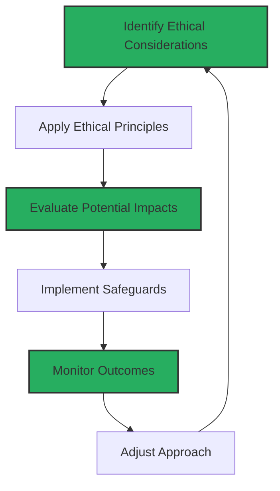

#  ETHICS OF AI-ASSISTED DEVELOPMENT

<i>"Navigating the moral dimensions of human-AI collaborative creation"</i>

---

## 🚀 Chapter Overview

This chapter explores the ethical dimensions and implications of AI-assisted development. As AI tools become more capable of generating sophisticated code, developers must navigate complex questions about responsibility, attribution, bias, security, equity, and the changing nature of programming itself. This chapter provides frameworks for ethical decision-making and responsible AI adoption in coding practices.

---

## 📚 What You'll Learn

- **Ethical Foundations**: Core principles for responsible AI-assisted development
- **Bias Recognition & Mitigation**: Identifying and addressing biases in AI systems
- **Attribution Frameworks**: Properly acknowledging human and AI contributions
- **Governance Systems**: Establishing accountability in AI-assisted workflows
- **Impact Assessment**: Evaluating how AI tools affect the development profession
- **Future Challenges**: Anticipating emerging ethical issues in AI development

---

## 🎯 Target Audience

This chapter comes in three versions tailored to different experience levels:

<table>
  <tr>
    <td align="center"><b><a href="./Chapter_11_Beginner.md">🌱 BEGINNER</a></b></td>
    <td>For newcomers to AI ethics, introducing fundamental ethical principles, basic bias recognition techniques, and foundational practices for responsible AI use in development.</td>
  </tr>
  <tr>
    <td align="center"><b><a href="./Chapter_11_Advanced_Part1.md">🔧 ADVANCED (Part 1)</a></b></td>
    <td>For experienced developers implementing comprehensive ethical frameworks, sophisticated bias mitigation, and robust governance systems in development environments.</td>
  </tr>
  <tr>
    <td align="center"><b><a href="./Chapter_11_Advanced_Part2.md">🔧 ADVANCED (Part 2)</a></b></td>
    <td>Continued exploration of advanced topics including organizational AI ethics governance and advanced attribution systems.</td>
  </tr>
  <tr>
    <td align="center"><b><a href="./Chapter_11_Ninja_Part1.md">⚡ NINJA (Part 1)</a></b></td>
    <td>For ethics leaders exploring transformative ethical frameworks, anticipatory ethics methodologies, and cutting-edge approaches to responsible AI innovation.</td>
  </tr>
  <tr>
    <td align="center"><b><a href="./Chapter_11_Ninja_Part2.md">⚡ NINJA (Part 2)</a></b></td>
    <td>Advanced exploration of strategic ethics leadership and societal impact frameworks for AI-assisted development.</td>
  </tr>
</table>

---

## 🧩 Key Ethical Dimensions

<table>
  <tr>
    <td width="50%" align="center">
      <h3>Practical Considerations</h3>
      <ul align="left">
        <li><b>Bias Detection</b>: Identifying prejudice in AI-generated code</li>
        <li><b>Attribution</b>: Crediting AI and human contributions</li>
        <li><b>Transparency</b>: Clear disclosure of AI involvement</li>
        <li><b>Quality Assurance</b>: Maintaining high standards</li>
      </ul>
    </td>
    <td width="50%" align="center">
      <h3>Societal Implications</h3>
      <ul align="left">
        <li><b>Digital Divide</b>: Equitable access to AI technology</li>
        <li><b>Professional Impact</b>: Changes to developer roles</li>
        <li><b>Model Collapse</b>: Long-term viability of AI training data</li>
        <li><b>Ethical Leadership</b>: Guiding responsible adoption</li>
      </ul>
    </td>
  </tr>
</table>

---

## 📊 Ethical Decision Framework

---

## 🔑 Key Terms

- **Algorithmic Bias**: Systematic errors in AI systems creating unfair outcomes

- **AI Alignment**: Ensuring AI systems act according to human values

- **Responsible AI**: Development approaches prioritizing ethics and fairness

- **Digital Divide**: Gap in access to modern AI technology

- **Technological Unemployment**: Job displacement from automation/AI

- **Augmented Development**: AI enhancing rather than replacing humans

- **Model Collapse**: Degradation from training on AI-generated content

- **Informed Consent**: Stakeholder understanding of AI usage

- **Attribution Ethics**: Frameworks for acknowledging AI and human contributions

---

## 📋 Prerequisites

- Basic experience using AI coding assistants
- Familiarity with software development workflows
- Understanding of how AI code generation works (from previous chapters)
- Interest in technology's broader societal impacts

---

## 📝 Exercises & Resources

<table>
  <tr>
    <td align="center"><b><a href="./exercises/exercise_1_ethical_analysis.md">🔍 Exercise 1</a></b></td>
    <td>Ethical Analysis Framework: Evaluate the ethical implications of an AI-assisted development scenario</td>
  </tr>
  <tr>
    <td align="center"><b><a href="./exercises/exercise_2_bias_detection.md">⚖️ Exercise 2</a></b></td>
    <td>Bias Detection & Mitigation: Identify and address potential biases in AI-generated code</td>
  </tr>
  <tr>
    <td align="center"><b><a href="./exercises/exercise_3_governance.md">🔐 Exercise 3</a></b></td>
    <td>Ethics Governance System: Design a comprehensive framework for ethical AI governance in development</td>
  </tr>
</table>

---

> *"The question isn't whether AI will transform software development, but whether we'll guide that transformation according to our highest values or merely our immediate conveniences."*

