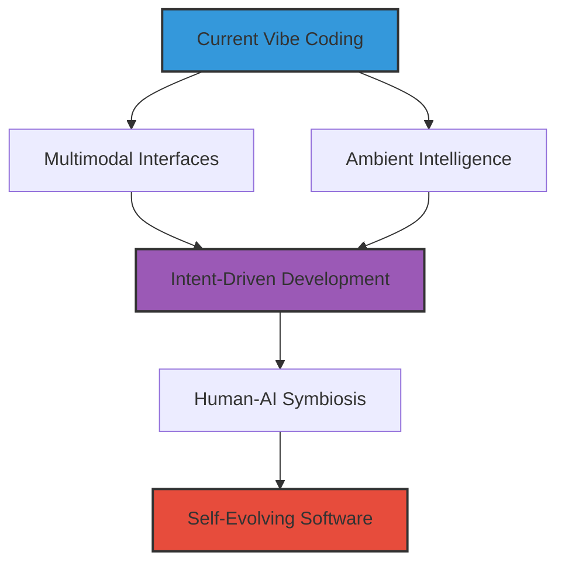

#  THE FUTURE BEYOND VIBE CODING

<i>"Envisioning tomorrow's horizons in human-AI collaborative development"</i>

---

## 🚀 Chapter Overview

This chapter explores emerging trends and future possibilities in AI-assisted development that extend beyond the practices covered in this book. As AI continues to evolve, we examine how developer workflows, tooling, expertise, and the broader software development ecosystem will likely transform in the coming years.

---

## 📚 What You'll Learn

1. **Future Interaction Modes**: Beyond text-based interfaces to multimodal and ambient AI
2. **Evolution of Developer Expertise**: How skills will transform as AI systems advance
3. **AI System Autonomy**: Implications of increasingly self-directing AI in development
4. **Emerging Ethical Challenges**: New frontiers in responsible AI development
5. **Strategic Positioning**: Preparing yourself for success in future development paradigms

---

## 🎯 Target Audience

This chapter comes in three versions tailored to different experience levels:

<table>
  <tr>
    <td align="center"><b><a href="./Chapter_12_Beginner.md">🌱 BEGINNER</a></b></td>
    <td>For developers curious about how AI might transform their career paths and what skills will remain valuable in the near future.</td>
  </tr>
  <tr>
    <td align="center"><b><a href="./Chapter_12_Advanced.md">🔧 ADVANCED</a></b></td>
    <td>For technical leaders preparing their teams and organizations for evolving AI capabilities and transformations in architecture and methodologies.</td>
  </tr>
  <tr>
    <td align="center"><b><a href="./Chapter_12_Ninja_Part1.md">⚡ NINJA (Part 1)</a></b></td>
    <td>For visionaries exploring transformative shifts in how software is conceived and created, focusing on intention-based development and collaborative reality creation.</td>
  </tr>
  <tr>
    <td align="center"><b><a href="./Chapter_12_Ninja_Part2.md">⚡ NINJA (Part 2)</a></b></td>
    <td>Continued exploration of radical future possibilities including digital-cognitive symbiosis and self-evolving software organisms.</td>
  </tr>
</table>

---

## 🧩 Key Concepts Explored

<table>
  <tr>
    <td width="50%" align="center">
      <h3>Near-term Evolution</h3>
      <ul align="left">
        <li><b>Multimodal Interfaces</b>: Voice, gesture, and thought-based interactions</li>
        <li><b>Ambient Intelligence</b>: AI that anticipates needs from context</li>
        <li><b>Evolution of Expertise</b>: New roles in an AI-assisted world</li>
      </ul>
    </td>
    <td width="50%" align="center">
      <h3>Transformative Possibilities</h3>
      <ul align="left">
        <li><b>Intent-Driven Development</b>: From thought to implementation</li>
        <li><b>Human-AI Symbiosis</b>: Deep integration of capabilities</li>
        <li><b>Self-Evolving Systems</b>: Software that adapts beyond initial design</li>
      </ul>
    </td>
  </tr>
</table>

---

## 🔮 Future Trajectories

---

## 💡 Practical Applications

<table>
  <tr>
    <td width="33%" align="center">
      <h3>🧠 Cognitive Enhancement</h3>
      
Extending developer capabilities through AI-human integration

    </td>
    <td width="33%" align="center">
      <h3>🌐 Collective Intelligence</h3>
      
Emergent capabilities through networked developers and AI

    </td>
    <td width="33%" align="center">
      <h3>🚀 Accelerated Innovation</h3>
      
Breakthrough paradigms in software creation and evolution

    </td>
  </tr>
</table>

---

## 📝 Exercises

<table>
  <tr>
    <td align="center"><b><a href="./exercises/exercise_1_future_interaction_modes.md">🔮 Exercise 1</a></b></td>
    <td>Design a prototype for a multimodal AI development interface that leverages voice, gesture, and context</td>
  </tr>
  <tr>
    <td align="center"><b><a href="./exercises/exercise_2_intent_driven_development.md">🧠 Exercise 2</a></b></td>
    <td>Create a framework for Intent-Driven Development that translates intentions to implementations</td>
  </tr>
  <tr>
    <td align="center"><b><a href="./exercises/exercise_3_human_ai_symbiosis.md">🌐 Exercise 3</a></b></td>
    <td>Design a speculative system for human-AI symbiotic development that creates a new collaborative paradigm</td>
  </tr>
</table>

---

## 📚 Further Reading

  

---

> *"The future of development isn't about replacing human creativity with artificial intelligence. It's about creating symbiotic relationships that unlock capabilities neither could achieve alone."*

*Note: This chapter is necessarily more speculative than previous ones. The scenarios described represent informed projections based on current trajectories but should be considered as possibilities rather than certainties. The goal is to encourage thoughtful preparation and strategic thinking about our collective technological future.*
