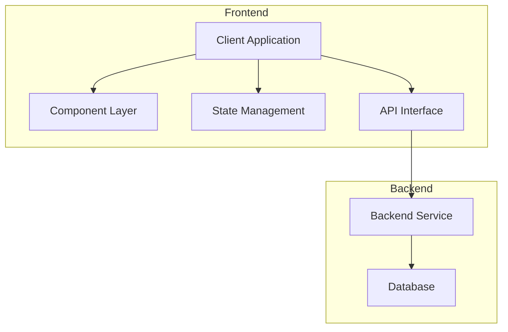

# Project Blueprint: Task Manager Application

## 1. Project Vision

A modern task management application that helps users organize their work efficiently with an intuitive interface and smart features powered by AI assistance.

## 2. Core Objectives

- Create a responsive, intuitive task management interface
- Enable users to create, categorize, prioritize, and track tasks
- Provide visualization of task progress and completion rates
- Implement data persistence through a backend API
- Ensure accessibility and cross-device compatibility

## 3. Architecture Overview



## 4. Data Models

### Task Model
```typescript
interface Task {
  id: string;
  title: string;
  description: string;
  status: 'todo' | 'in-progress' | 'completed';
  priority: 'low' | 'medium' | 'high';
  dueDate: Date | null;
  tags: string[];
  createdAt: Date;
  updatedAt: Date;
}
```

### User Model
```typescript
interface User {
  id: string;
  name: string;
  email: string;
  preferences: {
    theme: 'light' | 'dark';
    notifications: boolean;
    defaultView: 'list' | 'kanban';
  }
}
```

## 5. Component Structure

### Component Hierarchy
```
TaskApp
├── Header
│   ├── Logo
│   ├── NavigationMenu
│   └── UserProfile
├── Sidebar
│   ├── FilterPanel
│   └── TagList
├── MainContent
│   ├── TaskHeader
│   │   ├── ViewToggle
│   │   └── ActionButtons
│   ├── TaskList
│   │   └── TaskItem
│   └── KanbanBoard
│       └── StatusColumn
└── Footer
```

## 6. User Interface Mockups

### Task List View
```
+---------------------------------------+
| Task Manager          [User Profile]  |
+---------------------------------------+
| [Sidebar] | + New Task  [Filter] [^]  |
|           |                           |
| All       | [ ] High: API Integration |
| Today     | [x] Med: Update docs      |
| Upcoming  | [ ] Low: Review PR #42    |
| Projects  | [ ] High: Fix login bug   |
|           | [ ] Med: Create dashboard |
|           |                           |
+---------------------------------------+
```

### Task Detail View
```
+---------------------------------------+
| Task Manager          [User Profile]  |
+---------------------------------------+
| [Sidebar] | Task: Fix login bug       |
|           |                           |
| All       | Priority: High  Status: Todo     |
| Today     | Due: April 25, 2025       |
| Upcoming  |                           |
| Projects  | Description:              |
|           | Users unable to login with|
|           | OAuth credentials. Need to|
|           | debug authentication flow.|
|           |                           |
|           | Tags: #bug #auth #urgent  |
|           |                           |
|           | [Edit] [Delete] [Complete]|
+---------------------------------------+
```

## 7. State Management

```
AppState
├── User
│   ├── currentUser
│   └── authStatus
├── Tasks
│   ├── taskList
│   ├── currentTask
│   ├── filteredTasks
│   └── taskStats
├── UI
│   ├── currentView
│   ├── sidebarOpen
│   └── theme
└── API
    ├── loadingStatus
    └── errorMessages
```

## 8. API Endpoints

| Endpoint | Method | Description | Request Body | Response |
|----------|--------|-------------|-------------|----------|
| /tasks | GET | Fetch all tasks | N/A | `Task[]` |
| /tasks | POST | Create new task | `Task` | `Task` |
| /tasks/:id | GET | Fetch task details | N/A | `Task` |
| /tasks/:id | PUT | Update task | `Task` | `Task` |
| /tasks/:id | DELETE | Delete task | N/A | `{ success: boolean }` |
| /users/me | GET | Get current user | N/A | `User` |
| /users/me/preferences | PUT | Update preferences | `User['preferences']` | `User` |

## 9. Component Specifications

### TaskList Component

**Purpose:** Display a scrollable, filterable list of tasks with interactive elements for task management.

**Props:**
```typescript
interface TaskListProps {
  tasks: Task[];
  onTaskClick: (taskId: string) => void;
  onStatusChange: (taskId: string, newStatus: Task['status']) => void;
  onDelete: (taskId: string) => void;
  sortBy?: 'priority' | 'dueDate' | 'createdAt';
  filterBy?: {
    status?: Task['status'][];
    priority?: Task['priority'][];
    tags?: string[];
  };
}
```

**Visual Requirements:**
- Each task row displays: checkbox, title, priority indicator, due date, and action buttons
- Color-coded priority indicators (red: high, yellow: medium, green: low)
- Hover effects with subtle background highlight
- Completed tasks show strikethrough text
- Support for drag and drop reordering

**Behavior:**
- Clicking checkbox toggles status between 'todo' and 'completed'
- Clicking task title opens task detail view
- Right-side menu with quick actions (edit, delete)
- Support keyboard navigation and shortcuts
- Lazy loading for performance with large task lists

## 10. Implementation Strategy

1. **Phase 1: Setup & Structure**
   - Create project scaffold with React and TypeScript
   - Configure build tools and linting
   - Implement basic component structure

2. **Phase 2: Core Functionality**
   - Implement task list and task item components
   - Add task creation, editing, and deletion
   - Create state management structure

3. **Phase 3: Visual Refinement**
   - Implement UI design according to mockups
   - Add transitions and animations
   - Ensure responsive behavior

4. **Phase 4: Backend Integration**
   - Connect to API endpoints
   - Implement authentication
   - Add error handling and loading states

5. **Phase 5: Advanced Features**
   - Implement drag and drop
   - Add filter and sort functionality
   - Create dashboard with task statistics

## 11. Testing Strategy

- **Unit Tests:** Test individual components in isolation
- **Integration Tests:** Test component interactions and state management
- **E2E Tests:** Test complete user flows
- **Accessibility Tests:** Ensure WCAG compliance
- **Performance Tests:** Measure and optimize render times and bundle size

## 12. Deployment Considerations

- Implement CI/CD pipeline for automated testing and deployment
- Configure environment-specific variables for development/production
- Set up monitoring and error tracking
- Implement performance analytics

---

This blueprint provides a comprehensive roadmap for developing the Task Manager application, allowing AI assistance to be effectively leveraged at each stage of implementation while maintaining architectural integrity and design consistency.
