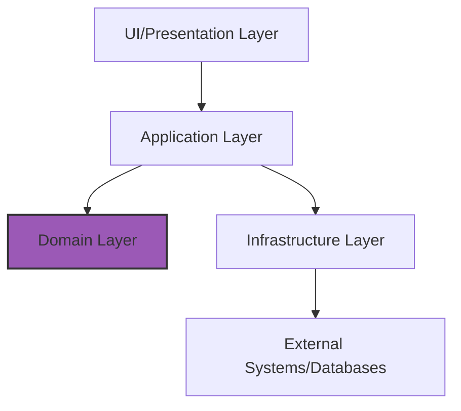
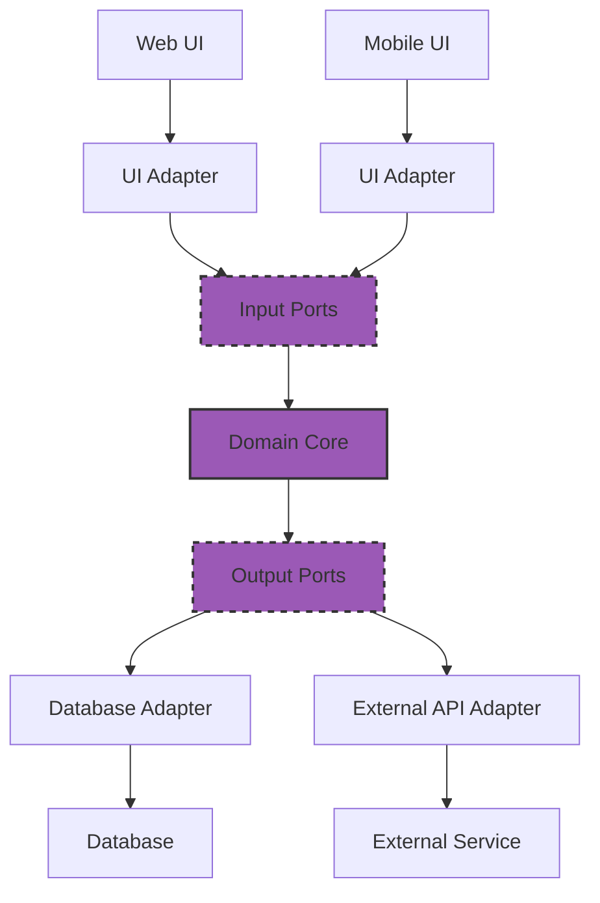
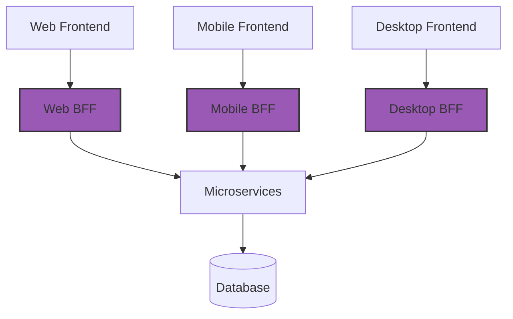
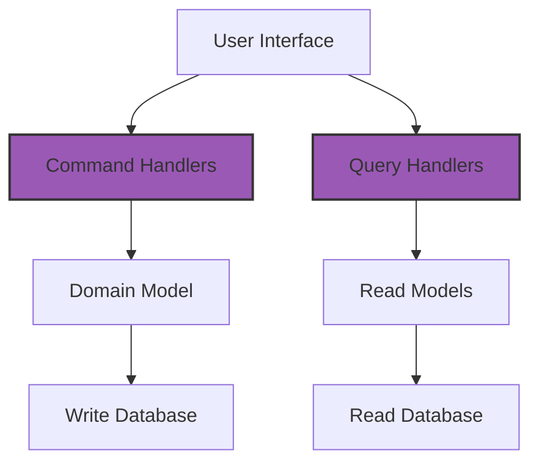
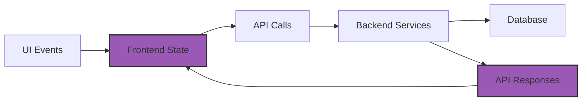
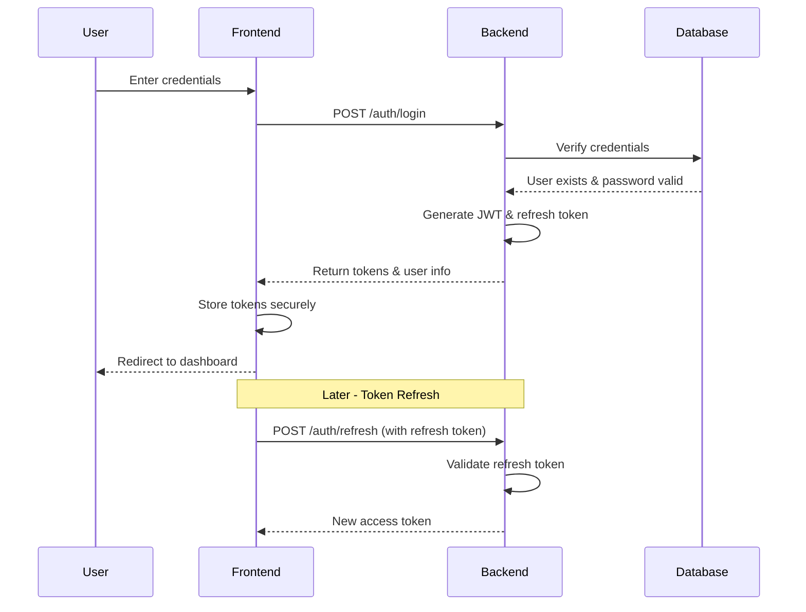

# Full-Stack Planning Methods

## 1. Unified System Architecture Planning

Before building a full-stack application, it's essential to develop a comprehensive architectural plan that addresses both frontend and backend concerns while defining clear integration points.

### Full-Stack Architectural Frameworks

#### 1. Clean Architecture
A layered approach that separates concerns with dependency rules flowing inward:



Key principles:
- **Independence of frameworks**: The architecture doesn't depend on specific libraries or frameworks
- **Testability**: Business rules can be tested without UI, database, or external elements
- **Independence of UI**: The UI can change without affecting the rest of the system
- **Independence of database**: Business rules aren't bound to a specific database
- **Independence of external agencies**: Business rules don't know about external interfaces

#### 2. Hexagonal Architecture (Ports and Adapters)
Centers the application around domain logic with "ports" defining interfaces and "adapters" connecting to external systems:



Benefits:
- Decouples business logic from external concerns
- Enables easy swapping of databases, UIs, or external services
- Facilitates testing by replacing external dependencies with mocks

#### 3. Backend-for-Frontend (BFF) Pattern
Creates dedicated backend services tailored to specific frontend needs:



When to use:
- Different client platforms have significantly different data needs
- Frontend teams need control over their backend APIs
- Performance optimization is critical for specific clients

### Architecture Decision Records (ADRs)

Document key architectural decisions to maintain alignment across frontend and backend teams:

```
# ADR-001: Authentication Strategy

## Status: Accepted

## Context:
The system requires user authentication across web and mobile clients with varying capabilities.

## Decision:
We will implement JWT-based authentication with refresh tokens.

## Consequences:
- Stateless authentication simplifies scaling
- Frontend must securely store tokens
- Need to implement token refresh logic on both client and server
- Revocation requires additional mechanisms
```

## 2. API Contract Design

API contracts serve as the formal agreement between frontend and backend, defining precisely how they will communicate.

### Contract-First Development Workflow

1. **Define API contract** before implementation (OpenAPI, GraphQL schema, etc.)
2. **Generate code** from the contract (client SDKs, server stubs)
3. **Implement business logic** within the generated structure
4. **Validate implementations** against the contract

### API Specification Formats

#### REST API with OpenAPI (Swagger)
```yaml
openapi: 3.0.0
info:
  title: Task Management API
  version: 1.0.0
paths:
  /tasks:
    get:
      summary: List tasks
      parameters:
        - name: status
          in: query
          schema:
            type: string
            enum: [pending, completed]
      responses:
        '200':
          description: List of tasks
          content:
            application/json:
              schema:
                type: array
                items:
                  $ref: '#/components/schemas/Task'
components:
  schemas:
    Task:
      type: object
      properties:
        id:
          type: string
        title:
          type: string
        completed:
          type: boolean
      required:
        - id
        - title
        - completed
```

#### GraphQL Schema
```graphql
type Task {
  id: ID!
  title: String!
  description: String
  status: TaskStatus!
  dueDate: DateTime
  tags: [String!]
}

enum TaskStatus {
  TODO
  IN_PROGRESS
  COMPLETED
}

type Query {
  tasks(status: TaskStatus): [Task!]!
  task(id: ID!): Task
}

type Mutation {
  createTask(input: CreateTaskInput!): Task!
  updateTask(id: ID!, input: UpdateTaskInput!): Task!
  deleteTask(id: ID!): Boolean!
}

input CreateTaskInput {
  title: String!
  description: String
  status: TaskStatus = TODO
  dueDate: DateTime
  tags: [String!]
}

input UpdateTaskInput {
  title: String
  description: String
  status: TaskStatus
  dueDate: DateTime
  tags: [String!]
}
```

### Type-Safety Across Stack

To maintain consistency between frontend and backend:

1. **Shared type definitions**: Use TypeScript interfaces or JSON Schema shared between client and server
2. **Type generation**: Automatically generate types from your API contract
3. **Runtime validation**: Validate data at boundaries with libraries like Zod or Joi

Example of shared types with TypeScript:
```typescript
// shared-types.ts (imported by both frontend and backend)
export interface User {
  id: string;
  email: string;
  name: string;
  role: 'admin' | 'user';
}

export interface Task {
  id: string;
  title: string;
  description?: string;
  status: 'todo' | 'in-progress' | 'completed';
  assigneeId?: string;
  dueDate?: string;
  createdAt: string;
  updatedAt: string;
}
```

## 3. Full-Stack MVP Definition

When planning a full-stack MVP, focus on end-to-end workflows that deliver core value while deferring non-essential features.

### Full-Stack MVP Planning Matrix

Create a matrix to identify essential features across the stack:

| Feature | UI Component | Frontend Logic | API Endpoint | Backend Service | Database | Priority |
|---------|-------------|----------------|--------------|-----------------|----------|----------|
| User Registration | Registration Form | Form validation, API call | POST /auth/register | AuthService | Users table | Must-Have |
| User Login | Login Form | Form validation, token storage | POST /auth/login | AuthService | Users table | Must-Have |
| Create Task | Task Form | Form validation, API call | POST /tasks | TaskService | Tasks table | Must-Have |
| View Tasks | Task List | Data fetching, filtering | GET /tasks | TaskService | Tasks table | Must-Have |
| Update Task | Task Edit Form | Form validation, API call | PUT /tasks/:id | TaskService | Tasks table | Must-Have |
| Delete Task | Delete Button | Confirmation, API call | DELETE /tasks/:id | TaskService | Tasks table | Must-Have |
| Task Categories | Category Selector | Filter by category | GET /categories | CategoryService | Categories table | Should-Have |
| User Profile | Profile Page | Form for user data | GET/PUT /users/me | UserService | Users table | Could-Have |
| Task Attachments | File Upload | File handling | POST /tasks/:id/attachments | AttachmentService | Attachments table | Won't-Have |

### End-to-End User Stories

Define complete user journeys that traverse the entire stack:

```
User Story: Task Creation and Management

As a registered user,
I want to create, view, and manage my tasks,
So that I can keep track of my work effectively.

Acceptance Criteria:
1. User can log in with email and password
2. User can create a new task with title, description, and due date
3. User can view a list of their tasks
4. User can mark tasks as complete
5. User can edit task details
6. User can delete tasks

Technical Implementation:
- Frontend: React components for login, task form, and task list
- API: Authentication endpoints, CRUD endpoints for tasks
- Backend: Authentication service, task service with CRUD operations
- Database: User table, task table with appropriate relations
```

## 4. Data Flow Planning

Plan how data will flow through your application from UI to database and back.

### CQRS (Command Query Responsibility Segregation)

Separate read operations (queries) from write operations (commands):



Benefits:
- Optimize read and write operations independently
- Scale read and write sides separately
- Simplify complex domain models

### State Management Planning

Define how application state is managed and synchronized:



State synchronization strategies:
- **Optimistic updates**: Update UI immediately, roll back on error
- **Pessimistic updates**: Wait for server confirmation before updating UI
- **Real-time updates**: Use WebSockets or Server-Sent Events for live data
- **Polling**: Regularly fetch updated data
- **Cache invalidation**: Clear cached data when it might be stale

## 5. Authentication Planning

Authentication is a critical cross-cutting concern in full-stack applications. Plan it comprehensively from the start.

### Authentication Flow Diagram

Map out the complete authentication process:



### Authentication Decision Matrix

Evaluate authentication options based on your requirements:

| Approach | Pros | Cons | Best For |
|----------|------|------|----------|
| JWT | Stateless, scales well | Difficult to invalidate, size limitations | APIs, microservices |
| Session-based | Easy to invalidate, smaller payload | State management needed, extra DB lookups | Monolithic apps |
| OAuth/OIDC | Delegate auth to trusted providers, standards-based | Additional complexity, external dependency | Apps needing social login |
| Magic Links | Passwordless, improved UX | Email delivery dependency, security considerations | Consumer applications |

## 6. Testing Strategy Planning

Develop a comprehensive testing approach spanning both frontend and backend.

### Testing Pyramid

```
      /\
     /  \
    /E2E \
   /------\
  /  Int.  \
 /----------\
/ Unit Tests \
--------------
```

- **Unit Tests**: Test individual components and functions in isolation
- **Integration Tests**: Test interactions between components
- **End-to-End Tests**: Test complete user flows across the entire stack

### Full-Stack Testing Matrix

Plan which tests to write at each level:

| Component | Unit Tests | Integration Tests | E2E Tests |
|-----------|------------|-------------------|-----------|
| UI Components | Component rendering, state changes | Form submissions, API call handling | N/A |
| Frontend Logic | Business logic, utility functions | State management, API client | N/A |
| API Layer | N/A | Endpoint contracts, status codes | N/A |
| Backend Services | Service methods, pure functions | Service interactions, database operations | N/A |
| Database Access | N/A | Query functionality | N/A |
| User Workflows | N/A | N/A | User journey simulations |

### Contract Testing

Test that the API implementation meets the contract specification:

1. **Consumer-driven contract tests**: Frontend defines expectations
2. **Provider contract tests**: Backend verifies it meets expectations
3. **Automated contract validation**: CI/CD pipeline validates contract compliance

## 7. Full-Stack Blueprint Checklist

Use this checklist to ensure your full-stack blueprint is comprehensive:

### Architecture & Design
- [ ] System architecture diagram
- [ ] Component interaction diagrams
- [ ] Data flow diagrams
- [ ] API contract specifications
- [ ] Database schema design
- [ ] Authentication/authorization strategy

### Frontend Planning
- [ ] Component hierarchy
- [ ] Route structure
- [ ] State management approach
- [ ] UI/UX mockups or wireframes
- [ ] API client implementation plan

### Backend Planning
- [ ] Service architecture
- [ ] Controller/route definitions
- [ ] Data models and relationships
- [ ] Business logic organization
- [ ] Error handling strategy

### Integration & DevOps
- [ ] Authentication flow implementation
- [ ] API contract enforcement plan
- [ ] Testing strategy
- [ ] Deployment pipeline
- [ ] Performance monitoring strategy

## 8. Avoiding Full-Stack Over-Engineering

Full-stack applications are particularly susceptible to over-engineering due to their complexity. Here are strategies to maintain appropriate simplicity:

### Signs of Full-Stack Over-Engineering

1. **Premature service splitting**: Creating many microservices before they're needed
2. **Over-complex state management**: Using sophisticated state libraries for simple data
3. **Excessive abstraction layers**: Too many layers of indirection across the stack
4. **Framework feature overuse**: Using all features of frameworks regardless of need
5. **Anticipatory coding**: Building features "just in case" they're needed later

### Simplification Strategies

1. **Start with monolith**: Begin with a well-structured monolith before considering microservices
2. **Use boring technology**: Favor proven, simple solutions over cutting-edge complexity
3. **Feature flagging**: Build complex features behind toggles to control rollout
4. **End-to-end slices**: Implement complete, thin slices of functionality before adding breadth
5. **Continuous refactoring**: Evolve the architecture as needs become clearer

### Full-Stack Simplicity Principles

1. **Minimal viable API**: Keep API surface small and focused
2. **Single source of truth**: Avoid duplicating data and logic
3. **Shared vocabulary**: Use consistent naming across all layers
4. **Clear boundaries**: Define explicit interfaces between components
5. **Progressive enhancement**: Start simple and add complexity only when needed

## 9. Integrating AI Into Full-Stack Development

AI can assist with planning and implementing full-stack applications, but requires thoughtful prompting.

### Full-Stack Blueprint-to-AI Prompt Strategies

#### 1. System Architecture Prompt
```
I'm building a task management application with these requirements:
[List full-stack requirements]

Please help me design a system architecture that:
- Separates frontend and backend concerns appropriately
- Uses [specified technologies]
- Ensures scalability and maintainability

Please provide:
1. A high-level architecture diagram (describe in text)
2. Component responsibilities
3. Data flow patterns
4. Key integration points between frontend and backend
```

#### 2. API Contract Prompt
```
Based on this system architecture and data model:
[Paste relevant sections from your blueprint]

Help me create a comprehensive API contract that:
- Follows RESTful/GraphQL best practices
- Provides all necessary endpoints for the frontend requirements
- Includes appropriate validation rules
- Handles authentication and authorization

Please provide the API specification in [OpenAPI/GraphQL Schema] format.
```

#### 3. Integration Implementation Prompt
```
I need to implement the integration between my React frontend and Node.js backend.

Here's my API contract:
[Paste API contract]

Here are my data models:
[Paste data models]

Please help me implement:
1. The API client in the frontend (using axios/fetch)
2. The state management logic to handle API responses
3. Error handling patterns
4. Loading state management
```

### AI-Assisted Full-Stack Implementation Workflow

1. Create comprehensive full-stack blueprint
2. Use AI to generate API contracts based on the blueprint
3. Generate frontend components that work with the API
4. Generate backend implementations that fulfill the API contract
5. Use AI to help implement integration points
6. Verify implementations against original blueprint

## Practical Exercises

### Exercise 1: Full-Stack Architecture Design
Design a comprehensive architecture for a simple e-commerce application with:
- Product browsing and search
- Shopping cart functionality
- User accounts and order history
- Admin panel for product management

Create diagrams showing:
1. System components and their relationships
2. Data flow for key user journeys
3. API boundaries between frontend and backend

### Exercise 2: API Contract Design
Create an OpenAPI or GraphQL specification for the e-commerce application from Exercise 1, defining:
- All necessary endpoints/operations
- Request/response schemas
- Authentication requirements
- Error responses

### Exercise 3: Full-Stack MVP Definition
For the e-commerce application:
1. Define the minimum set of features needed for a viable product
2. Create a feature priority matrix (Must-Have, Should-Have, Could-Have, Won't-Have)
3. Map each feature to required components across the stack
4. Define acceptance criteria for the MVP

### Exercise 4: Authentication Flow Design
Design a secure authentication system for the e-commerce application:
1. Select an appropriate authentication approach
2. Create a sequence diagram showing the login flow
3. Define how authentication state is maintained in the frontend
4. Address security considerations

---

Remember: **Effective full-stack development requires cohesive planning across all layers of your application**. Time invested in comprehensive blueprinting pays dividends in reduced integration issues, clearer team communication, and more maintainable systems.
